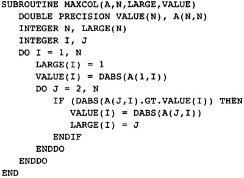
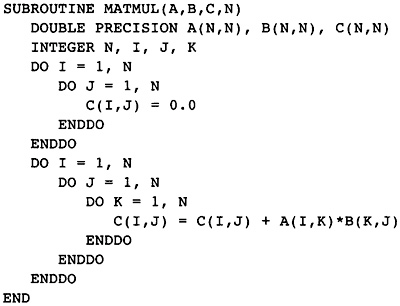
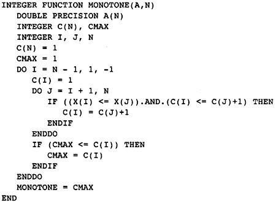
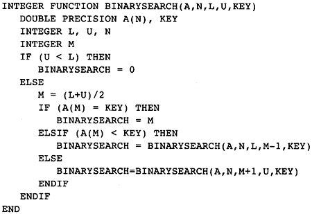

第1章 概述
##########

什么是优化的编译器？我们为什么需要它们？它们从何而来？这些是本章要讨论的问题，还有如何使用这本书。在正式向读者呈现详细的编译器设计之前，本章作为导引，先说一下优化编译器开发的非正式历史，并给出一个可运行的例子，来说明编译器中的技术。本书的其余部分会一直使用这个例子。

1.1 什么是优化的编译器
**********************

一个程序员如何让他的应用程序获得期望的性能呢？起初程序员按照简单易懂的方式编写程序，如此，程序的正确性可以得到测试或证明。然后，通过剖析和测试，找出程序消耗时间和内存资源的热点，修改程序以改进其对资源的使用。在程序员作了所有合理的修改之后，进一步的性能改进只能来自编译器，就是如何最优地将编程语言翻译为目标机器的指令。

优化的编译器的目标，就是高效地使用目标机器的全部资源。编译器将源程序翻译为机器指令，这些指令使用各种各样的计算单元。理想的翻译能够得到这样的目标程序，它在指令执行的每个时钟周期让每个计算单元保持活跃，做着有用（非冗余）的工作。

当然，理想化的翻译并不总是可能的。源程序的计算需求集合可能是不平衡的。它可能做很多整数计算，很少浮点计算，或者反过来，或者算术计算很少，而载入和存储操作很多。针对这样的情况，编译器必须尽可能有效地利用过载的计算单元。

编译器必须想办法补偿不平衡的计算机系统。在理想状态下，处理器的速度匹配内存系统的速度，它们又都匹配输入输出（IO）系统的速度。在现代精简指令集计算机（RISC）系统上，这是不成立的：处理器比内存系统快得多。为了充分利用处理器的能力，编译器必须让生成的代码减少访问内存系统，通过将数值保持在寄存器中，或者通过组织代码使所需的数据驻留在高速缓存中。

一个附加的麻烦是获取指令。绝大部分内存引用碎片是对指令的引用。我们希望指令驻留在某个高速缓存中；然而，情况并不总是这样。当指令不容易驻留高速缓存的时候，编译器应该生成尽可能少的指令。当指令容易驻留高速缓存并且数据引用很多的时候，编译器允许自由地增加指令以减少对数据的等待。达到平衡不是一件容易的事。

总之，优化的编译器试图让应用程序在执行过程中尽可能有效地利用处理器和内存的全部资源。编译器必须转换程序以平衡对计算单元和内存的使用。它必须恰当地选择指令，使用尽可能少的指令，同时达到这样的平衡。当然，完全做到是不可能的，但是编译器必须尽其所能。

1.2 有所侧重的优化编译器的历史
******************************

编译器具有非凡的历史，但是常常被人忽视。重大的开发始于19世纪50年代。每隔一段时间，权威人士都会断言，编译器开发已经没什么可做的了。他们总是被证明错了。如今，随着处理器的速度越来越快，编译器技术需要得到大力的开发。在此，我列出若干个激励并影响我最深的编译器开发小组。对于在这个领域作出了重要贡献的其他小组，我无意轻视。

尽管有早期为解析和编译所作的工作，第一个重要的编译器是针对IBM 704/709/7090/7094的Fortran编译器（Backus）。这个项目标志着编译器开发的分水岭。为了得到程序员的认可，它所生成的代码必须类似于机器语言程序员手工编写的代码，因此这是一个高度优化的编译器。它必须编译一个完整的语言，尽管语言的设计对开发者是开放的。当时这个项目所需的技术并不存在，他们必须自己开发。这个团队非常成功，他们创造了近十年间最优秀的编译器之一。这个项目提出了编译器pass或者phase的概念。

之后，还是在IBM，有个团队为IBM 360/370系列计算机开发了Fortran/Level H编译器。这些编译器同样是高度优化的编译器。他们的四元（quadruple）概念，和本书中介绍的设计所用到的抽象汇编语言的概念是类似的。Scarborough和Kolsky（1980）对编译器所作的后续改进，让此类编译器成为又一个十年间最优秀的编译器之一。

从19世纪60年代末期到70年代结束，有两个研究小组一直在开发上述编译器以之为基础的技术，也在开发新的技术。其中一个小组在IBM，由Fran Allen领衔，另一个小组在纽约大学（NYU），由Jack Schwartz领衔。这两个小组首先提出了可达定义和位向量（bit-vector）的概念，用于描述程序转换条件。他们的大部分工作发表在文献上；如果你能得到SETL简报（NYU 1973）或者SETL项目相关报道的副本，就能了解其详情。

其他小组也在研究优化技术。William Wulf定义了一种称为Bliss的语言（Wulf et al. 1975）。这是一种结构化的编程语言，在卡内基梅隆大学（MCU），Wulf和他的团队为这种语言开发编译器优化技术。其中的一些技术只适用于结构化的语言，而另一些是通用的，适用于任何结构的语言。这个项目升级为具有产品质量级别的编译器的编译器（PQCC）项目，开发元编译器技术，以构造优化的编译器（Leverett, et al. 1979）。这些论文是一些最丰富又最少被采用的编译器开发技术的来源。

其他商业公司也在研究编译器技术。COMPASS开发了基于p-graph技术的编译器（Karr 1975）。这种技术对于编译器优化比可达定义更优越，因为数据结构易于更新；然而，p-graph的初始计算比可达定义慢得多。Reif（Reif和Lewis 1978）和IBM Yorktown Heights的后续开发者（Cytron et al. 1989）将p-graph转换成流图的静态单赋值形式（Static Single Assignment Form），这是当今编译器开发所采用的一种流图结构。

Ken Kennedy，纽约大学（NYU）的一个学生，在莱斯（Rice）大学创立了一个编译器小组，以继续他在编译器优化方面的工作。起初，这个小组专攻向量化技术。向量化需要好的标量优化，所以他们也一直研究标量优化。在莱斯大学，由Keith Cooper领衔的小组作了分析多个过程（过程间分析）的部分最有效的工作（1988，1989）。本书大量采用了由Cooper领衔的大规模标量编译器项目和小组所设计的流图结构。

在19世纪70年代末期和80年代早期，随着超级计算机和RISC处理器的问世，新的编译器技术亟待开发。特别地，指令被管线化，数值在需要的时候是准备好的。指令必须重新排列，使得第一条指令的结果回来之前，启动一些别的指令。编译器编写者最初为如Cray-1这样的机器开发了这些技术。这方面工作的一个例子，是Richard Sites关于重排Cray-1汇编语言的论文（1978）。后来，IBM 801项目（Auslander和Hopkins 1982）和卡内基梅隆大学的Gross（1983）将这些技术应用于RISC处理器。这个领域的其它工作包括，描述RS6000编译器的论文（Golumbic 1990和Warren 1990），和威斯康辛（Wisconsin）大学关于指令调度的研究。

在19世纪70年代和80年代早期，寄存器分配是一个困难的问题：编译器应该如何将计算得到的数值指派给少量的物理寄存器，以最小化在寄存器和内存之间搬运数据的次数？Chaitin（1981，1982）将这个问题转换为图着色（graph-coloring）问题，并且开发出图着色启发式方法，这种方法在处理具有复杂流图的程序时表现良好。卡内基梅隆大学的PQCC项目开发了一种将它抽象为bin-packing（装箱）问题的方法，这种方法在处理直线式或结构化过程时表现最好。本书中开发的技术是以上两种技术的综合，同时用到了部分Laurie Hendron在McGill大学所作的进一步工作。

1.3 所有这些技术给我们带来什么？
********************************

考虑以上历史，现代RISC处理器需要一个高效的编译器，建造这样的编译器所需的全部技术在大约1972年出现了，肯定地说是1980年。那么，更近期的研究有何价值呢？那个时候存在的技术可以做到，但是要付出很大的代价。更近期的关于优化编译器的研究带来了更高效更易于实现的技术。有两个例子能说明这个事实。在19世纪60年代后期和70年代早期，Fortran/Level H编译器是其中一个最高效的优化编译器。它用到一个优化循环的算法，其基础是识别出嵌套的循环。在19世纪70年代后期，Etienne Morel开发出一种称为消除部分冗余（Elimination of Partial Redundancies）的技术，执行更有效的代码移动，而不需要计算任何循环的信息（Morel和RenVoise 1979）。

类似地，静态单赋值形式的概念让很多转换算法更简单更直观。Killdall（1973）开发的常量传播（Constant propagation）算法令人觉得复杂。后来Wegman和Zadeck（1985）作的建模让这项技术近乎直观。

新的技术让人们更易于建造优化的编译器。这是至关重要的。这些编译器是庞大的程序，大程序会遇到的问题，它都会遇到。如果我们简化了编译器的某个部分，就加快了开发进度，提高了编译速度，减少了编译器中存在的bug（故障，缺陷）。这造就了更廉价更可靠的产品。

1.4 编译器后端的游戏规则
************************

编译器后端有三个基本职能：生成能够忠实代表源程序本义的代码，有效率地分配机器的资源，尽其所能将程序改写为最有效率的形式。以上每个职能要遵守的一条根本规则是，必须忠实地表达源程序。

不幸的是，曾经编译器编写者认为，有必要让大部分程序保持正确，但不是全部程序。当程序员以不寻常的方式使用一些合法的特性时，编译器可能会生成程序的一个不正确的版本。这损害了优化编译器的名声。

如今人们意识到，编译器的代码生成和优化组件必须准确地体现程序的本义，既要符合源程序，也要符合编程语言的语言参考手册。这并不意味着，当编译器打开或者关闭优化时，程序会给出完全相同的结果。有些程序以编译器未能识别的方式违背了语言的定义。经典的例子是在变量被赋值以前使用它。当关闭或者打开优化时，这些程序可能得到不同的结果。

幸运的是，标准组织在描述语言标准的时候，越来越明白编译器编写者想知道什么。现在，各个主要的语言标准都以某种方式描述编译器优化的限制。为此，有时候语言的某些方面被保留为未定义或者由实现决定。这样的措辞意味着，当编译器遇到语言的这些方面时，它可能会想怎么做就怎么做。然而，请慎重，对于编译器将怎么处理这些情况，用户社区会时常给出期望，而编译器最好尊重这些期望。

如果源程序在某个段落以一种超出编译器预期的方式使用一种语言特性，编译器会怎么做呢？它必须选择以保守的方式实现那个特性，甚至以程序的运行时性能为代价。即使作出了保守的选择，编译器也可能见机行事。举例来说，它可能以两种不同的方式编译相同的代码段落，并且生成代码去检查采用那个版本的代码是安全的。

1.5 标准测试和设计编译器
************************

编译器编写者去哪里寻找一个优化的编译器所必须包含的改进呢？如何比较某种特定优化的两个变种并选择其中之一？编译器编写者利用目标机器的应用领域信息、源语言的应用领域信息、正确的判断力去选择一系列特定的优化，并且选择如何组织它们。

每个应用领域都有一套对其重要的标准程序。对于商业应用来说，排序和数据库是重要的。对于数值计算应用来说，线性代数和方程求解是重要的。其它程序对于仿真来说是重要的。编译器编写者会调查这些程序，并决定编译器该怎么做才能很好地翻译它们。与此同时，编译器编写者和他的用户会从这些程序中提取样例代码。这些样例代码会成为标准测试，用于检验编译器的质量是否达到要求。

他们还会调查被编译的源语言，决定必须支持的语言特性。在Fortran中，优化的编译器需要做强度减弱（strength reduction），因为程序员没有简化乘法运算的机制。在C中，强度减弱不太重要（尽管仍然有用）；然而，编译器需要很好地编译小的子函数，准确地计算出尽可能多的关于指针的信息。

有些标准优化是需要被实现的。消除冗余运算，将代码移出循环，这些优化对于命令式语言的优化编译器是必要的。事实上，这是第一原则的一部分，因为大多数应用程序员期望着这些优化。

编译器编写者必须小心谨慎。容易出现这样的事情，设计出来的编译器在编译标准测试程序时表现良好，编译普通程序时令人失望。Whetstone标准测试包含一个代码kernel，可以利用三角函数的一致性来优化它。SPEC92标准测试有一个kernel，EQNTOT，可以通过对整数指令的机智的向量化来优化它。

编译器编写者是否应该为处理这些反常的标准测试而加入特殊的代码呢？应该，也不应该。在竞争的世界，我们不得不加入特殊的代码，因为竞争对手是这样做的。然而，我们必须认识到，这并没有真正地建造出更好的编译器，除非大量的不同类别的程序证明这个特性是有用的。我们应该总是把标准测试看作关于编程的一般性检验。利用标准测试去找出通用的改进。总之，设计优化编译器的基本原则如下：

* 调查所关注应用领域的重要程序。选择对这些程序表现良好的编译技术。选择部分kernel作为标准测试。
* 调查被编译的源语言。从代码质量的视角发现它们的弱点。加入优化以补偿这些弱点。
* 保证编译器对标准测试程序表现良好，所采用的方法对其它程序来说是通用的。

1.6 本书概况
************

在设计开发一个编译器之前，开发者必须明白编译器的需求。这和编写编译器一样难以确定。我所找到的确定需求的方法是，手工编译几个经典的样例程序，假装你就是编译器。不是骗你！利用某种优化技术，编译器做不了的转换，你也做不了。

在第2章，我们就是这么做的，对一个特定的样例程序。对多个样例这么做太重复了。作为替代，我们会总结出若干个针对编译器的需求，这些需求体现在其它样例程序上。然后，我们去钻研设计。每章会描述编译器的后续phase，给出phase涉及的理论，用高级别伪代码描述这个phase。

我们假设读者能够根据这里给出的高层次描述写出详细的数据结构。也许，要想编写编译器，你必须对数据结构爱之如命。只有爱上复杂的数据结构，你才能享受编写编译器。

1.7 本书用作教科书
******************

这本编译器设计可以被用作第二编译器课程的教科书。本书假设读者熟悉构建编译器前端和简单的代码生成技术，一个学期编译器课程所教授的内容。我考虑过加入一系列练习，让本书成为一本教科书。作为替代，采用了另一个方案，就是让学生直接参与到设计中来。

本书会一直使用图1.1中的样例函数，以启发设计，演示细节。如此，它会成为本书大部分阐述的中心。学生们应该把图1.2 - 1.4中的样例当作编译过程的运行示例。学生应该把每一章开发的技术应用到样例。本书也会时时给出这些样例的答案，如此学生就可以检查他/她的答案是否符合书本的答案。

    图1.1 Running Exercise Throughout Book

    图1.2 Matrix Multiply Example

    图1.3 Computing the Maximum Monotone Subsequence

    图1.4 Recursive Version of a Binary Search

图1.2是一个经典的矩阵相乘算法。它包含大量的浮点数计算，伴随着不平衡的内存访问。如图所示，里面的循环包含两个浮点运算，三个load操作，和一个store操作。问题在于，当发生的内存操作比计算更多时，如何从机器获得良好的性能。

图1.3计算向量A的最长单调序列的长度。这个过程用到了动态规划。数组C(I)记录了从位置I开始的最长的单调序列。它这样计算下一个元素：对于所有之前计算的序列，检查是否允许把X(I)添加到当前计算得到的序列的前端。这个样例几乎没有浮点运算。然而，它做了很多load和store操作，伴随着数量可观的条件分支判断。

图1.4是一个递归式的二分查找算法。学生可能会将它翻译为用指针操作二叉树的过程。此处的挑战是，如何优化内存访问，如何降低过程调用带来的时间消耗。我建议将课程的主要评分和项目关联起来，项目的内容是设计几个优化算法的原型。原型可以被快速地实现，审阅者也按照原型的标准去考察它。作为原型，不需要处理复杂的内存管理问题，而实际的优化编译器会遇到这样的问题。

1.8 参考文献
************

Auslander, M., and M. Hopkins. 1982. An overview of the PL.8 compiler. Proceeding of the ACN SIGPLAN82 Conference on Programming Language Design and Implementation, Boston, MA. Backus, J. W., et al. 1957. The Fortran automatic coding system. Proceedings of AFIPS 1957 Western Joint Computing Conference (WJCC), 188-198. 

Chaitin, G. J. 1982. Register allocation and spilling via graph coloring. Proceedings of the SIGPLAN 82 Symposium on Compiler Construction, Boston, MA. Published as SIGPLAN Notices 17(6): 98-105. 

Chaitin, G. J., et al. 1981. Register allocation via coloring. Computer Languages 6(1): 47-57. 

Cooper, K., and K. Kennedy. 1988. Interprocedural side-effect analysis in linear time. Proceedings of the SIGPLAN 88 Symposium on Programming Language Design and Implementation, Altanta, GA. Published as SIGPLAN Notices 23(7). 

Cytron, R., et al. 1989. An efficient method of computing static single assignment form. Conference Record of the 16th ACM SIGACT/SIGPLAN Symposium on Programming Languages, Austin, TX. 25-35. 

Gross, T. 1983. Code optimization of pipeline constraints. (Stanford Technical Report CS 83-255.) Stanford University. 

Hendron, L. J., G. R. Gao, E. Altman, and C. Mukerji. 1993. A register allocation framework based on hierarchical cyclic interval graphs. (Technical report.) McGill University. 

Karr, M. 1975. P-graphs. (Report CA-7501-1511.) Wakefield, MA: Massachusetts Computer Associates. 

Kildall, G. A. 1973. A unified approach to global program optimization. Conference Proceedings of Principles of Programming Languages I, 194-206. 

Leverett, B. W., et al. 1979. An overview of the Production-Quality Compiler-Compiler project. (Technical Report CMU-CS-79-105.) Pittsburgh, PA: Carnegie Mellon University. 

Morel, E., and C. Renvoise. 1979. Global optimization by suppression of partial redundancies. Communications of the ACM 22(2): 96-103. 

New York University Computer Science Department. 1970-1976. SETL Newsletters. 

Reif, J. H., and H. R. Lewis. 1978. Symbolic program analysis in almost linear time. Conference Proceedings of Principles of Programming Languages V, Association of Computing Machinery. 

Scarborough, R. G., and H. G. Kolsky. 1980. Improved optimization of Fortran programs. IBM Journal of Research and Development 24: 660-676. 

Sites, R. 1978. Instruction ordering for the CRAY-1 computer. (Technical Report 78-CS-023.) University of California at San Diego. 

Wegman, M. N., and F. K. Zadeck. 1985. Constant propagation with conditional branches. Conference Proceedings of Principles of Programming Languages XII, 291-299. 

Wulf, W., et al. 1975. The design of an optimizing compiler. New York: American Elsevier.
