第2章 编译器的结构
##################

为了决定编译器的结构，编译器编写者需要考虑什么？他需要考虑被编译的源语言，所要求的编译器的速度，所要求的目标机器代码的质量，用户社区的期望，和建造编译器的预算。本章将带你领略编译器编写者决定编译器结构所必须经历的过程。

考虑上述因素设计一个编译器的最好方法，是手工模拟编译过程，去编译由用户社区提供的程序。为了简短起见，本书会使用一个主要的样例程序。我们会用这个样例来决定所需的优化技术，同时决定各种转换的次序。

为了方便阐述，本章简化了这个过程。首先，我们会介绍基本的框架，包括编译器的主要组件和编译器内部单元的结构。然后，我们将手工模拟一个样例程序。

图2.1的样例是一个Fortran子函数。它找出矩阵中每列的最大的元素，同时保存这个最大元素的索引和绝对值。尽管它是用Fortran写的，选择什么源语言是不重要的。这个样例可以用任何常见的源语言编写。当然，有些优化的重要程度在不同的语言中是不一样的，但是所有语言都汇集到一组公共的特性，例如数组、指针、异常、函数等，它们在不同的语言中大同小异。然而，编译器必须很好地编译各个语言的特殊的特性。例如，C语言具有丰富的索引数组或者描述动态存储的指针构造，Fortran对形式参数具有特殊的规则，这些参数允许增强的优化。

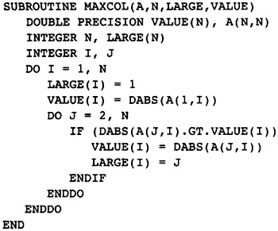

    Figure 2.1 Finding Largest Elements in a Column

2.1 编译器结构概述
******************

本书是编译器设计过程的简化版本。从无到有设计一个编译器，必须经历反复迭代。首先，构思一种编译器结构（假说）。然后，用这种结构模拟编译过程。如果它如期望的那样工作得很好（它不会），那么这种设计是可接受的。在模拟编译的过程中，我们会发现要修改的地方，或者发现整个框架无法工作。于是，修改框架并再次模拟。重复这个过程，直到出现了令人满意的框架。如果这个框架真的无法工作，就废弃它并重新开始。

关于结构，需要决定两件主要的事情：程序是如何表示的，按照怎样的次序执行转换。编译器前端读入源程序，然后将它翻译为一种称为中间表示（IR）的形式，这是为了编译器后端在其上执行优化、寄存器分配、代码生成等。在IR上执行的各种各样的转换，称为phase。

2.1.1 源程序的表示
==================

在翻译的过程中，源程序必须存储在计算机上。这种存储在数据结构中的形式称为IR。过去的经验告诉我们，这种表示应该满足三个条件：

* 1. 程序的中间形式应该被存储为一种接近机器语言的形式，只有适量的操作被保持为高层级（high-level）的形式，之后也被低层级化（lower）。这让每个phase能够操作程序中的所有指令。这样，每种优化算法可以应用于所有指令。如果高层级操作被保持在IR中，这些操作的子操作就不能被优化，或者必须在此之后由专门优化器来优化。

* 2. 编译器的每个phase应该在IR中保留关于程序的所有信息。其中应该没有隐含的信息，这就是说，同样的信息，有的phase知道，有的phase不知道。这意味着，每个phase具有简单的接口，其输出可以由少量仿真器测试。这个要求暗示着，编译器的任何一个组件都不知道其它组件内部是如何实现的。这样，即使一个组件被修改或替换，也不会损害其它组件。

* 3. 编译器的每个phase必须能够独立地测试。这意味着我们必须编写能够读写IR样例的辅助程序。被写到文件的表示形式必须是一种二进制或文本的表示。

第二个要求规避了一种软件开发团队的自然倾向。当一个团队在实现组件B的时候，可能会以某种方式用到另一个团队实现组件A的信息。这可以正常工作，直到将来有一天第一个团队局部修改了他们的实现。突然，组件B不再正常工作了。如果第二个团队让第一个团队暗地里保存一些信息，让他们的组件B使用，情况就更糟糕了。现在，接口不再是程序的中间表示，而是中间表示加其它（可能无文档记录的）数据。避免这种问题的唯一办法，就是要求接口简单并且有文档记录。

优化的编译器是复杂的。经过数年的开发和维护之后，技术支持团队的大部分工作将是修复问题。几乎做不了进一步的开发，因为没有时间。这种情况之所以存在，是因为大部分编译器只能作为整体得到测试。编译一个测试程序，有些phase发生了错误（或者程序编译了，而运行的时候出错了）。编译器的问题在哪里？大概不在你观察到问题的地方。COMPASS有一句精辟的话：Expletive runs downhill（上游排污，下游遭殃）。（当然，用了实际的expletive。）其含义是，问题发生在编译器中前面的什么地方，一直没有被注意，直到后面的某个phase，典型的如寄存器分配，或者构建目标对象（object）模块。做到下面几件事情可以避免这样的问题：

* 必须有程序测试中间表示的合法性。这些程序在编译时被临时调用，检查哪个phase产生了不正当的表示。

* 必须时常在phase中使用断言，检查要求成立的条件事实上是成立的。产品编译器经常这么做。

* 必须为每个phase创建回归测试集。这些测试包含IR的特殊版本，就是一个程序在这个phase之前被编译得到的IR。这份IR是phase的输入，然后仿真phase的输出，检查结果程序是否正确运行。

怎么存储程序才能满足这些要求呢？根据经验作出选择，然后用之前讨论的手工模拟来检验它。在这个编译器中，每个函数都会被内部存储为一种类似通用RISC处理器的汇编语言的形式。

COMPASS编译器引擎的经验告诉我们，一个操作计算得到的值必须具有通用的形式。值可能是向量，标量，或者结构化的值。在编译过程的早期，值的形式必须尽可能地接近源程序，这样程序才不会在被分析的过程中丢失信息。

这些观点几乎是自相矛盾的。我们要能够操作程序的最小片段，同时仍然能够恢复源程序中呈现的总体结构。这个矛盾导致了逐步低级化中间表示的想法。最初，LOAD指令有一套完整的下标表达式，后来，这些专用的load指令被替换为机器级别的load指令。

汇编语言程序长什么样子？每一行一条机器指令。每条指令包含一个操作符，表明要执行的操作；一系列操作数；一系列存放结果的目标（target）。下面给出了中间表示的准确形式，除了其编码方法：

* 1. 指令编码为记录，多条指令构成记录的一个链表。

* 2. 操作符描述指令的动作，表示为所有操作的一个内建的枚举值。

* 3. 一系列常量操作数。有些指令可能包含常量操作数。它们不太可能得到优化，因此被直接存放在指令中。编译器起初不会使用很多常量操作数，因为这样减小了优化的机会。后来，很多常量被存放在指令中，而不是使用寄存器。

* 4. 一列寄存器代表指令的输入。大多数指令具有固定数量的输入，因此它们可以表示为一个小的数组。起初，假设寄存器的供应是无限的，它们是临时变量。

* 5. 一个寄存器作为指令的输出。

汇编语言也有程序label，代表程序分支可以到达的地方。为了表示这个概念，中间表示被分割成block（块），代表指令的直线序列。如果一个block中的一条指令被执行了，那么这个block中的所有指令都会被执行。每个block以一个label开始（或者前面有一条条件分支指令），以一条分支指令结束。程序中会加入冗余的分支指令，以保证在任何可能的条件下，在block的结尾都有一条分支指令。也就是说，不会fall-through（直降）到下一个block。

操作符的数量是巨大的。在目标机器上，每条指令都有一个独特的操作符。开始的时候，它们不会被用到；然而，随着编译的进行，低级化过程会把一系列机器无关的操作符翻译为目标机器的操作符。在此没必要列出所有的操作符。作为替代，图2.2列出了样例中用到的指令的子集。

现在，源程序被建模为一个有向图，其中的节点是block。如果存在一条可能的从第一个block到第二个block的路径，这两个block之间就有一条有向的边。一个唯一的节点称为Entry，代表源程序的入口点。在图中，入口节点没有前驱节点。类似地，一个唯一的节点称为Exit，代表源程序的出口点，这个节点没有后继节点。在图2.3中，入口节点是B0，出口节点是B5。

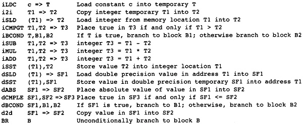

    Figure 2.2 Operation Codes Used In Examples

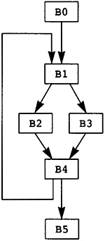

    Figure 2.3 Example Flow Graph

源程序的执行被建模为穿越图的一条路径。这条路径从入口节点开始，到出口节点终止。按照路径上节点的出现次序，路径中的每个节点内的计算得到执行。事实上，路径中的下一个节点是由节点中的计算决定的。在图2.3中，一条可能的路径是B0，B1，B2，B4，B1，B3，B4，B5。这条执行路径意味着，执行B0内的所有计算，然后B1内的所有计算，然后B2，等等。注意，B1和B4内的计算被执行了两次。

2.1.2 转换的次序
==================

由于很难线性描述编译器结构，在此对它作个概括，本章的剩余部分再作回顾。本书的其余部分会给出详细内容。如图2.4所示，编译器被划分为多个单独的组件，称为phase。下面，我们来介绍每个phase的概况。

编译器前端是语言特定的。它分析被编译的源文件，执行词法分析、解析、语义检查。它构建抽象语法树和符号表。肯定地说，我不会讨论编译器的这个部分，因为大多数教科书都会详细地讲解它。每种语言都有各自独特的前端，而不同语言可以共享编译器的其余部分，只要编译器能够处理好每种语言专用的特征。

在前端构建了抽象语法树之后，初始优化phase会构建流图，或者中间表示。由于中间表示看起来像抽象的机器语言，用标准的单pass代码生成技术可以构建流图，比如1cc（Frazer and Hanson 1995）就是这么做的。尽管可以用模式匹配（pattern-matching）技术，由于流图足够简单，直接遍历抽象语法树，随时随地生成指令，就足以构建IR。在构建流图的时候，可以对每个block内的指令作一些初步的优化。

支配者优化phase执行初步的全局优化。它可以识别如下情形：值是常量；两次计算会得出相同的值；指令不影响程序的结果。它识别并消除大部分冗余的计算。同时，它会再次应用已经在单个block内部执行的优化。它不会移动指令，从流图的一个点移动到另一个点。

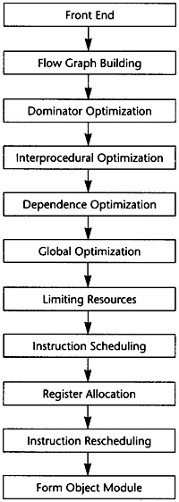

    Figure 2.4 Compiler Structure

过程间优化phase分析当前流图中的过程调用和整个程序中所有其它过程的流图。它找出哪些变量可能被过程调用修改，哪些变量和表达式可能引用相同的内存位置，哪些参数是已知的常量。它保存这些信息，为其它phase所用。

相关性优化试图优化load和store操作的执行时间。它是这样做的：分析数组和指针表达式，判断是否可以转换流图，使得在新的流图中load和store的数量变少了，或者load和store操作有希望击中RISC芯片上的高速缓存（cache）。这可能会交换或展开循环（loop）。

全局优化phase低级化流图，消除对数组表达式的符号化引用，将它们替换为线性地址表达式。这个过程会改造地址表达式，精心安排其操作数的位置，使得依赖于内层循环的表达式部分和不依赖于内层循环的操作数相分离。然后执行完整的一组全局优化，包括代码移动、强度减弱、死代码删除。

在全局优化之后，流图中的指令已经确定下来了。现在，编译器必须分配寄存器，并且重排指令以提高性能。在此之前，限制资源phase会转换流图，使得后续的phase可以正常工作并且更省力。限制资源phase会修改流图，减少所需寄存器的数量，以匹配可用的物理寄存器集。如果编译器知道所需的寄存器比可用的寄存器多得多，就会把一些临时变量保存到内存。它也会消除无用的临时变量副本。

接下来，尝试初次调度指令。寄存器分配和指令调度是矛盾的，所以编译器尝试调度指令。它依赖限制资源phase的效果，指望它保证寄存器分配能够顺利执行，而不需要进一步地把临时变量保存到内存。指令调度器同时重排来自几个block的指令，以减少执行最频繁的block所需要的执行时间。

在指令调度之后，寄存器分配phase用物理寄存器替换临时变量。这个过程分成三步，依次为下面三类临时变量分配寄存器：首先，在一个block中被计算而在另一个block中被使用的临时变量；其次，一个block中的临时变量，它可以和一个已分配寄存器的临时变量共享寄存器；最后，在单个block中被计算和使用的临时变量。这样的划分有赖于限制资源phase减小分配冲突的可能性：后面的分配和前面的分配发生冲突。

我们希望寄存器分配phase不需要插入将临时变量复制到内存的store和load操作。如果出现了这样的复制操作，指令调度phase就要再次执行。这时，调度器只会调度插入了新的指令的block。

最终，IR变成了表示汇编语言函数的形式。目标对象模块按照链接器（linker）要求的形式被写到文件。这是一个困难的任务，因为关于目标对象模块格式的文档是不准确的，这是众所周知的。主要的工作在于发现正确的格式。之后的任务就是创建目标对象模块，这是琐碎（而又繁重）的工作。

2.2 编译器前端
******************

为了理解每个phase，我们会为每个phase逐行模拟编译图2.1中的标准样例，从前端开始。前端将源程序翻译为抽象语法树。正如早前提到的，我不会讨论前端的操作；但是，我们确实需要理解抽象语法树。图2.1中的程序的抽象语法树如图2.5所示。

每个函数都有一棵树，编码了所有函数结构。树是采用缩进的方式描绘的；每个节点的子树额外缩进一级。如此，节点的类别缩进一级，而子节点缩进得更多一点。我并不试图精确地描述抽象语法树。对于读者来说什么样的节点类别名字能自然地代表节点，就选择什么样的名字。例如，类别为assign的节点是赋值节点。

list节点表示具有任意数量的子节点的节点，用在具有任意数量的部件的情形，例如由语句组成的block。symbol节点用一个文本参数表示变量的名字；当然，它实际上被表示为指向符号表的指针。

fetch节点区分地址和值。这个编译器作了一个统一的关于表达式的假设：表达式总是表示值。因此，assign节点以两个表达式作为操作数，一个代表位置的地址以接收结果，另一个代表赋值等式右边的值。fetch节点表示从地址获取值。它有一个参数，代表位置的地址。fetch节点的结果是存储在这个位置的值。

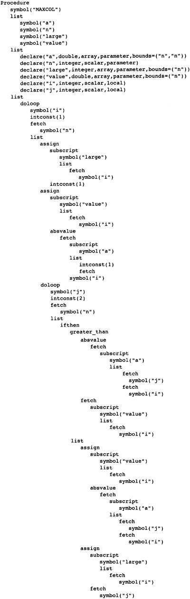

    Figure 2.5 Abstract Syntax Tree for MAXCOL

注意，这个树结构表示了程序完整的结构，指示了子函数的哪些部分包含在别的部分中。

2.3 构建流图
******************

初级编译器书籍介绍了标准的代码生成技术，利用这种技术，抽象语法树被翻译为流图。有两种方法可以实现这种翻译。先进一点的方法是，对抽象语法树应用一种基于树的模式匹配算法来推导流图。在此不推荐这种技术，因为假设目标机器具有RISC特征。模式匹配流图会在后来生成复杂的指令。相反，抽象语法树应该被翻译为尽量简单的原子指令。这个函数能获得更多的优化机会。

因此，翻译应该实现为对抽象语法树的一次遍历。只要可能，就应该生成简单指令。一般的操作，像加法和乘法，可以低级化到一种层级，在这种层级中，程序流图中的每个记录代表一条简单指令。但是，此后需要被分析的操作（在源程序的等价层级上）被翻译为高层级的操作，它们等价于源程序的构造。这些操作后来被翻译为低层级操作，在需要分析这些操作的phase完成之后。以下四类操作应该被保留为高层级形式：

* 1. 变量下标形式的fetch或store，A[i,j,k]，被保留为单个操作，它具有作为数组名字的操作数和作为下标表达式的操作数。以这种形式保留带下标的变量，而不是线性化下标表达式，使得后续的相关性分析可以求解一系列涉及下标的线性等式和不等式。

* 2. 一般的load和store操作也保留额外的信息。为了决定哪些store操作可以修改load操作将要读取的位置，这些信息是需要的。在涉及指针的语言中，这是尤其重要的。额外的分析，称为指针别名分析，被用于决定哪些存储位置被修改了。不会生成自动变量的load和store，它们是在函数中声明的变量，其值在函数结尾时消失。反而，这些值会被当作程序流图中的临时变量一样处理。

* 3. 子函数调用被保留为代表函数名字的表达式和代表参数的表达式。并不展开传递参数的方法，例如，传值（call-by-value）和传引用（call-by-reference）。这使得后来编译器中的过程间分析phase可以作更细致的分析。

* 4. 库函数处理起来不同于其它函数调用。如果一个库函数已知是纯函数，就像处理算子一样处理它。这使得编译器可以应用库函数具有的一致性。程序的分析可能会用到别的函数调用特征，例如，malloc已知会返回空指针或指向一块内存的指针，这块内存未被程序的其它部分引用。

图2.6给出的流图是直接翻译的结果。这里给出这个流图，是为了描述翻译的流程。这不是实际生成的，因为某些优化会在翻译的过程中被执行。注意，有两种不同的使用临时变量的方式。有些临时变量，例如T5，用起来就像一个局部变量，随着程序的执行，它的值会被修改。其它临时变量，例如T7，是纯函数的参数。对于T7来说，它总是存放常数1。对于这些临时变量，总是用相同的临时变量存放相同操作的结果。因此，任何对常数1的load都会存放到T7。翻译的过程必须保证，操作数在被使用之前求值。

为了保证表达式无论在何处计算都使用相同的临时变量，我们维护一个独立的表，称为形式临时变量表。它被下列实体索引：算子，操作数的临时变量，指令中包含的常量。对这个表的查询的结果，是临时变量的名字，它存放着操作的结果。图2.7给出了样例程序的形式临时变量表。有些条目是将在以后添加的，这里列出它们是为了将来引用它们。

在图2.6中，对于长长的指令队列，我们观察到的第一件事情是什么？考虑block B1。常数1被加载了六次，表达式 I - 1 计算了三次。当流图构建之后，可以作大量简化：

如果有两个相同计算的实例，在它们之间没有操作修改它们的操作数，那么第二个计算实例是冗余的并且可以被删除，因为它计算得到的值总是跟第一个实例一样。

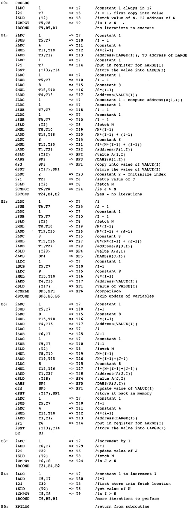

    Figure 2.6 Initial Program Representation

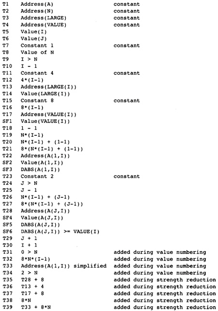

    Figure 2.7 Initial Formal Temporary Table

可以应用代数恒等式消除操作。例如，A * 0可以被替换为0。只有当计算A的副作用可以被忽略时，才可以这样做。有大量的代数恒等式可以被应用；然而，其中的小部分总是被用起来了，而我们明白，当发现新的代数恒等式可以改进程序的时候，就可以把它们加进来。

常量合并将表达式，例如 5 * 7 ，替换为结果数值，例如35。这时常会触发其它简化。编译时的算术计算必须精确地模仿目标机器的算术行为。

这些转换通常会删除函数中大约50%的操作。因此，编译器中其余的分析会变快，因为在每项分析过程中，大约一半必须扫描的操作都已经被删除了。图2.8给出了这些简化的结果。

2.4 支配者优化
******************

预备优化phase接收表示为流图的程序作为输入。它对程序应用全局优化技术，生成等价的程序流图作为输出。这些转换会考虑每个函数内可能的分支，就此意义而言，这些技术是全局的。

在编译器中有两种全局优化phase。初步的phase执行尽可能多的全局优化而不移动流图中的计算。在执行了过程间分析和相关性优化phase之后，会执行一种更通用的全局优化phase，以进一步清理和改进流图。下面介绍（此处）会用到的全局优化转换。

如果有计算 X * Y 的两个实例，并且第一个实例处在从Entry开始的所有路径上，那么可以删除第二个实例。这是通用冗余表达式删除的一个特殊的情形，即将在此后执行。这个简单的例子代表了最大数量的冗余表达式，因此在应用通用技术之前，有大量的工作要做。

复制传播和值传播会被执行。如果X是Z的副本，那么对X的使用可以替换为对Z的使用，只要在发生复制的点和发生使用的点之间，X和Y都没有改变。这种转换可以改进编译器前端生成的程序流图。编译器会生成很多临时变量，例如循环计数，或数组附加信息的分量，它其实是复制操作。

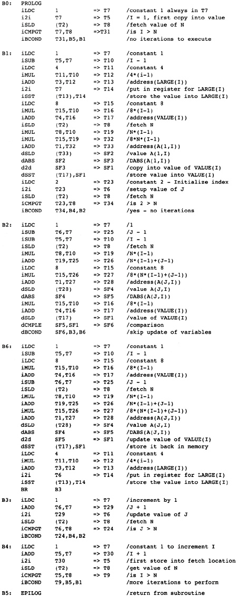

    Figure 2.8 Flow Graph after Simplifications

常量传播找出已经被赋以常量值的变量，并且把对它们的使用替换为这个常量本身。如果程序中的分支条件用到了常量，就可以决定并删除不会被执行的分支。

当别的优化被应用的时候，作为局部优化，代数恒等式、窥孔优化、常量合并也会被执行。

（此处）编译器有意不应用下面的全局优化，因为它们会让之后的相关性分析更加困难。

强度减弱不应用。强度减弱将带常数的乘法（或循环不变量表达式）转换为重复的加法。更精确地说，如果在循环中有 I * 3 这样的表达式，每次循环I都增加1，那么计算 I * 3 可以被替换为一个临时变量T，每次循环这个变量都增加3。

代码移动不应用。考察循环内的计算 X * Y，如果我们知道每次循环它都会被执行，并且在循环内其操作数不会改变，就可以把它移动到循环之前。这种转换会干扰循环交换，后者用于改善数据在高速缓存中的命中率，所以它被延迟到后面的全局优化phase。

现在仔细观察流图，找出穿越流图的可能的路径，让你的手指沿着几条路径游走，从block B0开始，到block B5终止。每条路径重复计算了常量1。代价更高的计算也被重复了。观察block B2和B6。很多在B6中计算的表达式也在B2中计算了。因为B2处在通向B6的每条路径上，所以B6中的计算是不必要的。

什么样的技术可以廉价地删除这些计算呢？B2是B6的支配者（待会给出精确的定义），意思是B2出现在从B0通向B6的每条路径上。有一系列应用于静态单赋值形式（待会给出定义）流图的算法可以删除重复的常量计算和表达式计算，这些计算已经出现在支配者block中。反正编译器要用到一些静态单赋值形式的算法，我们将使用这种形式来删除冗余的计算，就是说这些计算的副本已经出现在支配者block中。这是一种代价不高的广义化的局部优化，在构造流图期间使用它，得出图2.9中的结果。

重复这样的练习，即追踪穿过流图的路径。现在，流图中几乎没有明显的冗余表达式了。但是，仍然有一些。每次循环都执行的计算还没有被移动到循环之外。通常还有别的冗余表达式，不能由这个转换判定是冗余的，尽管在这个例子中没有出现。

大部分指令出现在哪里？它们在block B2中，计算一个地址，用于load数组元素。这些地址表达式在每次循环中都会改变，所以不能把它们移出由block B2开始的循环。它们有规律地改变，每次循环增加8，所以后面的全局优化phase将应用强度减弱来删除其中的大部分指令。

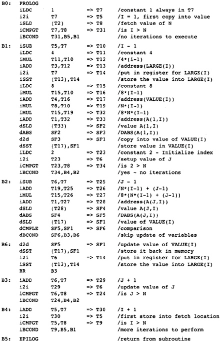

    Figure 2.9 After Dominator Value Numbering

2.5 过程间分析
******************

在处理程序流图的时候，编译器的所有其它phase都是一次处理一个函数。每个phase接收作为输入的程序流图（或抽象语法树），生成作为结果的程序流图。而过程间分析phase为每个函数积累程序流图。它分析全部流图，向编译器的其余phase供给每个函数的程序流图，一次一个。它不是按照它们的原始次序给出函数的。假设没有递归调用，一个函数在别的函数调用它之前被输出给编译器的其余phase。如此，随着编译过程的推进，更多信息被收集起来。

过程间分析phase为编译器的其它phase计算关于函数调用的信息。在编译器的局部和全局优化phase中，必须对函数调用的效果作出假设。如果函数调用的效果是未知的，那么优化phase必须假设，被调用函数知道的值，和它可能调用的所有函数知道的值，都可能被这个函数调用改变或引用。现代语言鼓励用函数（或成员函数）构造程序，这个假设会引起麻烦。为了避免对函数调用作出保守的假设，这个phase为每个函数调用计算如下信息：

* MOD 这个函数调用可能修改的变量的集合。
* REF 这个函数调用可能引用的变量的集合。

过程间分析还计算一个函数的形式参数的值和它们之间关系的信息，包括：

* Alias 对于传引用（call-by-reference）的参数，计算哪些参数所引用的内存位置可能与其它参数或全局变量相同。
* Constant 在函数被调用的所有地方总是接受相同常量值的参数。此信息可用于改进已经发生的常量传播。

当涉及到数组引用的时候，过程间分析phase尝试找出数组的哪些部分已经被修改或引用了。存储这种信息必须作出粗略的估算，因为只有某种形状的存储引用模式才会被存储。当实际的形状不符合常见的引用模式时，必须作出保守的选择，将形状扩展到可选的形态。

2.6 相关性优化
******************

对于RISC处理器来说，相关性优化的目的是减少对内存的引用，改善所发生的内存引用模式。

通过重构循环可以达成这个目标，使得在每次迭代中对内存的引用变少。程序经过转换，消除对内存的引用，如图2.1所示，其中用到了称为标量替换的转换，它保存了A(I)的值，这个值在循环的下次迭代中被用作A(I-1)。经典的优化技术无法识别这种可能性，但是相关性优化技术可以做到。可以用一种更复杂的转换，称为展开和阻塞（unroll and jam），为嵌套的循环消除更多对内存的引用。

当对内存的引用不能被完全消除的时候，基于相关性的优化可以被用来改善被引用的值处在高速缓存中的可能性，如此提高对内存的读取速率。现代处理器的速率超过了其内存系统的速率。为了补偿这种的差异，人们引入了高速缓存系统，它保存近期被引用的内存位置的值。近期被引用的内存有可能被再次引用，硬件可以快速地返回保存在高速缓存中的值，而不是再次从内存位置读取出来。

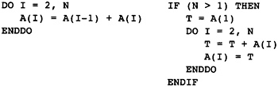

    Figure 2.10 Example of Scalar Replacement

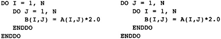

    Figure 2.11 Striding Down the Columns

考虑图2.11中的Fortran片段，它两次复制数组A到B。在Fortran中，列的元素被存储在内存中相邻次序的位置。当硬件读取一个特定的元素的时候，会向高速缓存读入一整个缓存线（cache line）（典型地，32字节到128字节），但是下一个元素是行中的下一个元素，它不在这个缓存线中；相反，它可能处在内存中很远的位置。当内层循环结束的时候，外层循环的下次迭代开始执行，当前高速缓存中的元素可能已经被剔除出去了。

基于相关性的优化会将图2.11左边的程序转换为右边的程序。执行的计算不变，但是引用元素的次序变了。现在，来自A的下一个元素是列中的下一个元素，如此高速缓存就起作用了。

这个phase还会展开循环以改善以后的指令调度，如图2.12所示。左边的程序是原始的循环；右边的程序是展开的循环。在原始的循环中，编译器随后的phase将生成这样的指令，要求每次到B的store在每次后续迭代的从A的load之前执行。循环展开之后，从A的load可能和（到B的）store交错出现，隐藏了引用内存的时间。后面会执行另一个优化，称为软件流水线，它增加更多这样的指令交错。

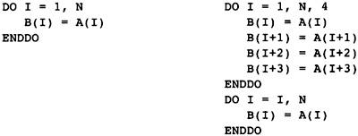

    Figure 2.12 Original (left) and Unrolled (right) Loop

2.7 全局优化
******************

全局优化清理前面的phase转换得到的流图。此时，所有需要源代码层级信息的转换都已经被执行了，或者信息已经以编码的方式被程序流图吸收了。在执行通用算法之前，需要执行几个转换来简化流图。这些初始的转换都是建立在遍历支配者树和静态单赋值方法之上的。这包括原始的支配者优化和下面的优化。

* Lowering：指令被低级化，使得流图中的每个操作表示目标机器的一条单一指令。复杂的指令，例如数组下标引用，被替换为等价的基本机器指令的序列。或者，多条指令可能被合并成一条单一指令，当常量而不只是存放常量值的临时变量可以出现在指令中的时候。

* Reshaping：在应用全局优化技术之前，编译器会考虑程序的循环结构而转换程序。考虑出现在循环内的表达式 I * J * K，其中I是最内层循环的索引，J是下一层循环的索引，K是循环不变量。程序语言典型的结合律会按 (I * J) * K 求值，而更好的方式是按 I * (J * K) 求值，因为在最内层循环中，计算 J * K 是不变量，可以移出这个循环。与此同时，我们会执行强度减弱、局部冗余表达式删除、代数恒等式等。

* Strength Reduction：考虑在一个循环的连续迭代期间按照规则的模式改变的计算。主要的例子是两个值相乘，其中一个值在循环中不改变，例如 I * J，其中J不改变，I增加1。这个乘法可以替换为一个临时变量，它在每次循环中增加J。

* Elimination：为了协助强度减弱和流图整形，重复地执行支配者优化中的冗余表达式删除算法。

考虑我们的样例函数。每次内层循环都会计算表达式address(A(J,I))。它可以被替换为一个临时变量，它初始化为address(A(1,I))，每次循环迭代增加8。

强度减弱首先在内层循环执行，然后在相邻的外层循环执行。这个流图有两个嵌套的循环。内层循环由block B2、B6和B3组成。在算术数列中变化的变量是J，由符号寄存器T6表示。表达式T25、T26、T27和T28都随着T6线性变化，因此它们都是强度减弱的潜在对象；然而，T25、T26和T27被用于计算T28，因此我们要对T28作强度减弱。T28在每次循环中增加8。

为了有一个地方存放初始化T28的代码，我们在block B1和B2之间插入一个空的block。为了方便记忆，我们称它为B12，代表B1和B2之间的block。编译器在循环中放入两组计算（如果不是已经存在的话）：

* 1. 初始化被强度减弱的变量的表达式，在这里变量是T28。这需要复制所有涉及计算T28的表达式，并把它们插入到block B12。
* 2. 强度减弱表达式的增量的表达式。在这里它是常数8，已经存在了。

在向B12插入这些表达式的时候，编译器会执行冗余表达式删除、常量传播、常量合并等。在这个例子中，编译器知道在循环的入口处J的值是2，因此会用常量值替换J，也就是T6。

图2.13中的代码表示了对内层循环应用了强度减弱之后的程序。T28不再表示一个纯的表达式：现在它是一个编译器创建的局部变量。这并没有改变编译器如何处理涉及T28的load和store操作。由于它和之前的纯表达式具有相同的值，load和store操作的副作用保存不变。

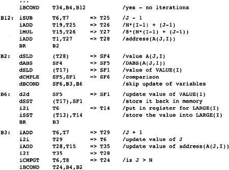

    Figure 2.13 Strength-Reduction Inner Loop

在编译器粗略的模拟过程中，我们发现编译器需要在强度减弱之前执行或多或少的冗余表达式删除、常量传播和常量合并。把强度减弱（和表达式整形）当作之前讨论的基于支配者的优化的一部分来执行，可以让我们得到此信息。

作为一个有用的假说，假定在对单入口循环执行强度减弱之前，先对循环入口点及其所有支配者树中的子节点执行基于支配者的转换。如果我们在这个点对循环执行强度减弱，就会获得三个优势。第一，强度减弱先应用于内层循环，后应用于外层循环。第二，循环体已经由基于支配者的算法简化了。还有第三，在循环入口点前面插入的block仍然可以得到关于可用表达式和常量的信息。

为了方便说明，在block B3中不再使用的计算已经被删除了。在实际中，它们将被后面的死代码删除phase删除。这样的次序让强度减弱更容易实现，因为编译器不需要顾虑是否有什么地方用到了一个将要被删除的计算。

现在考虑block B12的内容。我们知道J或者T6的值是2。于是编译器对这个block应用值编码、常量传播、常量合并等优化。为了得到好的代码，需要执行一个别的优化。它执行了加减运算，然后乘以8。应用整数乘法分发方法会产生更好的代码，因为8会被加到一个已经存在的值上，这样生成了图2.14中的代码。

现在对外层循环执行强度减弱。有三个潜在的强度减弱对象：address(A(1,I))或T33；address(VALUE(I))或T17；address(LARGE(I))或T13。再次，我在block B0和B1之间插入一个block B01，用来为循环B1, [B2, B6, B3], B4存放初始化的值。这三个指针在block B01中被初始化，在block B4中被增加。

这种模拟过程的一个价值是观察在设计编译器时所想不到的情形。对于强度减弱，有两种这样的情形：

现在，load常量4到T11发生得太早了。所有对它的使用已经被删除了，除了在循环的结尾更新指针。在这个例子中，这不是问题，因为后来这个常量会被合并到指令的立即数字段。更复杂的表达式可能在被使用之前早早地被计算出来了。对这个问题，没有容易的解决办法。

在block B01中对常量8的计算让block B1中的计算变得冗余。后面，代码移动算法应该识别这些情况并删除冗余的表达式。

对两个循环都作了强度减弱之后，编译器得到了图2.15中的流图。

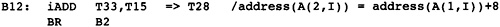

    Figure 2.14 Header Block after Optimization

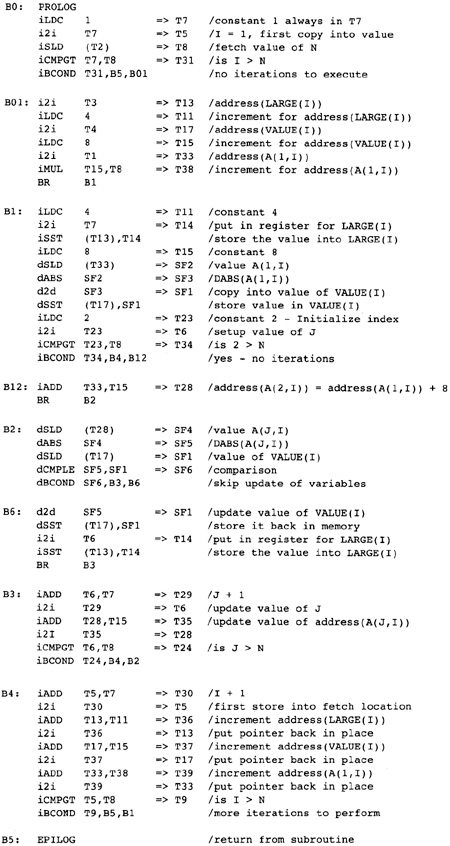

    Figure 2.15 After Strength-Reducing Outer Loop

检查流图，这个时刻正好。编译器已经创建了流图，简化了表达式，删除了大部分冗余表达式，应用了强度减弱，并执行了表达式整形。除了为强度减弱插入了一些专用的代码，没有移动任何表达式。代码移动将把代码移出循环。

这里提议一种代码移动技术，它的基础是Etienne Morel设计的称为部分冗余删除的技术（Morel and Renvoise, 1979）。抽象地说，这种技术试图在一些穿过流图的路径上插入表达式的副本，以增加冗余表达式的数目。它发挥作用的一个例子是循环。部分冗余删除算法会在循环前面插入循环不变量表达式的副本，使循环中原始的副本变成冗余。令人惊讶的是，这种技术不需要用到循环的知识。我们把三种别的技术和代码移动结合在一起：

* 1. 在代码移动中结合强度减弱的一种形式。这种技术实现起来代价不高，并且能在没有循环的地方应用强度减弱，这是一种优势。

* 2. 移动load和代码移动相结合。移动load操作可以被当作一个代码移动问题来处理，通过假装任何store操作实际上是一个store操作跟随相应的load操作。这样，关于一个表达式是否可用，store操作可以被视作和load操作具有相同的效果。正如将要在这个例子中看到的那样，这会增加可以移动的load操作的数目。

* 3. 也可以移动store操作，通过向后查看流图，并且对反向流图应用一样的算法，这些算法是我们对正常的流图中的表达式所应用的算法。

在这个特定的例子中，代码移动只移除了对常量4和8的冗余的load。对VALUE(I)的load被移出了内层循环。它不是循环不变量表达式，因为在循环中有一个对VALUE(I)的store操作。然而，一个store可以被视作一个store跟随一个load，load的结果寄存器和store的源寄存器相同，这个观点意味着，在使用VALUE(I)的每条路径上，都有一个VALUE(I)的load，使得循环中的load是冗余的。这时得到了图2.16中的代码。

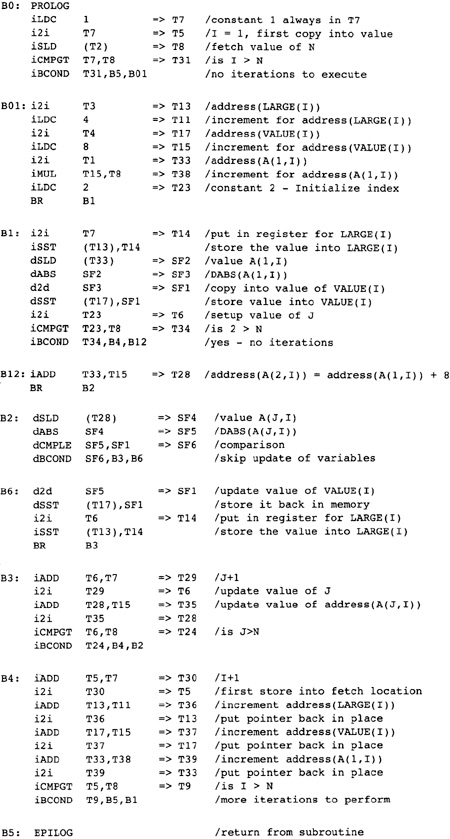

    Figure 2.16 After Code Motion

现在，利用部分冗余性，我们可以在反向程序流图上向前移动store操作，如图2.17所示。在循环中出现的到VALUE(I)和LARGE(I)的store可以被移动到block B4。虽然我们以为这是移出循环的一次移动，但是分析过程跟循环没有关系。这取决于这样的事实：在每条到达B4的路径上都出现了这些store操作，这些重复的store确实出现在循环内。以上处理结合死代码删除，给我们带来这些优化phase的最终结果。

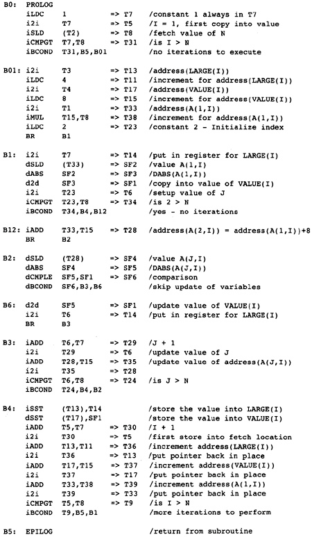

    Figure 2.17 After Store Motion

2.8 限制资源
******************

现在，样例函数的程序流图已经被转换为一种适合为目标机器生成指令的形式。在程序流图的操作和目标机器的指令之间，有着一对一的对应关系。还有三件事情将决定结果程序。

* 窥孔优化：多条指令必须被结合成具有相同效果的单条指令。这包括经典的窥孔优化连同简化方法，后者包含将常量合并到可以使用常量的指令中去。

* 指令调度：必须找出最优的指令次序。通过重排指令，指令固有的超过一个机器时钟周期的延迟，可以被其它指令隐藏起来。

* 寄存器分配：程序流图中的临时变量必须被替换为物理寄存器。

不幸的是，指令调度和寄存器分配是相互制约的。如果编译器重排指令以减小执行时间，就会增加存放值所需的物理寄存器的数目。另一方面，如果编译器在指令调度前为临时变量分配物理寄存器，指令重排的尺度就会受到限制。这是一个已知的phase次序的问题。对于指令调度和寄存器分配，没有一个天然的次序。

限制资源phase执行这三个任务中的第一个，并且为指令调度和寄存器分配预处理代码。它试图这样解决这个问题：在指令调度之前求解部分寄存器分配问题，然后执行指令调度。随后执行寄存器分配，如果寄存器分配器生成了新的指令（spill code），就执行第二次指令调度。

在为指令调度和寄存器分配作准备之前，编译器将程序的中间表示低级化到效率最高的指令系列。这是最后的代码低级化phase。

我们从修改流图开始，让每个操作对应目标机器的一个操作。由于我们选择了接近RISC处理器指令集的指令表示，大部分指令已经对应了目标机器指令。这个步骤通常被称为代码生成；然而，我们对代码生成的理解是更宽泛的。当我们建造流图的时候，我们开始代码生成；我们进一步作代码生成，去低级化流图；现在，我们以代码生成结束，实现流图指令和目标机器指令的对应关系。

为了说明代码低级化，我们假设目标机器具有这样的指令，它包含小常量的立即数操作数。例如，指令可以把小常量和一个立即数操作数相加。或者，load和store操作可以接受一个常量，作为地址的正向偏移。目标机器也有这样的指令，它多次加一个寄存器的4或8倍，再加另一个寄存器，结果存放到目标寄存器。换句话说，我们考虑像Alpha那样的目标处理器。在低级化代码的时候，编译器还会执行下面的操作：

将流图中的指令替换为等价的目标机器指令。如果流图中的指令就是目标机器指令，编译器就让它保持原样。

去除寄存器到寄存器的复制操作。编译器不再接受这样的惯例，就是一个特定的表达式在一个固定的符号化寄存器中被计算出来。现在，全力去除寄存器到寄存器的复制。

在代码低级化的过程中，有些block会变成空的。编译器会删除它们。

在Alpha处理器上，下面这些重要的指令会简化这个特别的例子：

S4ADDQ指令计算一个寄存器的4倍加另一个寄存器，简化了整数数组的地址算术运算。

S8ADDQ指令计算一个寄存器的8倍加另一个寄存器，简化了双精度数组的地址算术运算。

CPYS指令，接受两个操作数，产生一个浮点值，它结合了一个操作数的符号和另一个操作数的绝对值。可以用它计算绝对值。

使用这些指令可能让其它指令变得不必要，例如，load常量的指令，或者乘法或位移操作（其目标寄存器也是冗余的）。这些不必要的计算也必须被删除。部分可以由其它优化去做，或者由死代码删除去做。

编译器也会调整block的次序，于是条件分支的两个目标可能被替换为一个直降（fall-through）的目标;但是，我们并不删除额外的分支部分，因为寄存器分配可能需要插入block，而这样的删除会改变block的次序。图2.18中的代码展示了代码低级化的结果。在这个点，不要求相同的表达式总是在相同的寄存器中计算，因为这会增加不必要的指令。因此，用一条单一的iADD指令增加循环变量。注意，在循环中，用了S8ADDQ来增加引用A数组的指针。

在代码被低级化的同时，限制资源phase通过执行以下转换为指令调度和寄存器分配作准备。

* Rename：相同的临时变量被函数中不相关的两个部分使用，这样的情况很多。其来源是源程序为两个用途使用相同的自动变量，或者是编译器早前的phase所作的转换。现在，一部分临时变量的使用被重命名了，它们引用一个新的临时变量。通过使用不相关的名字，寄存器分配更有效率。图2.19说明了重命名。在左边的代码中，两个循环使用了相同的索引变量。在重命名之后，使用了两个不同的索引变量，如右边的代码所示。

* Coalesce：在程序流图中很多寄存器到寄存器的操作可以被删除。在 T1 = T2 的复制中，如果在从复制操作到使用T1的所有路径上，T1和T2都没有变化，所有对T1的引用就可以被替换为对T2的引用，可以删除复制操作。删除一个复制操作可以暴露删除更多复制操作的可能性。如果知道一个临时变量和另一个已经被计算的临时变量相等，此编译器会用一种略微更通用的算法删除它。

* Pressure：在程序流图中点p处的寄存器压力，是在点p处存放临时变量所需的寄存器的数目，这些值是在p之前被计算出来，在p之后被使用的。为函数分配寄存器时，最大的寄存器压力，是对所需寄存器的最小数目的估值。这不是精确的下方估值，因为可能需要更多寄存器，由于函数中多条路径的相互作用。然而，如果寄存器压力大于可用的寄存器数目，那么在函数的部分区域，一些临时变量将被存储到内存中。这被称为寄存器溢出（spilling）。

* Spilling：限制资源phase会考虑寄存器压力超过物理寄存器数目的每个点。它会考虑包含那个点的每个封闭的循环，寻找一个临时变量，它在循环里面没有被使用，但是在后面被使用了（换句话说，它存放了一个跨越整个循环的值）。取一个对最外层循环具有以上属性的临时变量，在循环之前把它存储到内存，在循环之后在把它加载（reload）回来（在必要的地方）。这样，在循环内部的所有区域，寄存器压力减小1。如果没有这样的跨越循环的临时变量，就选择一个在那个点所在block没有被使用的临时变量。如果不存在这样的临时变量，就选择一个在这个block中被使用或定义的临时变量。这整个过程会被反复执行，直到在函数中的任何位置，寄存器压力都已经被减小到可用寄存器的数目以下。

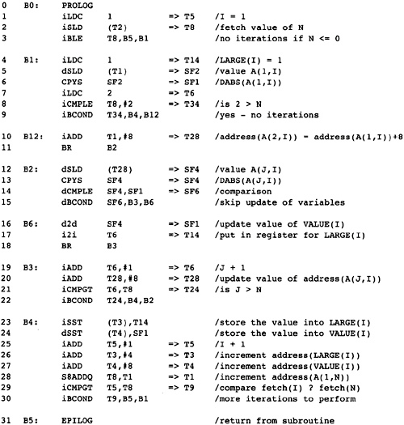

    Figure 2.18 After Code Lowering

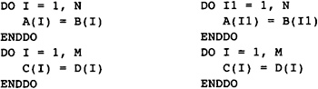

    Figure 2.19 Computing Right Number of Names

为了计算寄存器压力，编译器需要知道在流图的每个点，有哪些以后将被用到的临时变量，换句话说，程序中每个点的活跃的临时变量的集合。为了方便说明，每个临时变量活跃的点的集合被表示为一系列以两个数字表示的间隔，这些数字关联着图2.18中的每条指令。如果一个临时变量在间隔的第一条指令的开始处是活跃的，我们就用一个闭合的中括号表示它。如果它在一条指令的中间变得活跃了，我们就用一个开放得小括号表示它。图2.20显示了每个寄存器活跃的指令范围。

利用这个信息，我们可以计算程序中每个点所需寄存器的数目，也就是寄存器压力。如果所需寄存器的数目超过了可用的物理寄存器的数目，就无法给所有临时变量分派寄存器。图2.21给出了在子函数中每条指令前后活跃的寄存器。在这个特别的例子中，最大的寄存器压力出现在最内层循环中。这常常是成立的，但并不总是这样。

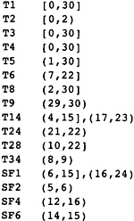

    Figure 2.20 Table of Live Ranges

我们为每个寄存器集计算单独的寄存器压力：整数和浮点数。我们已经展示了整数寄存器的寄存器压力。图2.21没有给出浮点寄存器的寄存器压力，这样让这个表更容易理解；然而，程序中只有三个浮点寄存器，所以确定其寄存器压力是简单明了的。

现在，我们来计算每条语句开始处的寄存器压力。这是一对数字，表示在每条指令的开始处活跃的符号化寄存器或物理寄存器的数目，包括整数的和浮点数的。回想形式参数在程序的开始处是活跃的（如果程序在什么地方使用了它们），所以T1、T2、T3和T4在子函数的开始处是活跃的。

通常来说，小的流图不需要寄存器spilling。最大的寄存器压力比寄存器的数目小得多。但是，让我们假装机器只有8个寄存器。在内层循环的末尾，寄存器压力是9，在这个点有这么多活跃的符号化寄存器，我们无法把它们安置到可用的寄存器。在寄存器压力是9的这个点，符号化寄存器T1、T3、T4、T5、T6、T8、T14、T24和T28是活跃的；但是，T1、T3、T4、T5和T8在内层循环没有被引用（定义或使用）。因此，其中一个可以在循环前被挤出（spill），在循环后被再次加载进来。这样会让整个循环的寄存器压力减小1。理想地，我们会尽可能选择被最少嵌套循环引用的寄存器。但是，这些临时变量在下一层循环都被引用了，因此我们随意地选择存储T5，它是代表I的临时变量。

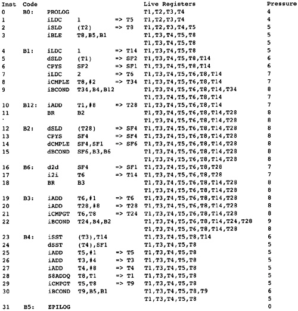

    Figure 2.21 Live Registers and Register Pressure Before Instruction

我们利用堆栈（SP是一个专用的寄存器）将寄存器spill到内存。注意，寄存器压力在某个点达到了峰值，通过spill一个寄存器，我们减小了其它点处的寄存器压力。

插入的过程需要两个步骤。首先，在最外层循环开始的地方插入一个store操作，在这个循环内临时变量（T5）没有被引用，然后在循环结束的地方插入load操作，如果这个临时变量在循环后面是活跃的。其次，优化load和store的位置，把load移动到尽量远离程序开始的地方，把store移动到尽量远离程序结尾的地方。这样我们得到了图2.22中的代码。

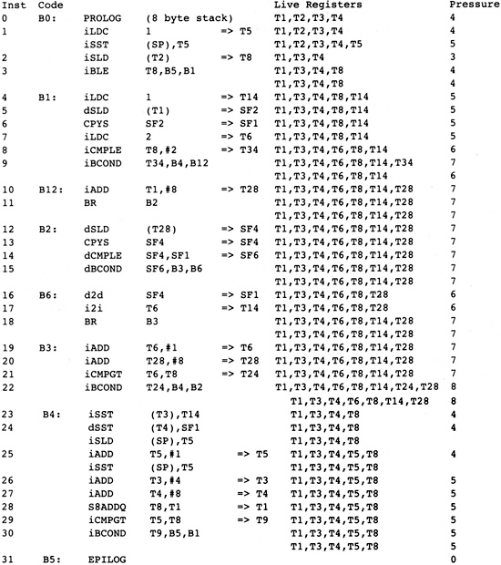

    Figure 2.22 Load and Store Operations for Spill

在限制资源phase之后，编译器知道在程序流图的任意点其操作所引用的资源都是可用的。编译器剩余的phase都会保持这个不变属性，无论它们何时执行转换。

2.9 指令调度
******************

现代RISC处理器的实现采用了所谓的流水线架构。这意味着每个操作被划分成多个阶段，执行每个阶段需要一个机器时钟周期。因为每个阶段需要一个时钟周期，所以每个时钟周期可能发出一条新的指令，但是发出之后过了几个时钟周期，这条指令可能还没有完成。不幸的是，大部分代码生成技术试图在一个值被发起计算之后尽快地使用它。在早期的机器上，这项技术是受欢迎的，因为它限制了所需的寄存器的数目。但是，这种次序减慢了RISC处理器的执行速率，因为值不是立即可用的。指令调度重排指令，更早地在指令的值被使用之前启动指令，这样处理器就不会被延迟了。

近期的RISC处理器可以同时发出若干条指令。这些指令必须是不相关的，并且使用不同的处理器功能单元。调度器必须建立这些指令的分组，称为packet。一个packet中所有的指令可以被同时发出。

原始的指令调度器在单个block中调度指令，同时可能会考虑结束前驱block的指令。为了调度指令，调度器会创建称为指令依赖图的数据结构，图中的节点是指令，如果第一个指令必须在第二个指令之前执行，就在它们对应的节点之间连接有向的边。每条边标记一个数字，表示在两条指令之间必须等待的机器时钟周期间隔。调度器会对指令依赖图执行一种专用的拓扑排序算法，以找出所需时钟周期总数最小的指令次序。

限制于block的调度没有有效地利用RISC处理器的多指令同时发动的特性。block通常是小的，其中的每条指令依赖于block中一些其它指令。将指令调度问题考虑为填充一个矩阵，其中的列代表可以被同时发动的指令，行代表执行这个block需要的机器时钟周期。block调度会稀疏地填充这个矩阵：有很多空的槽，说明机器的多指令同时发动的特性没有被用起来。这是一个问题，尤其对于需要很多时钟周期的指令，像load、store、乘法、除法或浮点运算。RISC处理器的其它整数运算通常需要一个时钟周期。在编译器中，有若干中技术相互协作来改善这个问题：

* Unroll：编译器前期的phase已经执行了循环展开，这增加了block的长度，增加了block调度器调度指令的机会。

* Superblock：在循环中两条路径汇合的点，很难把指令从汇合点的后面移动到前面。当循环中的后继block是短的时候，编译器早前已经复制了这个block，这样汇合的路径被替换为两个block，它们只在循环的开头汇合。这个转换是在循环展开的同时被执行的。

* Move：代码移动所用的普通优化技术试图为尽可能短的指令序列保持临时变量活跃。调度的时候，我们为每个block单独调度。对于执行频繁的block，我们会重复代码移动算法，但是允许从一个block到另一个block的指令移动，即使不能减少指令的执行。

* Trace：考虑执行最频繁的block B，不管怎么找到的，由启发式方法或者统计信息。找出包括B的最长的路径，它包含了路径上每个block的执行最频繁的前驱节点和后继节点。现在，假装将这条路径视作一个block，对依赖图作一些修改，以保证条件分支会作出正确的动作。查看在这条路径上是否有任何指令可以被移动到前面的（或后面的）block。

* Software pipelining：在循环是单个block的特殊情形下，软件流水线可以给出良好的调度。软件流水线利用依赖图（不是指令依赖图）提供的依赖信息，将循环一次迭代的调度和后续迭代的调度交叠起来。这不会减小每个迭代占用的时间长度（可能会增加），但是让迭代能够更快地开始，从而减少整个循环的执行时间。在其它调度发生之前，提前识别这些可以作软件流水线的block和循环，并单独处理它们。

在指令调度期间，会发生一些窥孔优化。之前不相邻的指令，调度之后变得相邻了，于是可以作窥孔优化，例如调度之后出现这样的情形，一个store紧随一个对相同位置的load。因此再次应用一些窥孔优化是有效的。

当指令调度完成的时候，指令的次序就固定了，不可以改变，除非再次执行指令调度。在那样的情况下，可能只需要重新运行block调度器。

我们已经缩小了寄存器需求，于是在流图中的每个点寄存器的值都可以被安置到物理寄存器中。现在，我们会重排指令以满足目标处理器的指令调度约束。我们假设一个像Alpha 21164这样的处理器，它在每个时钟周期可以发出四条指令。很多整数指令需要一个周期来完成。大部分浮点运算需要四个周期来完成。在任意给定的周期，我们可以发出一条或两条load指令，或者一条单一的store指令。不能像load指令那样在相同的周期内发出一条store指令。我们假设在必要时可以将其它整数操作填充进去。像整数乘法或浮点除法这样的指令需要大量时钟周期。

问题是怎么把指令分组为一到四个指令packet，这样一个packet中的所有指令可以被同时发出。编译器也重排指令以尝试保证一个值在被使用之前是可用的，就是让程序不使用一个操作数（值）直到计算它的指令发出之后若干个时钟周期。load和store操作需要的时间是可变的，取决于内存总线的负载，和值是否在高速缓存中。在Alpha 21164上，在处理器芯片上有两个高速缓存，而大部分系统在处理器主板上有一个更大的高速缓存。load指令加载处理器最近的缓存需要2个周期，加载次近的缓存需要8个周期，加载板上缓存需要20个周期，如果数据是在内存中，就需要较长时间。此外，处理器包含优化加载连续内存位置的硬件。如果在两个连续的时钟周期发出两条对连续内存位置的load操作，处理器会优化对内存总线的使用。

在决定怎么调度的时候，重要的是至少不考虑无用的分支。在记录周期数的位置，用星号（*）标记它们。

利用硬件旁路，一个比较指令和一个分支指令可以在相同的时钟周期被发出。注意，对（B1中的）SI9的赋值可以向前移动，这样消除一个额外的slot。还有，可以到达B12的block只有它的前驱节点，所有不需要插入NOP。

现在，注意以block B2开始的内层循环包含三个block。第一个block测试条件，第三个block更新迭代。在第三个block中，除了一条计算，其余的计算都可以被移动到第一个block（hoisting），而剩余的指令可以被更有效地调度，通过生成这个迭代block的一个副本（superblock调度）。

注意，在代码的中间插入了若干NOP。机器一次挑选四条指令，它们对齐到16字节边界。在处理下一个packet之前，必须初始化当前packet中的所有四条指令。为了以最短的时间执行指令，我们必须最大化每个packet中不相关指令的数目。图2.23给出了指令调度的结果。

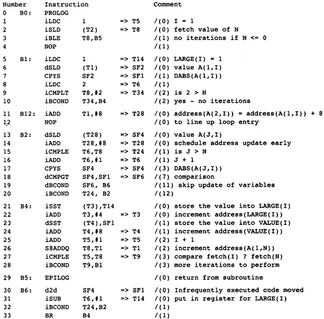

    Figure 2.23 Scheduled Instructions

2.10 寄存器分配
******************

寄存器分配phase修改程序流图，用物理寄存器替换临时变量。对整个函数作寄存器分配的技术有若干种。有一种是基于图着色算法的。以每个临时变量作为节点构造一个图。如果两个节点（临时变量）不能占用相同的物理寄存器，就在它们之间连一条无向边。寄存器分配问题简化为着色这个图，不同的颜色代表不同的物理寄存器。

另一种寄存器分配方法是基于装箱（bin packing）问题的，每个箱子代表一个物理寄存器。如果在程序中不存在一个点，两个临时变量都需要存放值（同时活跃），那么它们可以被分配到相同的箱子中。

每种技术都有优势和劣势。在考虑条件分支的时候，图着色技术更胜一筹。因为装箱算法往往近似计算需要临时变量存放值的点的集合，利用一些易于求集合交集的数据结构，所以对于有分支的程序，装箱算法的表现不如图着色算法。

在考虑直线型代码的时候，装箱算法比图着色表现更好。因为装箱算法可以在它作分配的时候遍历block，可以决定何时相同的寄存器可以被立即重用。它还可以利用程序中的操作和它们的次序的信息来决定将哪些临时变量存储到内存，当寄存器不够用的时候（即使已经执行了限制资源phase，这也可能发生）。图着色没有引用局部性的概念。

这个编译器的寄存器分配器结合了这两种技术。因为限制资源phase已经运行过了，几乎不会发生寄存器spilling了。图着色被用来为在block的开始处存放值的临时变量分配寄存器，因为在这些地方图着色表现最好。一种由Hendron（1993）建议的装箱算法的修改版被用来为每个block中的临时变量分配寄存器。

程序流图中有在block开始处活跃的临时变量（全局分配）和在block内部活跃的临时变量（局部分配），之前尝试分离它们，遇到了困难，因为无论先作全局分配还是先作局部分配，都会影响寄存器分配的质量。限制资源phase的存在解决了这个问题，在任何一个分配发生之前，它已经执行了全局临时变量spilling。

注意，限制资源phase的出现消除了大部分寄存器分配期间的寄存器spilling。它并没有消除全部spilling。条件分支的副作用可以引起图着色或者装箱算法执行期间的寄存器spilling。这种情况是不可避免的，因为最优的寄存器分配是NP完全问题。在发生寄存器spilling的地方，寄存器分配器会插入所需的store和load操作。

现在，我们对样例程序应用寄存器分配。首先，编译器必须重新为临时变量计算活跃的点，因为指令调度已经改变了这些点（见图2.24）。注意，调度器引入了一个局部寄存器的重定义，因此我们需要更早地作superblock调度（当我们不知道它会带来惩罚），或者为正确数量的（临时变量）名字重新计算活跃的点，或者局部地为正确数量的（临时变量）名字重新计算活跃的点，当我们制造这些问题的时候。此处我们只处理整数寄存器；在这个例子中，浮点数寄存器是简单的，因为它们全部相互冲突，因此每个临时变量分配一个不同的寄存器。

在临时变量的生命时间信息被计算出来之后，编译器用图着色算法处理在一些block的开始处活跃的临时变量，或者处理直接被分派物理寄存器的临时变量。被分派物理寄存器的临时变量是被预先分配的；然而，此处必须考虑它们以避免任何意外的分派。物理寄存器会被命名为$0、$1等。注意形式参数对应的临时变量被分派到由目标机器的调用标准指定的物理寄存器。图2.25列出了被全局分派的寄存器，连同寄存器的类别。在这个例子中，所有需要的寄存器被称为scratch寄存器，这意味着，如果寄存器在函数中被使用了，就不需要保存和恢复寄存器中的值。

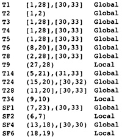

    Figure 2.24 Live Ranges after Scheduling

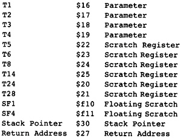

    Figure 2.25 Global Register Assignments

在所有block开始处活跃的寄存器被分配之后，我们可以分配只在单个block内部活跃的符号化寄存器。在这个小的样例中，只有几个。在实际的程序中，这些寄存器的数目比全局活跃寄存器的大得多。图2.26列出了这些局部寄存器。寄存器会尽可能地被重用，因为编译器希望最小化所用寄存器的数目。这避免了使用非scratch寄存器的必要性，否则就需要在函数开头插入store操作以保存它的值，在结尾插入load操作以恢复它的值。

图2.27给出了结果汇编代码。所有临时变量都已经被替换为寄存器了。没有插入spill指令，因此指令序列没有改变。

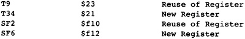

    Figure 2.26 Local Register Assignments

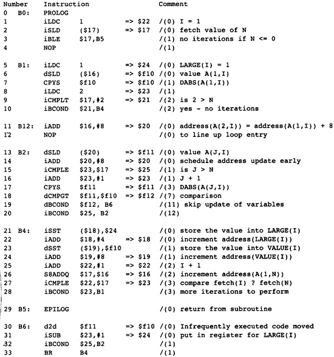

    Figure 2.27 Code after Register Allocation

2.11 再次调度
******************

下一个phase是再次调度phase，只有当寄存器分配器更改了指令序列的时候，才会执行它。这是可以发生的，由于窥孔优化或者引入了spill代码。如果这些情况都没有发生，就不需要再次调度。

如果寄存器分配器生成了任何指令，就是说发生了寄存器spill，就再次执行指令调度，但是仅仅针对插入了load或store操作的block。

2.12 构建目标对象模块
*********************

最后，我们接近完成任务了。指令已经选择出来了；寄存器已经分派好了。剩余的任务是琐碎的，就是将这些信息和全局分配的数据信息翻译为目标对象模块。这项任务包括为调试器插入调试信息。由于我们的任务是漫长的，在此对最后这个phase点到为止。它涉及一点点错综复杂的技术。然而，它之所以复杂，是因为目标对象模块的结构是复杂的并且是无文档的。所有我看过的描述目标对象格式的文档都包含严重的错误。因此，这个项目涉及计算机科学试错，以确定链接器想要什么。这个phase还会为报表档案产生汇编语言清单，如果要求的话。

2.13 参考文献
*************

Allen, R., and K. Kennedy. “;Advanced compilation for vector and parallel computers. San Mateo, CA: Morgan Kaufmann. 

Frazer, C. W., and D. R. Hanson. 1995. A retargetable C compiler: Design and implementation. Redwood City, CA: Benjamin/Cummings. 

Hendron, L. J., G. R. Gao, E. Altman, and C. Mukerji. 1993. A register allocation framework based on hierarchical cyclic interval graphs. (Technical report.) McGill University. 

Hendron, L. J., G. R. Gao, E. Altman, and C. Mukerji. 1993. Register allocation using cyclic interval graphs: A new approach to an old problem. (Technical report.) McGill University. 

Morel, E., and C. Renvoise. 1979. Global optimization by suppression of partial redundancies. Communications of the ACM 22(2): 96-103. 

Wolfe, M. 1996. High performance compilers for parallel computing. Reading, MA: Addison-Wesley.
