第3章 图
########

成为编译器编写者的首要先决条件是成为“数据结构迷”。一个人必须生活、呼吸和热爱数据结构，所以我们不会提供通常的通常出现在编译器书籍中的所有背景数学的完整列表。我们假设您可以访问任何一种数据结构或介绍性的编译器编写书籍，例如 Lorho (1984) 或 Fischer and LeBlanc (1988)。这种设计假设您熟悉以下主题，这些主题由每个主题参考的数据结构书籍介绍。

等价关系和分区。编译器经常计算等价关系或分区集。等价关系经常被表示作为一个分区：将所有相互等价的元素组合在一起元素集。因此，整个集合可以表示为一组不相交的集合元素。分区经常被实现为 UNION/FIND 数据结构。这Tarjan (1975) 开创了这种方法。

*集合上的偏序关系* 。编译器包含许多显式和隐式偏序。例如，表达式的操作数必须在表达式之前计算。编译器必须能够表示这些关系。

本章讨论的主题与图表有关。一些编译器中的数据结构，例如结构流图和调用图，表示为有向图。无向图用来表示寄存器分配的干扰关系。因此，这里讨论的主题是用于实现编译器的理论范围。讨论的主题如下：

* 用于实现有向图和无向图的数据结构
* 深度优先搜索和有向图中边的分类
* 支配者、后支配者和支配前沿
* 计算图中的循环
* 代表集

3.1 有向图
**********

有向图由一组节点 N 和一组边 E 组成。每条边都有一个节点是它的尾巴，一个节点是它的头。有些书将边定义为有序的结点尾和头的对。然而，这使得编译器的描述更加困难。可能有两条边具有相同的尾部和头部。在包含 C switch 语句或 Pascal case 语句的流程图中，两种不同的选择具有相同的语句体将创建具有相同尾部和头部的两条边。

对于流程图，有两个特殊的节点。入口是一个没有前驱的节点，代表程序开始的点。出口是一个没有后继的节点，代表过程退出的地方。所有执行路径都从 Entry 开始；所有有限路径表示在 Exit 处完全执行结束。请注意，无限长的路径是可能的，表示流程图中的无限循环。

如果一个过程有多个入口点，这在 Fortran 中是可能的，那么创建一个不包含任何指令的单独的入口节点，在入口节点和每个真正的入口点之间都有一条边。当指令发出时，程序入口代码被插入到每个入口点。单个入口节点的存在保证了程序分析将正确执行。同样，如果有多个节点没有后继者，那么创建一个单独的出口节点，每个原始出口和出口节点之间都有一条边。

过程的每次执行都由从入口到出口的路径表示。不幸的是，反之则不然：从入口到出口的路径并不代表执行路径；例如，如果流中有两个条件分支图在相同的条件表达式上分支。在这种情况下，第二个条件分支只能在与第一个条件表达式相同的方向分支。分支的路径其他方式是不可能的。编译器无法识别这种情况，因此它假设所有路径是可能的。这个假设减少了优化的数量。

图 3.1 中的图表表示运行示例的流程图。节点BO 是入口节点。节点 B5 是出口节点。过程中的任何执行路径都是表示为 B0 和 B5 之间的路径。

有向图是使用两种不同的技术实现的。通常节点表示为一些数据结构，边表示为添加到每个节点的两个属性：节点的后继集和前驱集。 X 的后继集是作为边的头，尾为 X 的节点 Y 的集合。类似地，X 的前驱集是作为边的尾部的节点 P 的集合，其中边的头为 X。因此在图 3.1 中，B3 的前驱是 B2 和 B6，而 B3 的后继是 B2 和 B4。请注意，任何节点 X 都满足关系： X 是它的每个后继节点的前驱，X 是其每个前驱节点的后继。这些集合实现为链表，包含在数据结构中的链表的头部代表节点。

.. figure:: chapter03/figure-3.1.png

    Figure 3.1 Flow Graph for MAXCOL

另一种技术是为每个节点分配一个整数并表示每个节点边作为布尔矩阵中的位。如果节点 X 和 Y 之间有一条边，则该位在位置 EDGE[X,Y] 设置为真；否则为假。

后继/前驱表示的优点是扫描所有离开或进入节点的边是有效的。如果有向图是稀疏的，它也是空间有效的，就像大多数流图一样。矩阵方法在构建有向图方面更有效，因为它更容易检查特定节点是否已经是后继节点。我们将在寄存器分配期间使用矩阵方法的导出；否则，将使用后继/前驱实现。

在无向图中，边没有方向感。一条边不是在特定方向上从一个节点行进到另一个节点。相反，无向图代表了相邻的概念：两个节点相邻或不相邻。实现有向图的技术用于实现无向图：对于无向图中的每条边{X，Y}，在实现中构建两条边（Y，X）和（Y，X）。在矩阵形式中，这意味着矩阵是对称的，只需要存储一半的矩阵。

3.2 深度优先搜索
****************

在有向（或无向）图中访问节点没有自然顺序。 编译器中的大多数算法以下列方式访问节点。 编译器首先处理一些节点，如果它正在处理流程图，通常是入口节点。

假设编译器正在处理某个节点 X ，在处理X的某个时刻，编译器会处理X的后继节点。当然，编译器不想多次处理同一个节点，如果 X 的后继节点已经被处理过，它将不会再该后继节点。由于该算法是递归实现的，当X经过处理后，它将作为一个过程返回，以便开始处理X的前任可以继续处理。

如果有向图是一棵树，则深度优先搜索对应于一棵树的遍历。回想一下，在树的遍历中存在前序遍历的概念，其中一个节点在其后继节点被处理之前被处理；后序遍历，其中节点的子节点在节点上的实际工作完成之前被处理；和中序遍历，其中节点的工作在子节点的处理之间执行。有向图也有类似的想法。

在深度优先搜索期间，该算法可以按照访问节点的顺序为节点分配一个编号。这称为前序。如果按此顺序在节点上执行工作，则它对应于树的前序遍历。同样，按照完成的顺序为节点分配一个编号。这称为后序，对应于树中的后序遍历。一个重要的顺序是反向后序，因为它对应于在处理任何后继节点之前在节点上执行工作（可能除了循环之外）。

图 3.2 给出了深度优先遍历算法。此遍历将边分为四类。一条边 (n,S) 是一条树边，如果当 n 决定处理这个后继者时 S 还没有被处理。换句话说，这是第一次访问 S。由于每个节点只能有一个第一次访问它的前任，因此这些节点与树的边缘一起形成一棵树或树的森林，如图 3.3 所示。这种树结构很重要，因为它允许编译器使用树遍历的概念在流程图中移动。

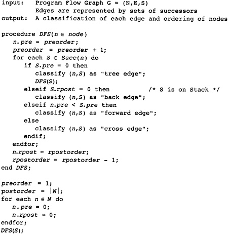

    Figure 3.2 Basic Depth-First Search Algorithm

第二类包括后向边。这些是从一个节点到另一个已开始处理但尚未完成的节点的边。如果你看一下算法，这意味着边必须回到一个仍在被直接或递归调用它的过程处理的节点：在实现方面，边的头部是仍在堆栈上的节点，并且该节点将是深度优先树中当前节点的祖先。这条边从一个节点到由树边组成的树中的一个祖先。

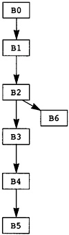

    Figure 3.3 Depth-First Search Tree for MAXCOL

与后向边相对的是前向边。从 n 到 S 的前向边是从节点到其后继节点的边；但是，已经处理了后继者。事实上，它是作为 n 的其他一些后继处理的结果进行处理的。所以这是深度优先搜索树中从祖先到后代的边。

没有其他边可以上树或下树，所以第四类边必须从一个子树到另一个子树。这些被称为交叉边。图 3.3 的边分类在表 3.1 中给出。

.. table:: Table 3.1 图边的分类
   :align: center
   :widths: auto

   +----------+----------+----------+----------+
   | 树边     | 前向边   | 交叉边   | 后向边   |
   +==========+==========+==========+==========+
   | B0 -> B1 | B0 -> B5 | B6 -> B3 | B3 -> B2 |
   +----------+----------+----------+----------+
   | B1 -> B2 | B1 -> B4 | B4 -> B1 |          |
   +----------+----------+----------+----------+
   | B2 -> B3 |          |          |          |
   +----------+----------+----------+----------+
   | B2 -> B6 |          |          |          |
   +----------+----------+----------+----------+
   | B3 -> B4 |          |          |          |
   +----------+----------+----------+----------+
   | B4 -> B5 |          |          |          |
   +----------+----------+----------+----------+

有一个涉及深度优先搜索的基本原则。考虑从某个节点 n 开始的深度优先搜索。深度优先搜索将访问的节点集正是离开 n 的某个路径上的节点集。为什么？显然，深度优先搜索遍历所访问的任何节点都在某个路径上，因为树的边缘形成了一条路径。相反，考虑从 n 开始的任何有限路径。下一个节点是 n 的后继节点。在深度优先搜索中，节点的每个后继节点要么从该节点访问过，要么已经被访问过。因为我们从 n 开始，所以从 n 访问这个后继。从 n 到该后继者的边可以被从 n 到后继者的树节点路径替换。现在考虑下一个节点：它要么是从路径上的第二个节点访问过的，要么已经从第一个节点访问过。再次，可以拼接树节点的路径以创建从 n 到第二个节点的路径。这个过程可以一直持续到到达路径上的最后一个节点，此时我们有一条从n到结束节点的树边路径，表明通过深度优先搜索到达了结束节点。

我建议您熟悉深度优先搜索。它是编译器中所有其他算法的基础。

3.3 支配关系
************

由于程序流程图用于描述程序的执行路径，而优化是一种避免重复已经完成的工作的技术，我们需要一些概念，即在所有执行路径上一个块总是在另一个块之前。这个概念被称为支配地位。

**定义**

*支配者* ：考虑一个程序流图（N，入口，出口），当且仅当从入口到 B2 的每条路径都包含 B1 时，块 B1 支配块 B2。

支配者的大部分属性由两种论据决定，每一种都基于支配的定义。第一种论证形式是考虑从入口到块 B 的所有路径。由于支配者在所有这些路径上，可以确定支配者的属性。第二种论证形式是通过剪切和粘贴路径来推理的。考虑一条从 Entry 到 B 的路径，它不包含特定的块 D。通过在末尾添加一条边，可以将该路径扩展为到另一个块的路径；新的路径仍然没有经过 D 。

*引理 D1：*

每个块 B 支配自己，因为 B 在从 S 到 B 的每条路径上。

*引理 D2：*

如果 B2 支配 B1，B1 支配 B，那么 B2 支配 B。

**证明**

考虑从 S 到 B 的每条路径。根据优势的定义，B1 在每条路径上。考虑从 S 到 B1 的子路径。根据支配地位的定义，B2 在这条路上；因此，B2 在从 S 到 B 的每条路径上。也就是说，B2 支配 B。

*引理 D3：*

如果 B2 支配 B，而 B1 支配 B，那么要么 B2 支配 B1，要么 B1 支配 B2。换句话说，B 的支配者形成了一个线性有序的序列。此列表中 B 之后的支配者称为 B 的直接支配者，写作 idom(B)。

**证明**

考虑从 Entry 到 B 的任何路径。如果路径不简单，则丢弃所有循环，在路径中制作一个简单的路径。由于 B2 和 B1 都支配 B，因此它们都在路径上。考虑 B2 在路径上跟随 B1 的情况（B1 跟随 B2 的情况是对称的）。我们声称 B1 支配 B2。为了证明矛盾，假设 B1 不支配 B2。那么一定有一条从 S 到 B2 的路径不包含 B1。用从 S 到 B2 的新路径替换从 S 到 B 的原始路径的第一部分。我们现在有一条不包含 B1 的通往 B 的路径，这与 B1 支配 B 的假设相矛盾。

引理 D3 意味着支配关系可以表示为一棵树，其中每个块的父级是其直接支配者。我们在图 3.4 中为程序 MAXCOL 展示了这棵树。请注意，入口节点 B0 没有直接支配者，因此它是树的根。任何只有一个前驱的节点都将前驱作为其支配者，因为每条路径都必须经过前驱。因此，B2 是 B6 的直接支配者。

计算支配关系的历史很有趣。早期的算法很慢。 Purdom (1972) 设计了最早的实用算法之一。为了计算由 B 支配的块，他假装 B 不在图中。然后他执行了深度优先搜索。无法到达的区块只能通过B才能到达，因此B必须支配它们。在图 3.1 的程序流程图中，如果我们假设 B2 不在流程图中，那么块 B2、B3 和 B6 是不可达，所以 B2 支配这三个节点。 B2 不支配 B4，因为从 B1 到 B4 的替代路径避开了 B2 。

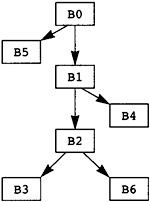

    Figure 3.4 Dominator Tree for MAXCOL

当前用于计算直接支配树的算法是由 Lengauer 和 Tarjan (1979) 开发的。该算法有两种形式，运行时复杂度为 O(\|N|ln|N|) 或 O(\|N| (\|N|))，具体取决于实现的复杂度。我没有在这里说明算法，因为它太复杂，无法在可用空间中准确描述。相反，我将给出算法的合理化，然后是 Purdom 的更简单的算法，易于理解。

Tarjan 使用在程序流程图的深度优先搜索期间收集的信息来计算支配者。请注意，B 的支配者是任何深度优先搜索树中 B 的祖先。通常它将是深度优先搜索树中的直接父级。什么时候不会这样？当在深度优先搜索树中有一条不是树边的边进入 B 时。这样的边缘意味着除了树中的路径之外，还有另一种方法可以到达 B。在这种情况下，可以成为 B 支配者的最近块是 B 树中的共同祖先和边缘的尾部。但是现在事情变得复杂了，因为该块可能不是支配者，因为另一条边进入了其中一个块。

为了解决这些问题并存储我们一直在讨论的信息，Tarjan 定义了一个称为半支配数的量，并在深度优先搜索树的自下而上遍历中计算这些值。有了这些值，他可以很容易地计算出实际的支配者。

编译器将支配信息存储为树。树的节点是流程图中的块；但是，树边不一定是流程图边。树中任何节点的父节点都是它的直接支配者。对于每个块 B，编译器保留两个存储支配信息的属性：

* idom(B) 是 B 的直接支配者。
* children(B) 是块的集合，其中 B 是直接支配者。从逻辑上讲，这个信息是一个集合；但是，将信息存储为链表是有用的，由 B 支配的 B 的后继者在列表中排在第一位。这将使后面的一些优化算法更有效地工作。

此树结构导致运行示例的树如图 3.4 所示。

编译器还需要知道一组块的共同支配者。共同支配者是支配块集合的每个元素的块并且被支配集合中的每个块的所有其他块支配。这个共同支配者可以如图 3.5 所示计算。该算法的工作原理是，如果 Z 不支配 B，并且 B 不支配 Z，那么人们可以从其中一个沿着支配树向上走，找到一个支配两者的块。

尽管它计算一对的共同支配者，但该算法适用于任何一组块，因为可以通过成对计算块的共同支配者来找到共同支配者。

这是一个计算支配者的简单算法。回忆一下深度优先搜索的基本原理。访问节点 n 的深度优先搜索也会访问从 n 可达的所有节点。现在通过假设进入 n 的边不存在并且 n 不存在来假设 n 不在图中。在这个残缺图上从 Entry 开始执行深度优先搜索。哪些节点无法从之前可访问的 Entry 访问？如果没有通向它的路径，则该节点不可到达。如果它以前是可达的，这意味着 n 在这些不可达节点的每条路径上。换句话说，n 是所有这些不可达节点的支配者。因此，该算法包括执行单个深度优先搜索以确定所有可到达节点。丢弃无法访问的节点。现在对于流程图中的每个节点 n，假设 n 不在图中，并从 Entry 开始重复深度优先搜索。不可达的节点是n支配的节点。

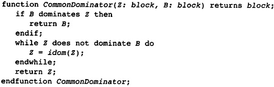

    Figure 3.5 Computing the Common Dominator

3.4 后支配者
************

如果编译器将计算移动到流程图中的较早点，则支配信息会给出流程图中将计算移动到的安全位置。编译器可以将计算移至当前块的每条路径上的较早块。相反的信息也很有用。如果编译器想要将计算移到稍后的位置，它可以移到哪里？这个问题引出了postdominance 的想法，它与dominance 具有相似的特征，除了路径是从B 到Exit 而不是从Entry 到B，并且使用后继块而不是前驱块。

**定义**

*后支配：* 当且仅当从 B 到 Exit 的每条路径都包含块 X 时，块 X 后支配块 B。

支配的相应性质成立。实际上，后支配只是反向图上的支配关系，其中后继者被前辈取代，反之亦然。通过计算反向图上的支配，可以使用相同的算法来计算后支配。信息可以存储为树，如图 3.6 所示。 后支配的属性如下：

* pdom(B) 表示 B 的直接后支配者，并表示 B 在后支配者树中的父级。
* pchildren(B) 表示立即由 B 后支配的块的集合。这再次表示为实现为链表的集合，其中 B 的前辈也由 B 支配，在列表中首先出现。

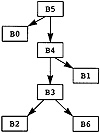

    Figure 3.6 Postdominator Tree for MAXCOL

3.5 支配边界
************

考虑任何离开块 B 的路径。最初路径上的块由 B 支配。最终到达一个不由 B 支配的块。除非路径返回到 B，否则之后的所有块都不受 B 支配。不被 B 支配的第一个块是重要的，因为它指示了 B 支配的块的范围，并使用有关 B 中的计算的信息指示了优化的限制。考虑到所有路径，拥有该特征的块的集合称为支配 B 的边界。

**定义**

*支配边界：* 块 B 的支配边界 DF(B) 是所有块 C 的集合，使得 B 支配 C 的前任，但 B 等于 C 或 B 不支配 C。

该定义是对前述动机的重述。如果 C 是一个块，其前任由 B 支配而 C 不是，则存在从 B 到前任的路径。将该前任的边添加到 C 中，并且一条路径与动机相匹配。显然，与动机相匹配的路径会在支配边界中引入块。

请注意，块 B 是特殊处理的。从 B 开始的循环，经过由 B 支配的块并返回到 B，将 B 引入支配边界。

可视化支配边界的一种方法是考虑以 B 为根的支配树的子树。从该子树中的一个块到子树外部块的流程图边将子树外部的块引入支配边界。为了便于讨论，B 被认为在子树之外。

这为计算支配边界提供了一个简单的算法。自下而上遍历支配树，在父级之前计算子级的支配边界。在考虑块 B 时，有两种情况：

离开 B 且不导致 B 在支配树中的子节点的流图边必须到达等于 B 或不被 B 支配的块。（如果块由 B 支配，则 B 必须是它的直接支配者，所以它是一个孩子。）这样的块属于 B 的支配边界。

考虑支配树中 B 的一个孩子 C 的支配边界中的块 X。如果 X 不等于 B 并且不被 B 支配，那么它在 B 的支配前沿。如果 X 被 B 支配，那么 B 必须是它的直接支配者，因为它不被 C 支配。由于 B 不是它自己的直接支配者，这两个条件可以结合起来给出图 3.7 所示的算法。

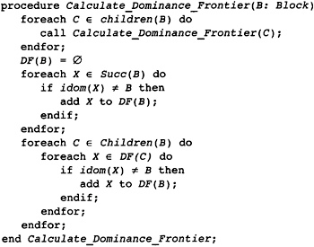

    Figure 3.7 Computing the Dominance Frontier

.. table:: Table 3.2 支配边界
   :align: center
   :widths: auto

   +----+----------+
   | 块 | 支配边界 |
   +====+==========+
   | B3 | B2 B4    |
   +----+----------+
   | B6 | B3       |
   +----+----------+
   | B2 | B2 B4    |
   +----+----------+
   | B4 | B1 B5    |
   +----+----------+
   | B1 | B1 B5    |
   +----+----------+
   | B5 | Ø        |
   +----+----------+
   | B0 | Ø        |
   +----+----------+

考虑图 3.1 中支配树的运行示例。 自下而上的支配树遍历首先访问块 B3、B6、B2、B4、B1、B5，然后是 B0。 随着行走的进行，支配边界被计算出来（见表 3.2）。 在支配边界的计算中，B3 发现 B2 和 B4 在其支配边界中，因为它们是继任者，不受 B3 的支配。 类似地，B6 在其支配边界中找到 B3。 在计算 B2 的支配边界期间，B3 不会处于其支配边界，因为 B2 支配 B3。 但是，B2 处于 B2 的支配边界。

3.6 控制依赖
************

编译器需要知道一个块的执行导致另一个块的执行的条件。这里描述的想法来自 Cytron（1987、1990 和 1991）。考虑两个块 B 和 X。B 何时控制 X 的执行？

如果 B 只有一个后继块，它不控制任何事情的执行。一旦 B 开始执行，它就完成执行并进入下一个块。因此 B 必须有多个后继者才能被视为控制 X 执行的块。

B 必须有一些离开它的路径通向 Exit 块并避开 X。如果这不是真的，那么 B 的执行将始终导致 X 的执行。换句话说，B 不能被 X 后支配。

B 必须有一些离开它的路径通向 X。同样，这个条件的失败将违反控制的概念。因此 B 可以被视为一个开关：某条出路通向 X，另一条出路避开 X。

B 应该是具有此特性的最新的块。确实，较早的块可能同样控制 X 的执行；但是，该块可以被视为控制 B 的执行，然后 B 控制 X 的执行。

所有这些条件都可以概括为以下定义。

**定义**

*控制依赖：* 当且仅当存在从 B 到 X 的非空路径使得 X 后支配除了 B 之外的路径上的每个块时，块 X 是依赖于块 B 的控制。X 与 B 相同，或者 X 不后支配 B 。

第一个条件总结了 B 是具有到 X 的路径的最新块的想法。如果有满足另一个条件的较晚块，则 X 不会在路径上的所有块中占后支配地位。第二个条件与第一个条件中路径的存在一起给出了切换条件。有一种方式通过 B 可以避开 X，而另一种方式必须通向 X。

需要对控制依赖进行更精确的定义，因为编译器需要了解切换机制，从 B 中出的边必须导致 X。这涉及对记录所涉及边的定义的补充。

**定义**

*控制依赖：* 块 X 控制依赖于边 (B,S) 当且仅当有一条从 B 到 X 的非空路径从边 (B,S) 开始，使得 X 后支配路径上除 B 之外的每个块。X 要么与 B 相同，要么 X 不后支配 B。

不幸的是，该定义使用了一些未知的路径。为了有一个计算控制依赖的有效方法，编译器需要一个更一般的条件。幸运的是，条件与 X 后支配 S 相同。

**观察**

如果 B 和 X 是流程图中的块，其中存在从每个块到 Exit 的路径，则 X 后支配 B 的后继 S 当且仅当存在从 B 到 X 通过 S 的非空路径使得 X 后支配该路径上 B 之后的每个节点。

**证明**

假设路径存在。因为 S 在路径上，所以 S 被 X 后支配。相反，假设 S 被 X 后支配。从 S 到 Exit 有一些路径。由于 S 受 X 后支配，因此 X 在这条路径上。在 X 处剪短路径并将 B 和从 B 到 S 的边添加到路径的开头。这给出了从 B 到 X 的路径。路径上除 B 之外的每个节点都由 X 后支配。如果不是，则有一条从它到 Exit 的路径，通过剪切原始路径并粘贴到新路径中，一个可以创建一条从 S 到 Exit 的路径，从而避免 X，这是一个矛盾。因此我们有该路径。

**观察**

如果 S 是 B 的后继者，则要么 S 是 B 的后支配者，要么 pdom(S) 被 pdom(B) 后支配。

**证明**

假设 S 不是 B 的后支配者。考虑从 S 到 Exit 的任何路径。有可能延伸到从 B 到 Exit 的路径。因此，pdom(B) 在这条路径上。因此 pdom(B) 不等于 S 并且在从 S 到 Exit 的每条路径上，因此它是 S 的后支配者。因此它必须后支配 pdom(S)。

现在我们可以给出一个计算控制依赖关系的算法。看定义：边(B,S)是给定的。哪些块是控制依赖于这条边的？任何后支配 S 并且不后支配 B 的块。这些是后支配树中的节点，从 S、pdom(S)、pdom(pdom(S)) 开始，并在但不包括 pdom(B) 处停止。第二个观察表明，通过父母（后支配者）向上遍历树，算法必须最终到达 pdom(B)。

图 3.8 中的算法可以应用于每条边。实际上，它需要应用于留下具有多个后继者的块的每条边，因为具有单个后继者的块可以没有依赖于它的块控制。对于我们的运行示例，这给出了表 3.3 中的结果。有时编译器需要转置这些信息：对于每个块，它依赖于哪些块。在这种情况下，使用相同的算法；然而，信息是由依赖块而不是由导致依赖的边索引存储的。

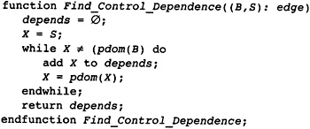

    Figure 3.8 Calculating Control Dependence

.. table:: 表 3.3 示例程序的控制依赖关系
   :align: center
   :widths: auto

   +----------+-----------------------+
   | 边 (B,S) | 控制依赖于 (B,S) 的块 |
   +==========+=======================+
   | (B0,B5)  | ∅                     |
   +----------+-----------------------+
   | (B0,B1)  | B1, B4                |
   +----------+-----------------------+
   | (B1,B4)  | ∅                     |
   +----------+-----------------------+
   | (B1,B2)  | B2, B3                |
   +----------+-----------------------+
   | (B2,B3)  | ∅                     |
   +----------+-----------------------+
   | (B2,B6)  | B6                    |
   +----------+-----------------------+
   | (B3,B2)  | ∅                     |
   +----------+-----------------------+
   | (B3,B4)  | ∅                     |
   +----------+-----------------------+
   | (B4,B1)  | B1, B4                |
   +----------+-----------------------+
   | (B4,B5)  | ∅                     |
   +----------+-----------------------+

3.7 循环和循环树
****************

优化编译器试图减少程序执行期间发生的计算次数。因此，编译器需要确定程序中最常执行的区域并集中精力改进它们。在编译时确定频繁执行的区域是不切实际或不可能的。然而，重复执行的程序部分，即循环，是最佳候选者。因此编译器构建了一个数据结构来表示有关循环的信息。

**定义**

*环形：* 循环是一组块 L，如果 B0，B1 ∊ L，则存在从 B0 到 B1 的路径和从 B1 到 B0 的路径。如果 B 有一个不在 L 中的前任，则块 B ∊ L 是入口块。如果 B 有不在 L 中的后继者，则块 B ∊ L 是退出块。

换句话说，循环是程序的一个区域，其中执行路径可以重复地从一个块循环到另一个块。入口块是执行可以进入循环的块，退出块是执行可以离开循环的块。由于我们假设从 Entry 到任何块都有一些执行路径，因此每个循环必须至少有一个入口块。
有趣的循环是具有单个入口块的循环，或单入口循环。对于这样的循环，入口块必须支配循环中的所有其他块。如果存在避开入口块的路径，则路径上的循环中必须存在第一个块，并且该块将是另一个入口。

图 3.9 给出了计算单入口循环的循环块的算法。考虑任何块 B。它可以成为单入口循环的入口块的唯一方法是在流程图的某个深度优先搜索行走中是否存在后边。考虑替代方案：循环中的入口块必须包含在循环路径中，并且是循环中到达的第一个块。因此，循环中的所有块都将是 B 在遍历中的后代，并且通向 B 的边是后边。

该算法背后的想法是向后走循环。考虑 B 的每个前驱来自后边。从这些前驱向后走图。最终走回到 B，并且循环中的所有块都将被访问。该算法使用工作列表算法实现了这个想法。集合队列包含所有已知在循环中但其前驱尚未处理的块。每个块最多被插入一次队列，因为队列∴循环并且插入仅在块尚未在循环中时发生。

稍后我们将推广这个算法来处理多入口循环，并用它来计算循环的嵌套结构。编译器不仅需要知道循环，还需要知道哪些循环包含在其他循环中。请注意，编译器计算循环的方式将确保所标识的循环是不相交的（没有共同的块）或嵌套的（一个循环是另一个循环的子集）。嵌套结构用于三个目的：

1. 编译器在基于依赖的优化期间使用循环嵌套，因为这些阶段转换循环以提高程序性能。
2. 循环嵌套用于执行一种强度降低。 在循环的每次迭代期间以常规方式修改的值可以以更有效的方式计算； 例如，乘法可以用重复的加法代替。
3. 在寄存器分配期间使用循环嵌套来查找程序中可以存储值或从内存中加载值的点。

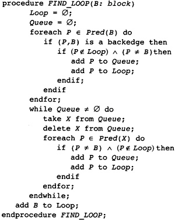

    Figure 3.9 Template of Code for Finding a Loop

3.7.1 无限循环
==============

一个循环可能没有退出块，在这种情况下它是一个无限循环。这样的循环可能发生在实际程序中。考虑一个程序，它使用硬件中断或信号机制来执行所有操作，而主程序仍处于循环中。程序员可以把这个循环写成一个无限循环。这些是结构性的无限循环。由于程序执行期间发生的实际计算，可能存在编译器无法确定的其他无限循环。

当存在这些结构性无限循环时，许多全局优化算法会给出错误的结果。这些算法都是基于减少从入口到出口的路径计算数量的想法。如果有一个没有这样的路径的块，算法可能会以意想不到的方式执行。

一个简单的设备消除了这些结构性的无限循环：从循环中的一个块插入一条边到退出。当然，这条边永远不会被遍历，因为块中没有指令可以使程序沿着这条边流动。但是，优化算法现在将正常执行。

编译器如何识别这些无限循环？如果没有从它到 Exit 的路径，则该块处于无限循环中。因此，在流程图的反向上执行深度优先搜索（将前驱视为后继，反之亦然）。未被访问的块是无限循环中的块。在深度优先搜索之后，选择一个未被访问的块，在它和 Exit 之间创建一条边，然后尝试使用这条边继续进行深度优先搜索。图 3.10 描述了这个算法。

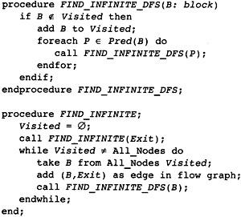

    Figure 3.10 Eliminating Infinite Loops

3.7.2 单入口和多入口循环
========================

如前所述，循环可以按入口块的数量进行分类。 没有入口块的循环是不可达的：指令无法执行，因此这些循环已经被消除。 单入口循环对于优化器来说是最有趣的。 必须处理多入口循环，因为它们可能出现在程序中； 但是，优化技术不会那么有效。 许多优化技术仅适用于单入口循环。 [1]_

.. [1] 单入口循环通常称为可约循环。多入口循环称为不可约循环。该编译器使用优化单入口循环的技术。识别多入口循环以确保不发生不正确的翻译。

编译器如何识别多入口循环？循环是循环路径的联合。考虑这些循环路径之一。在深度优先搜索期间，访问的路径上有第一个块 B。循环上的所有其他块都是 B 的后代，进入 B 的循环边是后边。因此，通过考虑这些前辈并向后走循环，可以找到如图 3.9 所示的带有条目 B 的循环。多入口循环的问题在于，此遍历可以从循环中逃脱（向后遍历其他入口之一）并最终一路返回入口。这意味着B不支配这些前辈。考虑图 3.11 中的多入口循环 {C,D} 。如果深度优先搜索按 {A,C,D,E,B} 的顺序访问块，则 C 是循环中被访问的第一个块。边 (D,C) 是后边。当从 D 向后走时，访问 {D,C,B,A}。

为了避免这个问题，必须修改算法以停止后向行走。但是步行应该停在哪里？编译器想要一个单入口区域，即使它不是循环。因此，在最靠近循环且支配循环中所有块的块处停止步行。这将是控制标头 B 和 B 的所有前辈通过后缘到达 B 的块。回想一下，B 支配自己。使用这些信息，图 3.9 中的算法被修改为图 3.12 中的算法。

该算法实现了我们刚刚讨论的想法。请注意，当遇到多入口循环时，此时不会计算循环体。相反，导致循环体的块集记录在称为生成器的属性中。在开始循环识别之前，该集合将被初始化为空。具有非空生成器集的块是多入口循环的直接支配者。由于以下原因，无法立即识别循环体：

我们很快就会看到，整个过程都嵌入在深度优先搜索中，在该搜索中，从一个块开始的循环会在遍历的所有块都处理完之后才被识别。记录生成器集允许这对于多入口循环也是如此。

不止一个多入口循环可以有相同的直接支配者。对于形成循环嵌套的过程，聚合将被视为一个循环。

我们将能够更有效地处理此循环中包含的循环。考虑一个多入口循环，入口块 B1 和 B2 具有公分母 C。通过延迟循环的识别直到所有后继者都被识别，将处理发生在 C 和 B1 或 C 和 B2 之间的路径上的循环作为嵌套循环。如果此子循环是单入口循环，则可以对其应用整套优化。如果在处理 B1 或 B2 时创建了多入口循环的主体，则这些子循环不会被视为单独的循环。

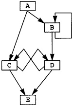

    Figure 3.11 Example Multiple-Entry Loop

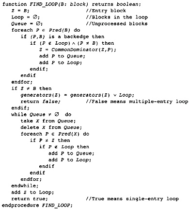

    Figure 3.12 Identifying a General Loop

我们将对 FIND_LOOP 稍作修改，以构建测试循环树，但这是基本算法。 当找到一个单入口循环时，循环体被识别。 当找到一个多入口循环时，循环体的识别被延迟到块Z的处理。这个循环体由非空生成器（Z）集合的存在来识别。

后面的描述将 FIND_LOOP 分为两个过程：第一个找到生成器，第二个找到循环体。 该过程被拆分，以便查找多入口循环的主体可以使用与单入口循环相同的代码。

3.7.3 计算循环树
================

编译器需要完整的循环集和循环之间的关系。此信息存储为树。循环 L1 是 L2 的孩子当且仅当 L1 是 L2 的子集并且不包含在 L2 中包含的任何其他循环中。用于计算循环的算法找到具有特定标头块的最大循环。这确保了两个循环要么不相交，要么一个包含在另一个循环中，这种条件允许将循环组织成一棵称为循环树的树。循环树中有四种节点：

1. 树的叶子是流程图中的块。
2. 单入口循环是树中内部节点的一种形式。
3. 组织为单入口区域的多入口循环是内部节点的另一种形式。回想一下，多入口循环包括循环以及从循环返回到循环中所有块的公共支配者的所有树节点。
4. 树的根是代表整个流图的特殊节点。它不会是循环或块，因为流程图包括两个块：没有前驱的入口和没有后继的出口。这些块不能参与循环并且不是单个块。

为了记录树结构，将属性添加到块和循环树中的其他节点：

LoopParent(X) 是一个属性，指示该节点是树中哪个节点的子节点。它还指示循环或块包含在哪个循环中。LoopParent(X) 也可以是根，指示此块或循环不包含在另一个循环中。根的 LoopParent 为 NIL。

LoopContains(X) 是由 X 表示的区域中的节点集合。对于一个块，它是 NIL。对于循环或根，它是树中 X 的子集的集合，与直接包含在该区域中的循环或块的集合相同。

LoopEntry(X) 是作为该区域入口的块。

这些属性允许循环树周围的自由时刻，完全了解哪些块和循环包含在其他块和循环中。

随着循环树的建立，每个循环都被识别并输入到树中。一旦它被输入到树中，它就会被作为一个单一的实体来处理。在构造过程中，它的内部结构不再被查看。算法 FIND_LOOP 被修改以处理树节点并被扩充为完整构造过程的一部分。为了形成这棵树，我们需要对算法进行两处修改：

1. 按后序考虑图中的块。由于深度优先搜索的结构，包含在另一个单入口循环中的单入口循环具有具有较小后序号的入口块。因此，通过后序访问块，内部循环在外部循环之前被识别。
2. 一旦确定，将每个循环当作一个单独的块来处理。这是通过为每个块或循环保留一个数据来完成的，该数据指示它包含在哪个块或循环中（如果有的话）。当一个人找到一个块时，使用这个数据向外扫描到包含这个块的最外面的识别循环。

编译器现在拥有完整的算法。在图 3.13 中，我们有 FIND_LOOP 的最终版本，它计算块，称为生成器，确定循环中的所有其他块。如果是单入口循环，则 FIND_LOOP 继续并使用 FIND_BODY 在循环树中构建节点。

FIND_BODY 通过从生成循环的块向后移动到头部来计算循环体中的节点集（参见图 3.14）。中间的所有块都在循环中。它在循环树中构建节点并填充所有属性。必须注意确保块和已经计算的循环之间的区别。循环头和前驱总是块。在将节点插入循环树之前，编译器必须找到已计算的最大封闭循环。这是由 LoopAncestor 完成的，如图 3.15 所示。

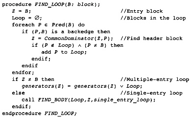

    Figure 3.13 Computing Generators of a Loop

LoopAncestor 通过向上扫描 LoopParent 属性来查找包含当前循环或块的最外层已处理循环，直到找到具有空条目的节点。由于一旦识别出封闭循环，该属性就会由 FIND_BODY 更新为非空条目，因此该算法给出了最外层的现有循环。

最后，可以描述计算循环的主要过程（见图 3.16）。 Calculate_Loop_Tree 首先执行深度优先搜索以计算每个节点和后边缘的后序数。该实现可以在计算算法的其余部分的同时执行这种深度优先遍历，只需在访问节点后将计算嵌入到递归深度优先搜索过程中。

首先Calculate_Loop_Tree 初始化块的所有属性。这些可以在创建块时初始化；但是，为了完整起见，此处描述了该步骤。然后程序按后序访问块。如果生成器集非空，则该块是多入口循环的头部，因此构建该循环。然后该过程检查该块是否是单入口循环的头部。请注意，一个块可能是多入口循环和单入口循环的头部。在这种情况下，编译器构建两个循环的嵌套：多入口循环是最内层循环，单入口循环是外层循环。图 3.17 给出了我们常设示例的循环树。

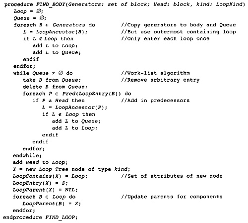

    Figure 3.14 Computing the Body of a Loop

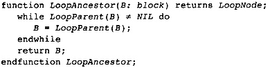

    Figure 3.15 Finding the Outermost Processed Loop

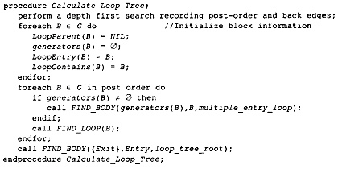

    Figure 3.16 Computing the Complete Loop Tree

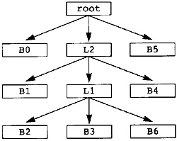

    Figure 3.17 Loop Tree for Example Program

3.8 实现整数集
**************

在整个编译器中，需要整数集。我们已经看到了一个例子：在深度优先搜索期间访问的一组节点。有多种方法可以实现这些集合，具体取决于计算和使用它们的要求。

一种形式的集合由节点组成，其中构造算法保证我们不会尝试两次添加相同的节点，或者集合很小，因此通过集合的搜索时间很短。在这种情况下，集合可以实现为链表。插入包括将元素添加到列表的开头或结尾。删除包括从链表中删除元素，搜索包括扫描链表。这种形式的集合对于扫描集合中的所有元素是有效的，但对于插入或删除来说效率不高。

另一种方法是使用位向量来表示集合。为值域中的每个可能元素分配一个唯一的整数值，从 0 开始。然后将任何集合表示为长度为分配的最大数加 1 的位数组。这种技术提供了插入的有效实现（查找的索引位并设置它），删除（索引以找到该位并将其清除），并集，交集和搜索（索引以查找该位并检查它是否为1）。如果集合不是稀疏的，那么这种方法在空间上非常有效。但是，扫描集合中的所有元素效率不高。不幸的是，扫描是编译器中的常见活动。

Preston Briggs (1993) 基于 Aho、Hopcroft 和 Ullman (1974) 中的提示开发了另一种技术。这种技术在所有领域都非常有效操作；但是，它比位向量占用的空间多一个数量级，因此如果需要大量集合，则不希望使用它。

考虑我们的整数世界，编号从 0 到 MAX。分配具有初始 INDEX[0:MAX] 和 VALUE[0:MAX] 以及单个整数变量 NEXTPLACTE 的两个 MAX + 1 个元素的数组。

算法背后的想法（图 3.18）是集合的元素存储在 VALUE 中，从底部开始，并将它们堆积在相邻的槽中。当元素 X 添加到 VALUE 时，VALUE 中存储它的索引将放置在 INDEX(X) 中。否则 INDEX 的值不会被初始化。奇怪的是，该算法正在处理未初始化的数据。

算法如何知道值何时在集合中？它检查相应的 INDEX(X)。该信息可能未初始化，因此首先检查该值是否在范围内。如果不是，则该元素不在集合中。如果值在范围内，它仍然可以未初始化，因此它检查 VALUE 数组中的相应值。如果值匹配，则算法知道该元素在集合中。

从集合中删除一个元素有点棘手。该算法必须在恒定时间内运行，因此它不能删除一个元素并将其他元素向下移动。相反，它将集合中的最后一个元素向下移动到正在腾出的位置。同时它调整它的 INDEX 值并减少计数器 NEXTPLACE。

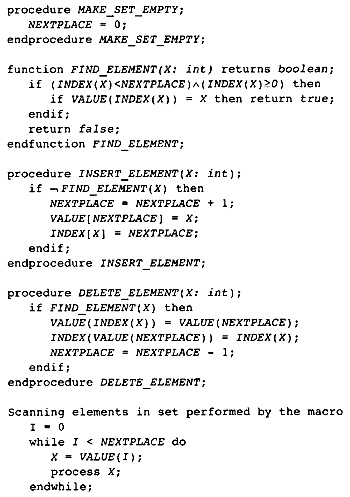

    Figure 3.18 Efficient Set Algorithm

基本操作发生在 O(1) 时间内，扫描集合中的元素与集合中的实际元素成正比。不过，它确实需要更多空间。考虑一个元素由 16 位数字表示的实现。因此，每个元素有 32 位，表明这种表示法占用的空间是位向量方法的 32 倍。因此，当只需要少量集合（通常是一两个）时，这种表示就可以很好地工作。

3.9 参考文献
************

Aho, A. V., J. E. Hopcroft, and J. D. Ullman. 1974. The design and analysis of computer algorithms. Reading, MA: Addison-Wesley.

Briggs, P., and L. Torczon. 1993. An efficient representation for sparse sets. ACM Letters on Programming Languages and Systems 2(1-4): 59-69.

Cytron, R., and J. Ferrante. 1987. An improved control dependence algorithm. (Technical Report RC 13291.) White Plains, NY: International Business Machines, Thomas J. Watson Research Center.

Cytron, R., J. Ferrante, and V. Sarkar. 1990. Compact representations for control dependence. Proceedings of the SIGPLAN ‘90 Symposium on Programming Language Design and Implementation. White Plains, NY. 241-255. In SIGPLAN Notices 25(6).

Cytron, R., J. Ferrante, B. Rosen, M. Wegman, and F. Zadeck. 1991. Efficiently computing static single assignment form and the control dependence graph. ACM Transactions on Programming Languages and Systems 13(4): 451-490.

Fischer, C. N., and R. J. LeBlanc, Jr. 1988. Crafting a compiler. Redwood City, CA: Benjamin/Cummings.

Lengauer, T., and R. E. Tarjan. 1979. A fast algorithm for finding dominators in a flow graph. Transactions on Programming Languages and Systems 1(1): 121-141.

Lorho, B. 1984. Methods and tools for compiler construction: An advanced course. Cambridge University Press.

Purdom, P. W., and E. F. Moore. 1972. Immediate predominators in a directed graph. Communications of the ACM 8(1): 777-778.

Tarjan, R. E. 1975. Efficiency of a good but not linear set of union algorithm. Journal of ACM 22(2): 215-225.
