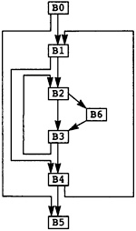

第3章 图表
##########

成为编译器编写者的首要先决条件是成为“数据结构迷”。一个人必须生活、呼吸和热爱数据结构，所以我们不会提供通常的通常出现在编译器书籍中的所有背景数学的完整列表。我们假设您可以访问任何一种数据结构或介绍性的编译器编写书籍，例如 Lorho (1984) 或 Fischer and LeBlanc (1988)。这种设计假设您熟悉以下主题，这些主题由每个主题参考的数据结构书籍介绍。

等价关系和分区。编译器经常计算等价关系或分区集。等价关系经常被表示作为一个分区：将所有相互等价的元素组合在一起元素集。因此，整个集合可以表示为一组不相交的集合元素。分区经常被实现为 UNION/FIND 数据结构。这Tarjan (1975) 开创了这种方法。

*集合上的偏序关系* 。编译器包含许多显式和隐式偏序。例如，表达式的操作数必须在表达式之前计算。编译器必须能够表示这些关系。

本章讨论的主题与图表有关。一些编译器中的数据结构，例如结构流图和调用图，表示为有向图。无向图用来表示寄存器分配的干扰关系。因此，这里讨论的主题是用于实现编译器的理论范围。讨论的主题如下：

* 用于实现有向图和无向图的数据结构
* 深度优先搜索和有向图中边的分类
* 支配者、后支配者和支配前沿
* 计算图中的循环
* 代表集

3.1 有向图
**********

有向图由一组节点 N 和一组边 E 组成。每条边都有一个节点是它的尾巴，一个节点是它的头。有些书将边定义为有序的结点尾和头的对。然而，这使得编译器的描述更加困难。可能有两条边具有相同的尾部和头部。在包含 C switch 语句或 Pascal case 语句的流程图中，两种不同的选择具有相同的语句体将创建具有相同尾部和头部的两条边。

对于流程图，有两个特殊的节点。入口是一个没有前驱的节点，代表程序开始的点。出口是一个没有后继的节点，代表过程退出的地方。所有执行路径都从 Entry 开始；所有有限路径表示在 Exit 处完全执行结束。请注意，无限长的路径是可能的，表示流程图中的无限循环。

如果一个过程有多个入口点，这在 Fortran 中是可能的，那么创建一个不包含任何指令的单独的入口节点，在入口节点和每个真正的入口点之间都有一条边。当指令发出时，程序入口代码被插入到每个入口点。单个入口节点的存在保证了程序分析将正确执行。同样，如果有多个节点没有后继者，那么创建一个单独的出口节点，每个原始出口和出口节点之间都有一条边。

过程的每次执行都由从入口到出口的路径表示。不幸的是，反之则不然：从入口到出口的路径并不代表执行路径；例如，如果流中有两个条件分支图在相同的条件表达式上分支。在这种情况下，第二个条件分支只能在与第一个条件表达式相同的方向分支。分支的路径其他方式是不可能的。编译器无法识别这种情况，因此它假设所有路径是可能的。这个假设减少了优化的数量。

图 3.1 中的图表表示运行示例的流程图。节点BO 是入口节点。节点 B5 是出口节点。过程中的任何执行路径都是表示为 B0 和 B5 之间的路径。

有向图是使用两种不同的技术实现的。通常节点表示为一些数据结构，边表示为添加到每个节点的两个属性：节点的后继集和前驱集。 X 的后继集是作为边的头，尾为 X 的节点 Y 的集合。类似地，X 的前驱集是作为边的尾部的节点 P 的集合，其中边的头为 X。因此在图 3.1 中，B3 的前驱是 B2 和 B6，而 B3 的后继是 B2 和 B4。请注意，任何节点 X 都满足关系： X 是它的每个后继节点的前驱，X 是其每个前驱节点的后继。这些集合实现为链表，包含在数据结构中的链表的头部代表节点。

    图 3.1 Flow Graph for MAXCOL

另一种技术是为每个节点分配一个整数并表示每个节点边作为布尔矩阵中的位。如果节点 X 和 Y 之间有一条边，则该位在位置 EDGE[X,Y] 设置为真；否则为假。

后继/前驱表示的优点是扫描所有离开或进入节点的边是有效的。如果有向图是稀疏的，它也是空间有效的，就像大多数流图一样。矩阵方法在构建有向图方面更有效，因为它更容易检查特定节点是否已经是后继节点。我们将在寄存器分配期间使用矩阵方法的导出；否则，将使用后继/前驱实现。
