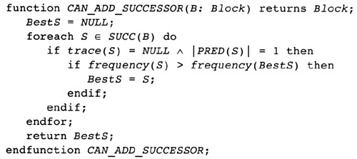
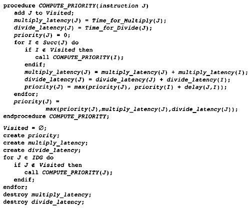

第12章 指令调度和再次调度
##########################

精简指令集计算（RISC）处理器采用简单的指令（这样保持硬件简单）来提高执行速率，还采用若干其它器件，来增加在固定时间间隔内可以执行的指令数目。

处理器是流水线化的。这意味着，单个指令在执行的时候被分解为若干个大约尺寸相同的小任务。一条指令的单个任务在一个装配线（称为流水线）上执行。流水线化提高了装配线的效率。当第一条指令完成第一个阶段时，第二条指令就可以开始执行了，或者被发出。在每个流水线上，每个指令周期可以发出一条指令。但是，一条指令发出之后，经过一到几个周期，也许没有完成求值。如果后面的指令试图使用前面指令计算的值，而前面的指令还没有完成所有流水线阶段，那么处理器会停顿，或者延迟发出第二条指令，直到第一条指令已经结束。为了提高性能，编译器会重排指令，以避免处理器停顿。[1]

.. note::

    [1] 当一个值还没有准备好时，早期的RISC处理器不会停顿。相反地，它们以垃圾数据为输入执行指令。编译器负责保证这样的执行不会发生。近期的处理器在等待操作数时都会停顿，因为有些指令不能确定等待的时间，特别是LOAD、乘法和除法指令，让调度变得困难。

处理器在相同时间会发出多条指令。处理器会加载一小组指令，称为packet，分析这些指令之间的关系。如果指令不使用或修改小组中其它指令的操作数，那么可能在相同时间发出这些指令。这提高了性能，如果处理器有多个计算单元，例如整数算术单元和浮动算术单元。

处理器可能有多个整数单元和多个浮点数单元。这时，预取指令的packet容量更大，可能同时发出多条算术指令。不是所有算术单元是相同的。这时，编译器会重排指令，这样每个packet会有指令可以在不同的算术单元上执行。

具有这三个特征的处理器称为超标量处理器。今天大多数在用的处理器是超标量的。很多处理器有一个额外的特性，称为乱序（out-of-order）执行。这样的处理器会像上面描述的那样工作，而且当packet中前面的指令由于受限而不能执行时，允许执行packet中后面的指令。这里我们不讨论这个特性，因为编译器几乎不能做什么事情来加强处理器乱序执行，对于普通的超标量处理器来说，这是不重要的。

Digital Alpha 21164处理器是超标量处理器的一个例子。考虑它是怎么匹配上述标准的。首先，Alpha不是一个乱序执行的处理器。所有指令都是按照次序执行的；如果一条指令被延迟执行，跟在它后面的所有指令也会被延迟执行。

Alpha是管线化的。大多数整数算术单元的指令需要一个时钟周期；浮动指令需要四个时钟周期。以上法则的一些例外是条件赋值、LOAD、乘法和浮点除法指令。Alpha会尝试在每个时钟周期发出四条四字节的指令。指令的block必须对齐到一个16倍数的地址。如果地址不是16倍数，那么获取包含当前指令的packet，会忽略packet中开头的指令，这样减少了这个时钟周期内可以发出的指令数目。如果packet中的指令具有依赖关系，它们不能全部发出，就会发出packet开头部分的指令，直到不能被立即发出的第一条指令。

Alpha包含两个整数算术单元和两个浮点算术单元。两个整数算术单元可以执行大多数整数指令。例外如下，一个单元做移位操作，另一个单元做跳转操作。有一个浮点乘法单元和一个浮点加法单元。有些指令被两个单元共享。

理想地，Alpha在一个时钟周期发出四条指令。其中两条指令由整数算术单元执行。另外两条指令，其中一条由浮点乘法单元执行，最后一条指令由浮点加法单元执行。这些指令在packet中出现的次序是任意的。

Alpha还有别的特征，调度器必须予以考虑。考虑load操作。它们由整数算术单元执行；但是，从内存获取数据所需的时间取决于当前哪个高速缓存或内存单元包含此数据。

Alpha包含三个片上高速缓存：一个数据缓存，一个指令缓存，一个更大的辅助缓存。基本缓存容纳8K数据，组织为直接内存映射缓存，每个cache line的长度是32字节。如果数据在这个高速缓存中，一个load操作需要两个周期。指令缓存也是8K的片上缓存；但是，这里不讨论它。

辅助片上缓存存放指令和数据。它存放96K信息，组织为三路组相联高速缓存，每个cache line包含64字节数据。如果数据在这个高速缓存中，一个load操作需要九个周期，包括把数据搬运到基本缓存。

在Alpha系统上，通常有一个大的主板高速缓存。这个缓存容纳若干兆数据，组织为直接内存映射缓存，每个cache line容纳64字节数据。如果数据在这个缓存中，一个load操作需要二十个周期，包括把数据搬运到两个更高层级的缓存。

如果数据在内存中而不在缓存中，load操作就需要更长的时间：有时在一百个周期范围内，取决于涉及的系统。这个时间太长了，使得调度器模拟其准确的时间没有意义。编译器可以用两种方法处理它。编译器可以乐观地假设数据在其中一个缓存中，针对这种情形调度指令，或者编译器意识到这些load操作会消耗大量时间，尝试尽量把它们移动到早前的位置。

程序执行管线化的效果是这样的，程序中的指令在某个点发出，经过一定数量的时钟周期才得到结果。由于硬件优化，经过多少周期而获得结果值，可能取决于它怎么被使用，因此延迟（delay/latency）是计算一个值的指令和使用这个值的指令的函数。

指令调度phase重排被编译函数中的指令，消除尽可能多的停顿。有三种不同类型的调度器，根据它们尝试在多大的函数区域重排指令：

Block调度器在单个block内重排指令。程序流图的形式不会改变。一个block重排指令，和另一个block重排指令不相关，可能的例外是在block末尾计算的值（或在block开头使用的值）。

Trace调度器在一条简单路径上的block内重排指令。选择程序中执行最频繁的路径重排指令。指令可能从一个block移动到另一个block。事实上，指令可以移动到所计算的值保证未被使用的地方（推测执行）。重排这些更大的指令序列，可以发现更多机会来消除停顿。

软件流水线器重排并复制循环中的指令以消除停顿。软件流水线的结果是一个新的循环，原始循环中的多次迭代被合并成一次迭代同时计算。

对于超标量处理器来说，block调度是不够的。如果机器在每个时钟周期可以发出四条指令，那么一个周期的延迟意味着没法执行四次潜在的计算。编译器必须想办法把计算指令移动到一起，这样它们可以同时执行。大多数block是小的，编译器必须组合来自多个block或一个循环的多次迭代的计算指令。换句话说，编译器必须执行某种形式的trace调度和软件流水线。

到此刻为止，我们忽略了执行指令所需的时间和处理器发出指令的方式。指令调度phase重排指令以避免停顿。图12.1的Alpha指令序列计算表达式A = (B + C) + D * E，如果按照源语言所描述的次序执行指令，就会浪费两个周期。初始的load操作需要两个周期，从数据缓存中获取数据。可以利用这些周期执行后面的load操作，允许load和后续的乘法和加法重叠。

    Figure 12.1 Instructions Before (left) and After (right) Scheduling

图12.1间接显示出三个顾虑。首先，原本的指令序列只用三个寄存器就可以执行。重排后的序列需要四个寄存器。重排指令可能增加所需寄存器的数目，让寄存器分配更困难。也有这样的情形，指令调度减小了所需寄存器的数目；但是，这很少见。总的来说，指令调度让寄存器分配更困难。

第二个问题是，当寄存器分配无法为所有临时变量分配物理寄存器时，会发生什么。寄存器分配器会插入store和load操作，把数据写到内存或者从内存读取数据。这些指令破坏了原始的指令调度，在寄存器分配之后可能需要重复指令调度。在第二次指令调度时，大多数临时变量已经赋予了物理寄存器，因此指令可移动的范围变小了。

第三个问题在上面的例子中是隐晦的。Alpha处理器同时可以发出四条指令。在这个例子中，可发出的指令总是不超过两条。很多周期没有指令可以发出，这样浪费了很多启动指令的机会（周期）。编译器怎样变形程序才能获得更多可发出指令？我们已经讨论了一种方法：循环展开。如果图12.1的代码是一个循环中的数组引用，那么循环的四次迭代可以同时执行，利用很多浪费的时钟周期。

12.1 指令调度phase的结构
*************************

编译器按组调度block：每个小组是支配者树的一条路径。注意，这是扩展的block的一般化。每个扩展的block是支配者树的子树，扩展的block构成的路径是支配者树的一条路径。一种trace调度方法在扩展的block上调度指令，因此这是那种技术的一般化。在调度block的时候，依次执行下面的操作：

1. 创建支配者树。支配者树是全局调度的基础数据结构。编译器用它找出可统一调度的路径。在调度指令的时候，它还会对指令执行值编码算法，在将被调度的路径上消除无用的计算。

2. 找出所有单block循环。对这些循环执行软件流水线。这涉及创建若干个block，以存放开始循环的指令、结束循环的指令和循环的副本，仅当执行的迭代很少时存放循环的副本。把这些block插入到支配者树中，原来的block标记为已调度单block路径的一个成员。

3. 为了执行指令调度，编译器需要知道在block和它支配的block之间有哪些临时变量被使用或定义。它们被称为IDEES和IUSE集合（不久我们会讨论如何计算它们）。编译器在开始调度之前计算它们。

4. 计算贯穿支配者树的路径或者trace，其上的block将被统一调度。有两种截然不同的组成trace的准则。如果执行频率是已知的，那么首先选择执行频率最高的路径，然后选择执行频率较小的路径。如果两个block具有相似的执行频率，那么更有可能与其前驱或后继合并的block被添加到路径中。

5. 现在对支配者树执行深度优先搜索。当到达开始一个trace的block时，调度这个trace。随着编译器遍历支配者树，它执行值编码算法，以找出重复的指令。重复的指令可以被删除，不需要调度。调度分成两个部分：计算指令之间的冲突图（interference graph），然后调整指令次序，让尽可能多的指令重叠执行。

和其它trace调度的方法不同的是，这个算法处理流图中的临时变量。后面会分配寄存器。在寄存器分配之后执行指令调度，每个trace是一个block，因此指令调度只发生在一个block之内。这时，只有那些插入了新指令的block需要再次调度。

12.2 Phase次序
***************

调度器执行两次。它跟在限制资源phase之后，所以我们知道，在程序中任意的点，有足够的寄存器存放所有的值。它在寄存器分配之前，所以还存在临时变量。它重排程序中的指令，生成相同程序的一个正确表示。在寄存器分配之后，调度器可能被再次调用，如果程序中插入了挤出（spill）操作。注意，窥孔优化在调度前执行。这样，指令调度phase附近的phase执行序列如图12.2所示。

指令调度发生在临时变量被绑定物理寄存器之前，前后移动指令的自由度相对更大。这可能会增加程序中每个点的活跃寄存器的数目。因此，必须约束调度器，在程序中的每个点，不让所需寄存器的数目增加到超过可用寄存器的数目。如果这对指令调度器限制得太多，我们将改变限制资源phase，进一步减小寄存器压力。当我们测试真实程序时，可以实验性地做这件事。

    Figure 12.2 Sequence of Phases Involving Scheduling

指令调度可以为窥孔优化创造机会。对于访问相同位置的load和store操作，它可以移动它们，让它们相邻。因此，当调度器调度指令的时候，它必须准备好作一些形式受限的窥孔优化。执行寄存器分配之后，可以再次调用指令调度器，如果寄存器分配器生成了新的指令。如果分配寄存器的时候没有发生寄存器挤出（spilling），就没有必要执行第二次指令调度。

12.3 例子
***************

这里给出两个例子，来说明指令调度。首先，图12.3是可运行例子的内层循环。我们会调度这个循环体，提高一些性能，即使循环包含的指令不多。这是真实程序中很多循环的典型情况。

图12.4给出了相应的调度后的流图片段。循环中的所有store操作被移走了，superblock[2]转换把指令复制到了循环的末尾，以改善指令调度。

.. note::

    [2] Superblock调度在附录B中讨论。

图12.5的例子有两个用途。编译器会软件流水线化这个循环，重叠多次迭代的执行。除了展示软件流水线，我们会用这个例子说明编译器将如何编译一个未作软件流水线化的循环。这样的循环可能会被展开，为了增加可以调度的指令。

    Figure 12.3 Inner Loop of Example

    Figure 12.4 Instructions in the inner Loop

    Figure 12.5 Vectorizable Loop

图12.6给出了循环被软件流水线化时前面的编译器phase产生的指令。循环体包含一次循环迭代的指令。图12.7给出了假设循环不会被软件流水线化时所生成的指令。循环按照四次被展开，于是有些计算可以重叠。在这个例子中，编译器可能实际上按照四次以上展开循环；但是，作为一个例子，展开得更多没有意义。

    Figure 12.6 Instructions for Vectorizable Loop

    Figure 12.7 Unrolled Loop

在描述调度算法本身之前，我们来讨论五个话题，它们构成了调度的基础：

编译器不是在单个block中调度指令，而是在一组block中调度指令，这组block称为trace。首先编译器必须计算trace。然后调度trace中的指令，就像这些指令来自单个block。

如同一会你将看到的，trace不必是流图中顺序相邻的block。当它们不相邻时，编译器必须计算这样的临时变量，它们在trace中的多个block之间被使用或定义。

当trace和block间的信息是已知的时候，编译器会计算一种称为冲突图（interference graph）的数据结构，它描述哪些指令必须在其它指令之前求值，必须提前多长时间发出这些优先的指令。

就在指令被调度之前，编译器必须为每条指令估算从它开始执行到trace的末尾需要多少个时钟周期。这被称为关键路径信息，调度指令时会根据该信息选择指令。

在调度指令的时候，编译器模拟指令的执行，在每个执行周期跟踪记录处理器的哪些功能单元是忙碌的。跟踪的方法是维护一组状态信息，在每个周期更新它。预先计算功能单元所能达到的所有状态，将此表达为一个有限状态机，这样做更高效。更新状态，然后规约到一个状态转移。

我们将依次讨论这些话题，然后在结束的时候给出调度算法。

12.4 计算trace
***************

同时调度多个block的想法以trace调度的形式流行开来，trace调度是Fisher（1981）提出的。他注意到，大多数程序的一部分block比其它block更频繁地被执行。如果我们选择一个这样的block然后扩展它，添加它前面的block和后面的block，形成一条block的路径，那么我们可以一起调度这些block中的所有指令。当然，编译器必须插入指令以修复跳转指令的效果，包括跳入和跳出这条路径。

Trace调度表现良好，但是它有一个严重的弱点。这些为了修复跳入和跳出trace而插入的指令称为补偿代码，它们的数量可以很大，它们本身可能没有经过良好的调度。因此，具有单个主导trace的流图会得到良好的调度（大部分时间消耗在单个trace中）。但是，如果流图有多个重要的trace，或者找不出单个主导trace，调度的效果就没有那么好，因为补偿代码会让程序变慢。

Freudenberger, Gross和Lowney（1994）注意到，如果选择这样一个trace，不存在从trace外的block到trace的跳转分支，trace中的block是trace中唯一的另一个block的后继节点，那么可以消除大部分补偿代码。消除了大部分补偿代码，这个算法给出的性能和通用的trace算法几乎一样好。这些trace的另一个名字是扩展的block（extended block）。

| **定义**
| *扩展的block：*

流图中的扩展的block是满足下列条件的一组block：

在扩展的block中存在单个block B0，它在扩展的block中没有前驱节点。它所有的前驱节点出现在扩展的block之外。

在扩展的block中，每个除B0之外的block B都有单个前驱节点，这个前驱节点是扩展的block的成员。

换句话说，扩展的block是流图中的一棵block的树。Lowney建议，trace取扩展的block中的一条路径。

本调度器是基于这种想法的一般化，Sweany和Beaty（1992）提出了这种想法，后来Huber（1995）改进了它。Sweany选择支配者树中的路径作为trace。一个trace由一个block序列组成，其中每个block是下一个block的直接支配者。然后，调度这个trace，就像调度一个block的指令。在这个trace中向前或向后移动指令，这样有些指令可能被移动到执行频度较小的点，或者被移动到其执行时间可以被隐藏的位置。

将Sweany的准则应用于扩展的block。扩展的block中的每个block要么是入口block，要么在扩展的block中受它的前驱节点支配。然而，Sweany的trace定义允许其它可能的trace。考虑程序中的一个结构化的if语句。如果两个可选的分支具有几乎相等的频度，那么构建这样一个trace可能更好，它由开头的分支语句和末尾的汇合语句组成。

这种指令移动和优化器中的代码移动有何不同？优化器移动指令是受限的，它不能把指令移动到任意远的地方：它仅仅把指令移动到一个稍后总是将被使用的点，它不能把指令移动到这样一个点，在那里执行频度可能会增加，计算和使用之间的指令序列被最小化。指令调度器不会受到这样的限制。它可以把指令移动到一个不保证被使用的点，只要指令没有代价，寄存器压力不过量。

| **定义**
| *Trace：*

一个trace是这样的block序列B1, B2, ..., Bn，其中对于每个1 < i <= n，block Bi-1直接支配Bi。就是说，一个trace是支配者树中的一条路径。

编译器会把流图划分成一个个分离的trace。第一个被构造的trace应该代表执行最频繁的block，按某种方式被展开以改善这些block的执行。下一个最重要的trace从余下的block中构造，依此类推。编译器使用怎样的标准来选择trace的block呢？它需要考虑下面的因素：

这个trace应该包含还不属于任何trace的执行最频繁的block B。选择是基于频度信息的。有三种方法可收集此信息：统计，静态频度信息估计（如Ball和Larus（1992）的方法），和最内层循环粗略估计（考虑最内层循环执行频度最高，分支具有相等的可能）。这个block B被称为trace的锚点，因为trace完全由这个元素的选择决定。我们很快会看到，锚点不是trace的入口点。

考虑B的后继节点S，B是它们的唯一前驱节点，它们不属于别的trace。选择S中执行频度最高的节点。必然地，这个执行频度小于B的执行频度。将S纳入trace，对S的后继节点递归重复这个过程。这个过程的效果是将从B开始的扩展的block中执行最频繁的路径纳入trace。

再考虑锚点B的直接支配节点D。如果它还不属于一个trace，也不嵌套于跟B不相关的一个循环，就把D纳入trace。由于B具有最高频度，D的频度不会高于B；但是，它可能嵌入于一个不包含B的循环。这时不要添加D。对D的直接支配节点重复这个过程，以此类推。

如果在B处没有后继节点可用于扩展trace，支配者树中B的一个孩子节点也是B的后支配节点，并且它的执行频率和B一样，就把这个后支配节点也包含进来。

如果trace超过（实验决定的）一个固定的尺寸，就终止它。这个尺寸应该按照指令数量统计。有些调度算法不与trace的尺寸成线性，因此避免生成太长的trace。反过来，一个长的trace已经存在显著数量的指令重叠，因此再增加trace的尺寸，几乎不会带来益处。

给定这些条件，计算trace的算法是简单明了的，如图12.8所示。构造一个按执行频率排序的block优先级队列。利用这个队列找出trace的锚点，然后依照上面提到的规则扩展它。向后扫描，包含支配者节点，直到必须停止trace。这给出了入口点。现在从锚点开始向前扫描，包含扩展的block的一条路径，或者一个后支配者节点。这些规则是灵活的。trace的最优选择取决于用户的编程风格和源语言的最优编程风格，因此准备好修改此代码，以满足这些需求。

    Figure 12.8 Calculating Traces

编译器需要一种命名trace的方法。编译器把trace的入口block用作名字。每个block有一个属性trace(B)，它要么是NULL，由于block还未插入到一个trace，要么是trace的入口block。有了这个属性，就能轻松找出trace中的所有block。trace由一组block组成，它们构成支配者树中的从trace入口block开始的一条路径。简单地向下扫描这棵树，查看每个孩子节点。如果一个孩子节点的属性值和trace相同，那么trace包含这个孩子。如果没有孩子节点的属性值和它的父亲节点相同，那么trace终止了。

注意，我们用双竖线，\|B|，表示B中的指令数量。这种表示法是有道理的，因为在数学中双竖线用于表示基数。

图12.9给出了将锚点的支配者添加到trace的决定过程。任意支配者（编译器必须在树的根停下来），如果它们不在trace中，就添加它们。如果trace太长了，就终止它。编译器还要检查支配者是否在一个循环中，而这个循环不直接或间接包含锚点。支配者位于外层循环是适合的，而位于不直接或间接包含锚点的循环是不适合的。

    Figure 12.9 Determining Whether Dominators Can Be Added to a Trace

    Figure 12.10 Determining Whether a Successor Can Be Added to a Trace

图12.10的算法用于扩展trace，从锚点开始扩展为扩展的block。找到一个后继节点，它只有一个前驱节点。选择执行频率最高的后继节点，它就是下一个添加到trace的block。

现在考虑我们在本书中一直使用的程序例子。我们使用流图，但是不构造超级block。构造超级block能生成更好的trace，那是将来讨论的话题。假设每个循环被执行100次，那么内层循环实际上被执行了近10000次。假设在每个循环中最大值改变了大约10次，因此block B6的执行次数是1000次（见表12.1）。

编译器构造block的优先级队列，选择其中一个执行最频繁的block。这里的选择不是唯一的。一种可能是会首先选择block B3。然后扫描这个block的直接支配节点，得到第一个trace {B0, B1, B2, B3}。下一个trace将是单个block {B6}。然后block {B4}构成一个trace，{B5}是最后一个trace。

<Table 12.1 Hypothetical Frequencies>

另一种可能是选择block B2作为锚点来构造第一个trace。添加支配节点，添加扩展的block的后继节点。这给出了第一个trace {B0, B1, B2, B6}。然后{B3}自身会构成一个trace，{B4}和{B5}也是。

12.5 预计算资源信息
**********************

此调度器处理trace，它们是穿过支配者树的路径。在一个block和它的支配者之间，可能有多个block。编译器必须知道哪些临时变量和内存位置在这些block中被使用或修改。

12.5.1 定义和使用信息
=====================

调度器选择一个block序列B1, B2, ..., BN，其中每个block是它的后继节点的直接支配者。然后，一起调度这些block，可能将某个计算从一个block移动到前面的或者后面的block。为此，编译器必须知道哪些临时变量在这两个block之间被修改或使用。这里所用的算法以Reif和Lewis（1978）的算法为基础，Sweany和Beaty（1992）为指令调度改造了它。

| **定义**
| *OUT：*

对于每个block B，OUT(B)是执行B过程中被修改的临时变量的集合。

| **定义**
| *IDEFS：*

对于每个block B，IDEFS(B)是从IDOM(B)到B的某条路径上被定义的临时变量的集合。这不包括发生在B或IDOM(B)中的定义。

在图12.11中，IDEFS(B4)包括T2和T3，但是不包括T1和T4。它包括T2和T3，因为它们是在从B1到B4的路径上被定义的，而B1是B4的直接支配者。

    Figure 12.11 Flow Graph for IDEFS Compuation

除了定义，使用也存在类似的信息集合。思想是相同的，后面我们会看到的计算方法也是相同的。唯一不同的是，被检测的是作为操作数的临时变量和变量的使用，而不是指令的结果。

| **定义**
| *IUSE：*

对于每个block B，IUSE(B)是从IDOM(B)到B的某条路径上作为操作数被使用的临时变量的集合。这不包括出现在B或IDOM(B)中的使用。

12.5.2 计算指令干涉信息
=======================

两个观察（observation）和一个数据结构说明了计算IDEFS和IUSE集合的技术。考虑从B的支配者到B的任意路径，IDOM(B) = B0, ..., Bn = B。注意每个Bi都受IDOM(B)的支配。

开始遍历以IDOM(B)开始的路径。在流图中B1必须是IDOM(B)的后继节点。这意味着IDOM(B)是B1的直接支配者。将B1标记为block Z1。继续遍历路径。起初，block（可能为空集）受Z1支配，但是最终要么到达了路径的末尾，要么找到了一个不受Z1支配的block。将该block称为Z2。断言IDOM(B)也是Z2的直接支配者。它受IDOM(B)支配，而不受路径上IDOM(B)之后任意其它block支配，因此它的直接支配者肯定是IDOM(B)。继续遍历，直到找到一个不受Z2支配的block，将它称为Z3。完成整个过程，找到该路径上的一个block序列Z1, ..., Zm，其中每个block在支配者树中是IDOM(B)的一个孩子节点。我们所要做的是找出每个在Zi和Zi+1之间的程序片段被修改的临时变量。我们即将看到，根据此信息，我们能计算出IDEFS(Zi)集合。

另一个观察告诉我们如何计算在Zi和Zi+1之间被修改的临时变量。考虑Zi+1。在流图中，我们知道它的每个前驱节点。其中一个前驱节点是路径上Zi+1之前的block。这个前驱节点受Zi支配。如果编译器知道受Zi支配的所有block的IDEFS信息，它就能够计算出从Zi到这个前驱节点的任意路径上被修改的临时变量集合（然后结合前驱节点的OUT信息，得到从Zi到Zi+1的信息）。

在描述这个计算方法之前，编译器需要一个这样的公式，它将IDEFS和在两个block P0和Pr之间可能被修改的临时变量的集合关联起来，其中P0支配Pr。考虑block序列P0, ..., Pr，其中Pi+1是Pi的直接支配者。在P0到Pr之间的任意路径包括所有这些block，而IDEFS的定义表明，在它们之间的任意路径上可能被修改的临时变量的集合，DEFS，必须满足下面的等式：

DEFS(P0, Pr) = IDEFS(Pr) . IDEFS(Pi) . OUT(Pi)

我们有基本的信息。编译器如何将基本的信息组织成一个算法？首先，编译器必须按照支配者树自底向上计算这些信息：为了计算支配者block的信息，需要被支配的block的信息。由于IDEFS的定义方式和前一个观察，这个观察就是支配者树中一个节点的孩子的信息可以影响其它孩子的信息，一个节点的所有孩子的信息是同时计算的。

编译器需要知道DEFS(Zi, P)，其中P是Zi+1的前驱节点。此信息难于高效地存储。存储使用UNION/FIND算法。考虑一个block B0，它是当前正在处理的block。假设Z1到Zn是支配者树中B0的孩子。这样，每个受B0支配的block，是以Zi为根节点的子树的一个成员。如果有一个block P，它是同一路径上Zi+1的前驱节点，就可以从P开始沿着支配者树向上走，到达B0相应的孩子，它是树的根节点。在此遍历过程中，我们可以利用上面的公式计算DEFS(Zi, P)。结合OUT(P)，我们就可以计算在Zi和Zi+1之间可能被修改的临时变量。这是我们需要的信息。

但是，这样的树遍历是低效的。于是，创建一个影子数据结构，在遍历树的时候它包含相同的信息。在遍历过程中，此数据结构被折叠（collapse）。此数据结构基于UNION/FIND树，添加EVAL操作以计算集合。下面介绍它是如何被构造的。当处理一个block的时候，把它添加到UNION/FIND结构，其中这个划分（partition）的代表是已经处理的子树的根节点block，子树中所有的block都受这个代表支配。当然，会发生标准的UNION/FIND折叠，使得该树比实际的支配者树更薄。此UNION/FIND结构中的边关联此结构中父节点和子节点之间的DEFS。当折叠发生时，DEFS集合被更新，以表示新的父亲和孩子。当EVAL被调用时，发生折叠，结果DEFS作为值被返回。

现在我们的算法差不多成形了，除了为特定节点的孩子计算IDEFS。之前的讨论告诉我们什么？我们可以把B0的孩子看作一个新的图，其中在两个孩子之间有一条边，如果有一条不经过父节点的边，从一个孩子到另一个孩子。给定这个新的图，IDEFS中临时变量的集合变成从图的根节点（它们是父节点的直接后继孩子节点）到某个节点的任意路径上被修改的临时变量的集合。为此，可以按照拓扑排序这些孩子。当然，会有强连通区域。这意味着任意的路径会穿过强连通区域，因此必须计算在一个强连通区域内被修改的所有临时变量的联合。

图12.12给出了执行上述计算的算法。查看每个孩子的前驱节点，找出支配这个前驱节点的别的孩子节点，这样构造孩子节点Zs的图。这确定了两个孩子节点之间的边。如之前指出的那样，向上遍历支配者树可以做到这个事情。相反，这个事情是由UNION/FIND算法做到的，因此路径可能被折叠。然后计算强连通分量，按照反向后序来排序其中的节点。这样达到了拓扑排序的效果。前驱节点出现在后继节点之前，除了强连通区域。

由于一条路径可以经过强连通区域任意次，一个强连通区域的作用是其中的block的作用的联合。对于单个block，前驱节点和当前block之间没有作用。已经计算了概要的作用，此信息被添加到已经为前驱节点计算的信息中，以指示在这样的路径上可以计算什么，即从直接支配节点开始穿过一个它的后继节点的路径，这个后继节点也是当前节点的一个孩子（或根）。然后，此信息被添加到支配者树以存储结果。

    Figure 12.12 Algorithm for IDEFS

图12.13给出了实现UNION/FIND和EVAL所需的支持函数。因为文献中几乎不使用EVAL操作，所以把它们包括进来了。实现它们需要两个属性。DEFS表示在父节点和孩子节点之间被改变的临时变量的集合；此信息存储在孩子节点那里。FindParent给出一个block的父节点。如果它是空，那么这是当前树的根。

.. figure:: chapter12/figure-12.13.png

    Figure 12.13 Algorithms for UNION/FIND/EVAL

初始化简单地将所有FindParent属性设置为空。DEFS属性不需要初始化，因为它只有在被设置之后才会被使用。FIND操作向上遍历树，找出树的根。此事一旦发生，就利用折叠函数折叠这棵树，以缩短将来的遍历过程。

UNION操作有一个固定的作为父节点的block。保证输入给它的两个block的FindParent属性是空，因此不会发生折叠。其它属性是在父节点和子节点之间被修改的block集合，被简单地存储在数据结构中。

EVAL操作利用FIND找出根节点。此时会发生一次折叠（在FIND中）。因此，EVAL简单地返回存储的数据，此数据已经被更新为在根（现在为父节点）和当前block之间。

上述内容如此复杂，有必要给出一个例子。考虑一直在用的例子（回顾图2.1），考虑它普通的流图。我们将处理单个临时变量。在这个案例中，我们可以把它看作布尔值而不是集合：如果临时变量在集合中，那么值为真。注意，block B1支配block B2和block B4。假设一个临时变量在block B6中被修改。IDEFS(B4)是什么？

在处理block B1之前（它计算IDEFS(B4)的值），此算法主要处理B2（它计算IDEFS(B3)和IDEFS(B6)的值）。block B3和B6构成一个图，B6处在B3的上游。当应用此算法的时候，OUT(B6)的值被添加到IDEFS(B3)中，因此IDEFS(B3)为真。

现在，对B1应用此算法，计算IDEFS(B4)和IDEFS(B2)的值。B4的一个前驱节点是B3，它受B2支配，因此在子节点构成的图中，B2处在B4的上游。在为B4计算IDEFS集合时，检查它的前驱节点B3，我们发现IDEFS(B3)为真，所以IDEFS(B4)为真。

此博弈算法可用于计算IUSE集合，利用被用作操作数的临时变量的IN集合，而不是被修改的临时变量的OUT集合。

12.6 指令干涉图
***************

现在，编译器已经确定了要调度的指令集合，构建了调度中用到的数据结构。[3]指令干涉图记录了排序指令的限制。为每个trace构建干涉图，记录哪些指令必须在其它指令之前发出，必须提前多少时钟周期发出，这样当它们被后面的指令使用时，其值是可用的（见图12.14）。

.. note::

    [3] 注意我说了”用到的“而非”需要的“。不构建干涉图而作指令调度是可能的。反过来，跟踪指令计算操作数，跟踪它们的位置，这样可以隐式地构建干涉图。构建干涉图会更容易更有效，尽管它消耗时间和空间。

    Figure 12.14 Computing the Interference Graph

| **定义**
| *干涉图：*

给定一个trace，它包含block {B0, ..., Bn}，它的指令干涉图是一个有向无环图。在该图中存在三种不同类型的节点：

* trace中的每条指令是图中的一个节点。它们是干涉图的基本元素。

* trace中的每个block B有一个Block Start节点，它们被引用为Block_Start(B)。这个节点被用来决定一个block从何处开始。它还携带必要的依赖信息，用以阻止这样的指令排序，它可能导致以后将被使用的数据被破坏掉。

* trace中的每个block B有一个Block End节点，它们被引用为Block_End(B)。结合Block Start节点，它被用来决定一个block有哪些指令，并且携带必要的依赖信息，用以阻止错误的指令排序。

在两个节点之间的边(Tail, Head)表明在最终的指令次序中Tail必须处在Head的上游。在两个节点之间没有边意味着它们的次序是任意的。每条边会标注一个整数*delay((Tail), Head)*，指示从Tail发出到Head发出之间至少间隔多少个时钟周期。如果延迟是1，那么Head可能在Tail随后的时钟周期发出。延迟为0是可能的。这通常意味着存在专用的硬件，相比正常的管线时序，它让一条指令的值更快地可被另一条指令使用。

何时在两个节点之间会有一条边？有两个必要的条件。在原始的指令次序中，Tail必须处在Head的上游；就是说，Tail在Head之前被执行。第二，两条指令必须使用或者定义相同的资源。有四种情况：

* 真依赖：如果Tail修改了某个资源，后面Head会使用这个资源，那么这是一个真依赖。在两个节点之间存在一条边，它的延迟数值指示Tail完成修改资源所需的时间长度。延迟的长度依赖于Tail和Head，因为对于不同的指令对，资源变为可用所需的时间是不同的。

* 反依赖：如果Tail使用了某个资源，后面Head会修改这个资源，那么这是一个反依赖。不允许改变指令的次序：如果Head在Tail前面发出，那么Tail需要的值会被破坏掉。通常延迟是1，表明仅仅存储和载入的次序是重要的；然而，架构可能给定一个不同的延迟。在Alpha 21164上，在一个STORE和一个LOAD指令之间的一条反依赖边的延迟是3，因为访问刚刚被存储的数据是更困难的。

* 输出依赖：如果Tail和Head修改相同的资源，那么必须保持原始的次序，这样后面的节点会得到该资源被Head修改后的值。通常延迟是1，表明仅仅次序是有关的。

* 输入依赖：如果Tail和Head都使用某个资源而不修改它，那么它们的次序是无限制的。因为指令的次序是任意的，所以不会创建边。

一个资源是任意表达程序执行状态改变的量。因此，每个临时变量是一个资源。于是，从求值一个临时变量的指令到使用这个临时变量的每条指令之间，会有一条边。从求值一个临时变量的指令到求值相同临时变量的下一条指令之间，会有一条边。从使用一个临时变量的每条指令到求值相同临时变量的下一条指令之间，会有一条边。

如果目标机器具有条件码，那么条件码是一个资源。处理它们，像处理临时变量。如果指令集普遍地设置条件码，像有些复杂指令集计算（CISC）架构，那么应该特殊处理条件码，因为干涉图的尺寸会特别大。在大多数RISC架构中，只有一些指令设置条件码（如果存在条件码），一些指令读取条件码。这时，将条件码处理为指令的隐式操作数或结果，就像临时变量处理为实际的参数那样。

根据LOAD和STORE指令能够引用的内存区域为它们计算干涉信息。编译器可以识别的每个内存区域是一个资源；因此之前别名分析中用到的标签指示了单独的资源。载入和存储操作的边匹配出现的依赖类型：

在每个存储操作和每个后续对相同内存区域的载入操作之间，有一条边。如果编译器能够确定它们引用的内存区域不重叠，那么边是不必要的。编译器能够确定内存区域是否不同，如果地址是已知不同的（例如，地址是不同的常数），或者如果依赖分析器留下的信息表明存储和载入操作不会引用相同的内存位置。

在每个存储操作和每个后续存储操作之间，有一条边。像考虑存储和载入操作那样考虑这种情形。

在每个载入操作和后续相同内存区域的下一个存储操作之间，有一条边。当然，如果地址已知是不同的，那么边是不需要插入的。

不是所有的边都需要插入到图中。假设编译器在创建一条边(Tail, Head)，而图中已经存在两条边(Tail, Middle)和(Middle, Head)，且

delay((Tail, Head)) <= delay((Tail, Middle)) + delay((Middle, Head))

那么，新的边是不必要的。图中已经存在的边比新的边对指令次序施加更强的约束。容易识别下列三种此类情况：

* 考虑一个节点Head使用一个资源R。根据定义，肯定有这样一条边，它从每个修改R的上游节点到Head。编译器只需要记录从上一个修改R的上游节点到Head的边。修改R的节点集合在图中构成一组边，因为在每个这样的节点到下一个节点之间存在输出依赖。

* 输出依赖存在相似的情形。如果Head修改资源R，那么只需要一条从上游修改R的节点到Head的输出依赖边。

* 考虑一个节点Tail使用一个资源R。从Tail到下一个修改R的节点有一条边，记录一个反依赖；然而，不需要记录它和后面修改R的节点之间的反依赖，因为初始的反依赖和随后修改R的节点之间的输出依赖包含了此反依赖。

BlockStart(B)和BlockEnd(B)的干涉条件是什么？这些节点代表每个block的边界，因此编译器必须确保BlockStart节点出现在BlockEnd之前，支配者的BlockEnd节点出现在受支配block的BlockStart之前。另一种观察BlockStart节点的方式是这样的，它代表了出现在block之前且在支配者之后的所有指令。这些思想给出了BlockStart和BlockEnd的干涉条件：

在BlockStart(B)和BlockEnd(B)之间有一条干涉边，在BlockEnd(IDOM(B))和BlockStart(B)之间也有一条干涉边。这样，BlockStart和BlockEnd节点构成了图中的一个链表。实现它的时候，要么强制这些边存在，要么引入一个虚假的资源，让每个BlockStart节点写这个资源，让每个BlockEnd节点读这个资源。这会创建如上面提到的相同的边。

假装BlockStart(B)会读在B和IDOM(B)之间的指令读取的每个资源，假装它会写在B和IDOM(B)之间定义的每个资源。换句话说，让IUSE(B)作为BlockStart(B)使用的资源的集合，让IDEFS(B)作为BlockStart(B)定义的资源的集合。

12.7 计算指令优先级
********************

接下来，编译器会计算每条指令的优先级，换句话说，在调度trace中的指令时，优先级表示指令对于整体调度的重要程度。如果编译器延迟调度一些指令，所谓的关键指令，那么整个trace的执行时间会变长。其它指令在被调度时有更大的自由度。

一条指令的优先级，是指令的最小执行时间，从它调度后的位置到trace的末尾。考虑一条未调度的指令，从它将来调度后所处的点到trace的末尾，其时间间隔最长。如果我们延迟调度这条指令一个周期，整个trace的执行长度就增长了一个周期。因此，对调度来说最重要的指令是时间间隔最长的指令，从它开始执行到trace的末尾。编译器会计算冲突图（interference graph）中从指令到冲突图的叶子最长的路径，以此估算一条指令从发出到trace的末尾所需的时间间隔。

为什么这是一种估算？这个数字可能不准确，有两个主要的原因。求出最长的路径，作为时间的长度，这个方法假设有足够的功能单元，这样每条指令在任意时钟周期都可以被调度出去。它还假设每个功能单元在每个时钟周期是可用的。如果没有足够可用的功能单元，那么有些指令必须延迟一个周期。在有些Alpha处理器上，每四个周期只能发出一条乘法指令。

冲突图是无环的，最长路径可以被高效地计算出来，同时可以改进估算，以部分补偿这两个状况。编译器必须为每条指令计算属性priority(I)。可以用这样的方法计算这个属性，深度优先遍历整个冲突图，对于一个节点，先计算其后继的优先级，再计算它的优先级：

priority(J) = max {delay(J, I) + priority(I) | I ∈ Succ(J)}

不是所有指令都实现为简单管线化形式，因此必须用更复杂的公式。作为代表，考虑下面两个Alpha 21164中的情况：

* 整数乘法指令发出的频度不能超过每四到十二个周期一次，具体频度取决于指令和源操作数。每条乘法指令的延迟是八到十六个周期，因此乘法指令是部分管线化的。

* 在上一条浮点除法指令的结果出来之前，不能发出另一条浮点除法指令。

为了计算出一个更准确的优先级值，编译器必须计算由这些类型的指令导致的总的延迟。优先级不会小于这些值的其中一个。

编译器在计算这些总的值的时候，为指令依赖图中的每个节点维护临时变量属性multiply_latency和divide_latency。这些属性只用来计算优先级，计算优先级之后可以丢弃它们。

图12.15描述了这个算法。它是前面的讨论的一个直接的实现。这个算法的形式是一个深度优先搜索，先处理后继节点，再处理当前节点。利用我们讨论过的方法计算到达block末尾所需的最长时间。如果有其它应该包括的信息，也可以添加到这个算法中。

    Figure 12.15 Computing Instruction Priority

12.8 模拟硬件
********************

一种观点将指令调度视作编译器模拟硬件，在每个时钟周期跟踪哪些功能单元在使用。然后它选择一条待发出的指令，根据当前哪些功能单元不在使用，并且在这条指令将来执行期间也不在使用。

为了进行这样的模拟，编译器需要一种追踪当前在使用功能单元的机制。编译器需要这样的一种高效的机制，最好一次简单的载入操作就能查明所有功能单元的当前状态。

历史上，功能单元的状态建模为一个布尔矩阵。每列代表一个时钟周期，其中第一列是当前时钟周期。每一行代表一个功能单元，如果它在任意列（也就是时钟周期）的值是真，那么这个功能单元在相应的时钟周期是在使用中。类似地，每条指令建模为一个相同形式的矩阵（时钟周期表示为列，功能单元表示为行）。如果一条指令在随后的周期不使用已经在使用的任意功能单元，换句话说，如果两个矩阵元素对元素相与（AND）的结果是一个零矩阵，就可以调度（选择发出）这条指令。如果可以调度这条指令，就可以这样更新状态，将之前的状态和被调度指令的状态相或（OR），得到新的状态。

Table 12.2 Hypothetical Machine State

最终，将没有指令能够被调度，因为功能单元是忙碌的，或者所依赖的前面的指令还在执行。这时，编译器将调度推进到下一个机器周期。这包括平移状态矩阵，这样第二列变成第一列，第三列变为第二列，等等。

为了解释这个方法，考虑一个假设的机器，它有一个整数功能单元、一个浮点加法单元和一个浮点乘法单元。假设我们在调度一个机器周期的中间，如表12.2中的机器状态所示。这个状态表明，我们已经调度了什么指令，它在使用整数单元。

表12.3-12.5代表单个指令类型的资源矩阵。多个指令可能共享功能用途的相同模式，因此它们可能结合在一起，让数据结构变小。

Table 12.3 Resource Matrix for Integer Operations

Table 12.4 Resource Matrix for Floating Add

Table 12.5 Resource Matrix for Floating Multiply

整数类型在一个周期完成任何运算，因此它在执行期间占用功能单元一个周期。浮点加法指令使用浮点单元两个周期，因此它不是完全管线化的。它只能间隔一个周期启动一条浮点指令。浮点乘法指令是完全管线化的。实际上，它应该被表示为多个功能单元在每个周期执行一个阶段；但是，只有浮点乘法器在使用这些功能单元，它们完全取决于管道中的第一个阶段，因此机器模型可以简化为只显示第一个阶段。

如果调度器首先调度一个浮点加法指令，然后在相同周期调度一个浮点乘法指令，那么机器状态看起来像表12.6那样。在这个周期，无法调度更多指令。

Table 12.6 End of One Cycle

Table 12.7 Machine State at Start of Next Cycle

为了开始下一个周期，机器将所有列向左平移一格，表明当前周期已经结束，下一个周期变成了当前时钟周期。这生成了表12.7中的状态。注意，机器可以发出一条整数指令或者一条浮点乘法。但是，不能发出浮点加法指令，因为相应的功能单元还是忙碌的。回想起浮点加法单元使用相同资源两次。

上面的描述是一种简化版本。有更多功能单元，不是所有功能单元都直接对应指令类型。例如，一个整数寄存器写的功能单元，将结果数据写到寄存器堆。还有，一些指令会使用 多个主要功能单元：一个复制整数到浮点数寄存器的指令，会涉及一些整数功能单元和一些浮点功能单元。

有这样一个问题，以这种方式计算机器的状态太费时间了，要求调度器使用专用的代码。本编译器使用一种Bala和Rubin（1996）提出的技术，来简化和加快处理状态。

12.8.1 预先计算机器状态机
=========================

主意是简单的。将机器状态表示为一个有限状态机。仔细看上面给出的描述。将每个机器状态矩阵视作有限状态机的一个状态。将每种指令类型视作词汇表的一个词，在词的作用下，一个状态转移到下一个状态，表示为矩阵相或（OR），如上面提到的那样。这给出了一个非确定性有限状态机。构建和它相关联的确定性有限状态机，我们就可以使用这个状态机而不是矩阵。这样，所有状态转移被简化为查询一个矩阵。

这个想法有一个问题。状态的数量可能很大：成千上万。这使得有限状态机需要巨大的存储。然而，Bala和Rubin注意到，处理器有着非常规则的结构。整数单元几乎和单个浮点单元无关。是时候审视有限状态机的向量积了。考虑有两个状态机，其状态是S1和S2，那么我们可以建立向量积有限状态机(S1, S2)，它是由S1和S2构成的有序的状态对。执行从一个状态到另一个状态的转移，等价于有序对的每个元素执行转移，取转移结果的有序对：也就是，τ(S1,S2) = (τ(S1),τ(S2))。

方案是这样的。将处理器划分成几个主要功能元素。每个部分构成一个机器。注意，所有指令是每个机器词汇表的一部分；整数指令很少改变浮点机器的状态，反过来也是。存储两个机器的状态，利用两个矩阵执行查找。每个主要功能部分的机器有数百个状态，而你在存储两个机器的状态。因此，状态可以表示为一对16位的数字。

注意，有限状态机可能是非确定性的。为什么？我们之前描述的构造不是确定性的吗？如果每个功能是单个功能单元，那么答案是肯定的。如果相同操作有多个单元（例如，多个整数功能单元），就会有相同指令类型到不同状态的多个转移。

这个机器的开始状态是什么？显然，一种开始状态是表示为值都是false的矩阵的状态；但是，还有两种其它状态类型：

* 当一个机器周期完成时，必须为下一个周期初始化机器状态。这要求将矩阵左移一列。因此，我们需要一个函数STATE_SHIFT(S)，它读取一个状态S，给出一个这样的状态，它的矩阵是将所有值都左移一列。这个函数的区间必须被考虑为调度下一个周期的开始状态。在内部，这个函数被表示为由S索引的一个向量，为下一个周期开始处的状态给出状态号。为了减小开始状态的数目，如果一个函数单元在一个给定的周期没有要调度的指令，就让调度器发出一条NOP指令。这意味着，所有初始函数单元将达到这样一种状态，它完成一个周期，而我们不需要为中间状态执行移位操作。

* 在block的开始处，编译器执行一个它的前驱block之后，必须估算一次机器的状态。这不需要准确：计算越精确，发生的停顿就越少。因为编译器不知道哪个block实际上是前驱block，它通过将多个状态矩阵或起来，根据每个前驱block结束处的状态构造一个状态。实际上，我们只需要考虑两个前驱block，因为我们可以连续地对剩余的前驱block成对地执行这个过程。因此，我们必须构造结束block的任意两个状态的或，由它们生成一个新的开始状态。我们需要一个函数COMBINE_PRED(S1, S2)，它接受两个矩阵的或作为参数，返回移位后的结果，作为block的第一条指令的开始状态。

我们已经概述了程序。所有的计算都是在编译器构建期间做的，这样机器中的代码包括代表转移函数的矩阵、COMBINE PRED函数、和一个代表STATE_SHIFT机器的向量。这非常像LEX和YACC中用到的表。

图12.16给出了算法的梗概。起初，机器的开始状态是完全空闲的。这个算法是按照矩阵编写的；但是，一个状态的矩阵存储一次，使用一个唯一的表示状态的整数来表示所有表中的矩阵，这些表被产生出来为编译器所用。

有一个等待列表，称为StateQueue，每个状态自创建之后就存放在那里。每个状态只进入队列一次，因为它同时进入StateTable和StateQueue，而且不会从StateTable移出。当一个状态被处理的时候，生成器尝试为每种可能的指令类别创建一个转移。

如果没有生成转移，那么对当前时钟周期来说机器满了，编译器必须生成一个转移，为下一个周期生成一个新的开始状态。为此，操作那个状态的矩阵，然后查看是否已经存在一个相应的状态。如果没有，也把它添加到状态集合中。

继续整个处理过程，直到所有状态已经被处理了，这样所有转移是已知的。算法执行结束后，一定找到了等价的确定性有限状态机。

12.8.2 向后查看已调度指令序列
=============================

针对有些调度优化和软件流水线，编译器有时想要向后扫描指令，为了向一个已调度列表插入指令。记录在资源矩阵中的机器状态和我们刚刚计算得到的状态告诉我们，是否存在一个空的位置，在那里可以插入一条指令。它并没有告诉我们，在那里插入一条指令是否会干涉后面某条已经被调度的指令。为此，我们需要反向有限状态机。

    Figure 12.16 Generating State Machine

考虑相同的状态集合，但是按照反方向构建转移。这样我们得到一个十足的非确定性有限状态机，由此我们可以构建一个确定性有限状态机。调度一个block之后，我们对block运行反向状态机，赋予每条指令一对状态数字。前向状态数字指示将来可以出现的合法指令，后向状态数字指示过去可以出现的合法指令。

现在，我们有了在指令执行之前对机器状态的表示和在指令执行之后对机器状态的表示。我们为每条指令存储此信息。在指令调度和寄存器分配期间，为每条指令记录两个临时属性。ForwardState(I)是指令I执行之前机器的状态。BackwardState(I)是指令I之后其余指令的状态。

12.8.3 在调度时替换指令
=======================

正常的指令调度只需要ForwardState(I)执行表调度（list scheduling）。事实上，不需要将它存储为一个属性，因为编译器只需要当前的状态，它可以存储为一个全局变量。调度指令打乱原始顺序，有三种实例：

正常调度指令的时候，我们在一个时钟周期调度一条关键指令，必须确保block的最小长度。此后，能够在它之后调度的关键指令变少了，只要它们不会延迟这条关键指令的调度。可以这样调度它们，先调度下一条关键指令，然后在它之前插入其它指令。

在执行软件流水线时，编译器调度一条指令，会假装实际上在均匀间隔的后续周期调度相同指令的影子版本。编译器必须记录这样的事实，影子指令被安排在后面固定的点。这样，有些后面的指令必须在下一条当前指令之前被调度。

在寄存器分配期间，指令极少会挤出（spill）到内存。这需要插入载入和存储操作。为此，最好的办法是在调度好的指令序列中找出可以放置LOAD或者STORE指令的空的位置，然后直接在那里放置这些指令。

因此，我们需要知道在什么条件下一条指令可以被另一条指令替换。这包括在已调度序列的一个空位插入一条指令的可能性。

假设已调度序列的每个位置具有状态ForwardStarte(I)和BackwardState(I)，不管位置上有没有指令。于是，这个已调度序列可以被实现为一个足够大的数组，每条指令占据一个位置。开始时，将ForwardState和BackwardState属性初始化为每个机器的开始状态，指示所有资源矩阵都是空的。

下面考虑指令I可以被插入到位置IS的条件。能够在那个位置插入指令，意味着该指令和之前已经调度的所有指令都不冲突。这等同于有一个ForwardState(IS)的输出转移，因为只有在无冲突时我们才会创建转移。BackwardState(IS)属性指示是否存在已经调度的后续指令和I冲突。如果不存在后续指令和I冲突，那么在I处有一个合法的BackwardState(IS)的输出转移。

如果指令I可以被放置在位置IS处，那么必须更新位置的ForwardState和BackwardState属性。这涉及从位置IS向前重新计算ForwardState属性，从位置IS向后重新计算BackwardSate属性。这没感觉上那么耗时。因为我们在处理有限状态机，只要新计算的状态不同于之前存储的状态，我们只需要向前（或向后）扫描。

只有少量位置重新计算状态会出现不同。为什么？回想有限状态机的构建，它涉及资源矩阵和列位移。一旦已经向左移动了当前指令涉及的所有列，当前指令在状态机中是不可见的。换句话说，只会出现少量的位移（矩阵的列的最大数量）。在实践中，只需要少量迭代。

图12.17给出的伪代码概述了这个插入算法。它详细描述了上面的讨论。如果指令无法插入，就返回false。反之，插入指令并更新状态。

    Figure 12.17 Inserting Instructions in Slots

12.9 调度算法
**************

调度器将trace中的指令打包为packet。每个packet中的指令可以在相同的时钟周期发出。下一个packet中的指令可以在下一个时钟周期发出，依此类推。对于Digital Alpha 21164来说，调度器会尝试发出四条指令：两个整数操作，一个浮点加法，和一个浮点乘法。在一个特定的时钟周期，如果不存在更多可发出的指令，调度器就会向每个不用的功能单元发出NOP操作。这样，每个packet总是满的；然而，可能包含NOP指令。之后编译器会结合多个packet以消除NOP操作。这不会直接加速处理器的执行；但是，这会减少指令的数目，从而提高指令缓存（cache）的效率。

这样，指令调度phase尝试将指令划分成多个packet，每个packet中的指令可以被同时发出。为此，它必须将指令分组为多个packet，使得一个packet中的指令不相互冲突。

如之前提到的那样，本调度器使用这样一个概念，就是基于支配者树的trace。第一件要做的事情是计算辅助信息：trace，IDEFS，和IUSE集合。然后开始遍历支配者树，如图12.18描述的那样。它的基本结构是这样的，选择一个trace，调度它，然后从trace中的block出发向下走，针对不在trace中的别的子节点执行一个trace。与此同时，我们利用对支配者树的值编号来跟踪已经被调度的指令。用操作码（opcode）和操作数的值编号去索引值表。当一个临时变量被修改时，要么是表迎来了新的操作码和操作数，要么迎来了非已知的指令，但是有一个新的值编号（来自IDEFS计算）。

Figure 12.18 Driver for the Scheduler

Figure 12.19 Example of Hoistable Instruction

这里为什么使用值编号？所有冗余表达式不是被消除了吗？不是！指令调度可能引入冗余的表达式。考虑图12.19中的源语句。如果其中一个分支和开头的条件表达式属于同一个trace，那么相当有可能A*B会被调度到条件转移之前。于是，它在别的trace的开头是可用的。

图12.20给出了遍历支配者树的实际算法。首先确定trace，如之前描述的那样。它以一个block为开头，Trace(B)=B。在支配者树中最多一个子节点具有相同的trace的值，沿着树向下走，直到不存在子节点具有trace的B的值。然后调用SchedulePackets以调度这个trace。调度trace之后，一次跟踪一条指令，将指令输入值表。当到达一个block的边界时，接着处理trace中的子节点；但是，得在那之前调度每个其它子节点的指令，因为这样的block肯定是一个trace的开头。

Figure 12.20 Determining the Trace and Walking It

图12.21开始真正的工作。SchedulePackets（注意复数形式）首先计算干涉图。这时，初始化属性Ready(I)和PredLeft(I)，前者是指令可以被调度而不造成停顿的第一个时钟周期，后者是还没有被调度的前驱节点的数目。PredLeft(I)是许多拓扑排序算法用到的属性，用以控制拓扑排序。总之，指令调度是干涉图的拓扑排序。Ready(I)是操作数可用的最大次数。指令被调度，且指令对所关联的延迟已经发生，这时其操作数是可用的。由于它是一个最大值，我们把Ready(I)初始化为0，每当我们发现一个给出更大值的操作数，就增加它。

在调度指令之前，算法会检查冲突图根节点处的指令是否在trace之外可用。如果是，就用一个COPY指令替换它。我们想做得更好，但是这里存在一个phase次序问题。寄存器合并（coalescing）已经发生了。我们试图让寄存器分配器为它们分配相同的寄存器；但是，这无法保证，因此必须使用复制指令，它会阻止其它优化。

Figure 12.21 Starting Trace and Scheduling Packets

集合Ready包含所有在这个周期就可以调度而无需延迟的指令。集合Available包含在这个周期或将来某个周期可调度的指令。换句话说，和那个集合中的成员相干涉的所有指令已经被调度了。为了计算这个集合，我们为每条指令记录一个属性，称为PredLeft(I)，它是冲突图中还没有被调度的前驱节点的数目。当这个属性变为0时，指令被添加到Available集合。

有了以上这些设施，图12.22中的Schedule Packet程序从Ready选择可调度的指令。首先选择最重要的指令，只选择那些和已经调度的指令不相冲突的指令。所有指令被调度之后，Available集合得到更新。packet中一条指令的每个后继节点的PredLeft属性被减小。当它变为0时，其指令被添加到Available集合中。

Figure 12.21 Starting Trace and Scheduling Packets

什么是Schedule_Importance？它决定Ready集合中哪些指令首先被调度。它对Ready集合中的指令作lexographic排序，它的思想基于Warren（1990）描述的RS600指令调度器。针对每个主要的功能单元，指令被分别排序，按照下面的次序。

考虑具有最大Priority(I)的指令子集。这些指令比其它指令更重要，所以首先调度它们。Ready已经包含其操作数已经在寄存器中的指令。首先计算决定执行序列长度的指令。

在此更小的指令集合中，减小寄存器压力的指令比增加寄存器压力的指令更重要。寄存器压力增大是指令调度的危险之一。事实上，如果追踪寄存器压力，就避免让它超过可用的寄存器数目。

在此更小的指令集合中，在干涉图中，后继节点多的指令比后继节点少的指令更重要。调度后继节点多的指令，能更快地增加Available集合的尺寸，因此似乎在不久的将来会有更多可被调度的指令。

如果还没有一个最好的选择对象，选择在原始trace中最靠前的指令。

当然这是一种启发式排序。通常来说，调度是一个NP-完全问题。可以为特定处理器添加其它准则。例如，新的Alpha处理器能够对相邻连续的内存位置作多次存储，这是一种优势。这可以添加为一个准则。如果上一个周期有一条存储指令，Ready集合中有一条存储指令，而后者指向的内存位置紧跟着前者指向的内存位置，就优先调度后者。

12.9.1 改进
============

针对这个调度算法，有两个可能的改进。它依赖处理器和被典型调度的程序集合。第一个改进发生在Schedule_Importance。如果有一条关键的指令要调度，就调度它；但是，一条更早的指令不是关键指令，它被调度在一个更早的位置，它可能阻止关键指令的调度。怎么修改调度器可防止这种情形呢？（有时想到这是NP-完全的）

考虑集合Available，它包含所有这样的指令，其操作数开始被求值。选择这个集合中Priority最大的指令。计算指令位置，在那里指令的操作数是可用的。然后，在执行正常的调度过程之前，将这个关键指令调度到这个位置。

这对调度算法作了大的改动；但是，在有些处理器上它可能有用。此算法不再按顺序调度指令，这样我们只需要跟踪ForwardState。现在，指令调度过程被视作一个大的指令数组，起初它是空的，每个空的指令位置的ForwardState和BackwardState为初始状态。在调度过程中插入一条指令必须使用替换算法而不是简单的插入。对于具有复杂架构的处理器来说，这个改动是值得的。

对调度算法别的改动是向后调度指令。换句话说，首先调度最后一个packet，然后前面的packet，依此类推，直到第一个packet。为此，编译器必须建立干涉图的反向遍历，计算从一条指令到block开头的周期数，而不是从它到block结尾的周期数。除此之外，算法是相同的。

向后调度trace有两个优势。首先，调度器可以跟踪准确的寄存器压力。如我们之前看到的那样，向后追踪指令序列，能够让编译器看到哪条指令是最后一次使用，因此编译器知道何时一个临时变量是活跃的或不活跃的。

向后调度的另一个优势更加微妙。当向前调度指令时，会出现这样的点，在那里没有重要的指令可调度；但是，可能有的指令原本可以晚些被调度，它们被提早调度了，因为除此之外无事可做。这无故地增加了寄存器压力。通过反向调度指令，编译器会在几乎可能最近的时间调度一条指令，让其值在需要的时候可用。向后调度trace的弱势是一个未知数。Trace调度典型地按前向次序调度指令。后向调度在多大程度上适用需要一些实验。有人喜欢这样做，把指令从一个trace中执行最频繁的block调度出去。这怎么做？

可以作调度算法的最终改进。如果trace的开头的一些前驱节点已经被调度了，那么开始状态不是有限状态机的初始开始状态。相反，有些功能单元可能是忙碌的。建立有些状态机的时候，我们计算两个状态的汇合（Join）。这可用于前驱节点计算初始状态。如果一个前驱节点还没有被处理，就在生成汇合（Join）时忽略它。

12.9.2 Block_Start和Block_End
==============================

在讨论调度算法的时候，我们未曾讨论干涉图中的Block_Start和Block_End节点，插入它们是为了标记block的边界，确保调度过程是合法的。在调度过程中怎么安置它们呢？

就像指令一样处理Block_Start和Block_End。它们是仅有的引用虚构功能单元的指令。在每个packet中，也有一个虚构的位置，在那里可以存放一个这样的伪指令。就按照算法设计的那样执行调度。包含Block_Start伪指令的packet表示block的开头，包含Block_End伪指令的packet表示block的结尾。这样，指令被调度之后，可以解析得到它们所属的原始block。

12.10 软件流水线
*****************

有一种专门为简单循环设计的调度方法。如果按照上述方法调度循环体，那么循环的开头什么事情也不做。在循环体中，功能单元变得活跃，而在循环体的结尾处，功能单元再次无事可做。这样使用功能单元是低效的。

缓减这个问题有两种方法。首先，编译器可以按若干次展开循环，然后调度展开的循环体。这减缓了问题，因为展开的循环中包含多个循环体的副本，这样功能单元可能会保持忙碌；但是，在展开的循环的前端和后端，问题仍然存在。此外，循环体可能变得很大，引起指令高速缓存（cache）的问题。

调度循环的另一种方法是软件流水线。考虑有一个循环L，编译器预先知道将被执行的迭代的次数。如果编译器能够让第二次迭代在第一次迭代之后立刻执行，后续迭代依此类推，那么在每次迭代的结尾处，功能单元会保持忙碌。

当然，上面陈述的是不可能的。只有一个指令流。但是编译器能够为各个迭代生成单独的指令流，然后尝试将它们交织在一起，形成一个指令流。实际上，图12.23的右侧列为此建立了模型，更加恰当地说明了编译器是怎么做的。编译器决定一个数字，将它引用为//，或者初始间隔。第一个循环迭代在第二个循环迭代的//周期之前开始执行，第二个循环迭代在第三个循环迭代的//周期之前开始执行，依此类推。得到的代码由三个小节组成。序曲部分代码为循环的执行作准备。它包含大部分第一个循环迭代的代码，少量第二个循环迭代的代码，依此类推。这样做的目的是让软件流水线后的循环周期性连续地执行计算。

软件流水线化的循环是重要的概念。循环的多次迭代相互交叠。第一次穿过软件流水线化的循环时，编译器完成第一次迭代的最后一条指令，完成第二次迭代的前部指令，等等。处理下一个迭代时，第一个迭代已经完成。第二次迭代所执行的指令，和之前循环体执行期间的第一次迭代相同，除了它们是为了后面的迭代。

Figure 12.23 Schematic of Pipelined Loop

软件流水线化的循环包含循环多次迭代的指令。我们稍后会讨论怎么知道迭代的数目。也会按某种程度展开循环，重命名临时变量，使得物理寄存器被正确使用。重要的是，原始循环中的每条指令在软件流水线化的循环中出现一次（如果循环被展开了，那么每条指令出现的次数是循环展开的次数）。

这有什么好处？当循环单独的迭代引用独立的数据时，软件流水线是有效的。在这种情况下，一个迭代的计算和另一个迭代的计算不相关，因此多次迭代的指令可以被更紧密地排列（通常紧密得多）。

软件流水线化的循环一直执行，直到完成几乎所有的迭代。然后退出而进入尾声代码，完成循环最后的迭代。

如果原始循环的迭代数目足够小，软件流水线就没有优势。事实上，这让实现软件流水线更困难。如果循环的迭代数目是某个数字的倍数（后面再说怎么确定这个数字），那么实现软件流水线也会更简单。生成循环的两个副本，这样可以结合以上两个认知：一个是一模一样的副本，另一个是软件流水线化的副本。编译器如图12.24所示那样处理代码。在构建软件流水线化的循环期间决定常数D和常数S，前者是软件流水线之前的迭代次数，后者表示循环的迭代次数。

Figure 12.23 Schematic of Pipelined Loop

编译器必须生成序曲（prologue）、尾声（epilogue）和软件流水线化的循环。实际上，首先会生成软件流水线化的循环，而所有其它的计算由循环决定。具体过程如下：

1. 调度循环的单次迭代，使得它可以和自身合并。想象卷起一张透明的纸，纸上有一些标记，卷起过程中，要求标记不重叠，标记均匀地分布。

2. 对于这个单次迭代的指令序列，找出循环中被赋值的一个变量活跃的最大时钟周期数。这将决定S，并且和调度一起，将决定//和软件流水线化的循环。

3. 然后重叠循环的开头几次迭代的多次执行，生成顺序的代码（而不是循环），作为序曲。

4. 以同样的方法生成尾声。就是重叠循环最后的几次迭代，生成顺序的代码。

要开始这个过程，我们需要估计初始间隔。这是软件流水线化的循环的长度。这是一个初始的估计，在决定循环的过程中，有几个因素会导致它改变。

12.10.1 估计初始间隔和限制条件
==============================

应用软件流水线，必须满足一些条件。我们给出一个简化的假设，即循环的每次迭代与其它迭代不相关。可以用多种方法检查这个条件：

如果编译器包含循环转换数据依赖分析器，那么可以用它检查循环是否存在循环递进（loop-carried）依赖[4]。这是最好的技术，将发现更多适合软件流水线的循环。

[循环递进依赖指的是，循环的一个迭代存储一个值，而另一个迭代可能会加载这个值，或者一个迭代有一个load操作，而另一个迭代可能有一个针对相同位置的store操作。store操作对store操作是类似的。]

如果循环中所有赋值语句左侧所写的数组和右侧的数组不同，那么迭代是不相关的。一个例外是，右侧出现的load操作所访问的位置被写了数据。这是最小的条件。它会找出大量适合软件流水线的循环，但是在线性代数代码中则不会。

如果循环中所有load和store操作通过临时变量被引用，而这些临时变量在每次迭代中改变的数据量相同，并且知道这些操作所引用的内存区域是不同的，那么这个循环可以被软件流水线化。令人惊讶的是，这是专用的也是通用的技术。它是专用的，因为它只能发现少量这样的情形。但是，如果用它生成两份循环的副本，一个是顺序执行，一个是流水线执行，就可以在循环的开头通过比较指针来选择它们。

本书实现一种软件流水线的有限形式。存在循环递进依赖时实现软件流水线是可能的。应用此处我们所讨论的一样的技术，结合干涉图中的依赖关系。相比简单的循环展开，此技术表现更好的情形是有限的。

说了这么多，到底什么是初始间隔//的初始估计呢？考虑循环L。它由很多指令组成。每条指令必须在软件流水线化的循环中执行。将这些指令分类放到bucket中，每个功能单元类别一个bucket：各种浮点单元，整数单元，和load/store单元。每个bucket中的元素数目除以那种类别的单元的数目。在Alpha上，有两个整数单元，因此整数指令的数目除以2[5]。这些系数的最大值是对初始间隔//的估计。

[5是的，我知道它们不是相同的单元。这个过程得到一个近似值。如果它不符合要求，后面会增加它。]

简单来说，这个估计说明packet必须有足够的位置来存放所有指令。因此，当packet有充足的位置时，//取最小的值。

12.10.2 调度单次迭代
==============================

为了构造软件流水线化的循环，我们首先确定循环单次迭代的调度，对其自身滚动重复，以建造软件流水线化的循环。在讨论trace指令调度时，用到了相同的技术。但是，有两个主要的不同之处：第一，我们在处理构成循环的单个block；第二，我们不会按顺序调度指令。

这意味着，我们将使用一种替换指令的算法，在状态机小节中我们讨论过该算法。起初，指令序列被安排为一个大的packet数组，每个packet中的位置都是空的。初始化ForwardState和BackwardState属性，以表明没有功能单元是忙碌的。现在计算冲突图，如我们为trace所做的那样。不需要包含Block_End和Block_Start伪指令。

现在，按照调度trace所描述的方法调度指令，但是有一个修改。当一条指令被放置到一个packet中的空位时，在//周期后的packet中的相同空位，在2 * //周期后的packet中的相同空位，等等，依次插入这条指令的一个副本，在//周期前的packet中的相同位置，在2 * //周期前的packet中的相同空位，等等，依次插入这条指令的一个副本。换句话说，在这些时钟周期为//的倍数的packet中的相同位置，都会有这条指令的一个副本。

因为我在这些空位中放置相同指令的副本是同步的，编译器没必要检查每个空位，以确认可以插入指令。每个空位的ForwardState和BackwardState和它的副本相同。如果它们不同，那么初始间隔太小了，则使用一个更大的初始间隔重新开始这个过程。

有可能不能实现这样的调度。需要插入一条指令，但是没有空位。这时，停下来，增加初始间隔，再次尝试。

重复这个过程，直到得到这样一个指令序列，每间隔//周期有相同指令的一个副本。注意这个过程必须终止。如果初始间隔//的值和一个block的指令序列的长度相同，那么我们会得到相同的指令序列而没有冲突。但是，软件流水线的性能正比于指令序列的原始长度除以//的值，因此当//接近于贯穿干涉图的最长路径的长度的时候，应该停止整个过程，改为使用循环展开。

想法是滚动重复这个指令序列，得到一个循环，使得它的长度是//个packet。这不是工作的结尾，由于临时变量和物理寄存器。如果我们完全滚动重复循环体，那么每个临时变量经历一次循环就会被破坏，尽管在顺序执行指令时，从求值点到使用点的时间延迟可能变得更长了。举例来说，当求值和使用之间的时间是四个周期时，初始间隔可以取两个周期。因此，为了避免这个问题，我们必须按照所需的最小尺度展开循环。

12.10.3 展开循环和重命名临时变量
================================

在这个时候，忽略指令序列中指令的副本。只考虑为一次迭代插入的指令。计算临时变量活跃的最大周期数TL。利用常用的方法计算这个值，在编译器中我们一直在用这样的方法。向后扫描指令序列，记录何时临时变量变为活跃又变为不活跃。最大的长度就是最长的生命期。

现在，用上面确定的指令序列（包含指令副本）的最后//个packet构建一个指令序列，成为软件流水线化的核心版本。按照S = (TL / //)次展开这个循环，以保证定义和使用之间有足够的距离。

接下来，我们必须重命名临时变量使得使用和定义的关系符合（插入副本和展开循环之前）原始的指令序列。为此，考虑循环内部计算的所有临时变量：{T1, ... Tk}。在展开的循环中，生成这些寄存器的S份不同的副本：循环的每个迭代各有一份。如果你喜欢，原始的寄存器可以用作其中一份。

现在，同步地遍历原始的指令序列和展开的指令序列，修改新的循环中的临时变量，使得属于原始循环一次迭代的临时变量是同一组临时变量。为此，考察回滚的指令序列中的每条指令，同时考察原始序列中相同的指令。对于指令定义的临时变量，考虑所有的使用。展开的循环中的指令要使用相同的临时变量。在展开的循环中找得到这些指令，因为它们到原始指令的距离和原始的指令序列是一样的（考虑循环末尾的包裹）。

现在我们得到了软件流水线化的循环。它由核心循环体的S份副本组成，重命名临时变量使得值的定义和使用的关系是正确的。但是，事情还没结束。现在应该计算一下寄存器压力。如果寄存器压力太高，要挤出（spill）寄存器，就得增大初始间隔，重复整个过程，直到寄存器压力降下来。寄存器挤出将完全抵消软件流水线的优势。

12.10.4 生成序曲
=================

为了生成序曲，我们来考虑软件流水线化的循环。假设序曲已经生成了。循环自身代表真实循环的S次迭代，其长度是// * S。当程序已经执行核心循环体的第一个//时钟周期时，我们完成了原始循环的第一次迭代。由于核心副本由原始指令序列的最后//条指令组成，序曲可以初始化为原始指令序列除了最后//条指令以外的所有其它指令，并且重命名其临时变量以匹配第一次迭代的临时变量。

当编译器结束第二个//时钟周期时，我们已经完成原始循环的第二次迭代。那个指令序列的最后//个packet在这个核中执行，前面//个packet在前面的核中执行。因此序曲包含所添加的一次迭代的除了最后//个packet的所有指令，之后移位//个packet，并且重命名临时变量以使用来自第二次迭代的临时变量。继续这个过程直到再也没有指令可以添加。

尽管序曲中的这些指令构成了正确的指令序列，应该将它和其它周围的代码合并起来，更好地调度它们。这样，序曲应该作为包含循环开头的trace的一部分而被调度。

注意在展开的循环的末尾，我们执行了原始循环的S次迭代。于是，完整执行展开的循环，意味着执行了若干倍数原始循环的S次迭代。

12.10.5 生成尾声
=================

按照生成序曲那样的方式生成尾声。当展开的循环被执行时，一次迭代（它是S的倍数）已经完成。有[序列长度 / //]次迭代还在执行中。可以这样构建尾声，将它初始化为原始指令序列的最后//条指令，重命名临时变量，使它们匹配展开的循环的下一个直到最后一个循环体。然后，添加原始指令序列中最后2 * //个packet，重命名临时变量，使它们匹配展开的循环中的前面的核的副本，等等。

注意这个迭代的数量可能大于S，因此这个过程可能向后重复直到展开的循环中的最后一个循环核。如果循环中的所有指令都占用单个时钟周期，那么软件流水线一点好处也没有。可获利的循环是那些包含浮点数运算或者载入操作的循环。在Alpha上，一个浮点操作占用四个时钟周期。软件流水线隐藏了这个延迟，因此有可能实现四倍的加速。当然，如果已经有部分运算可以并行执行，这样大幅度的改善可能不会出现。载入操作可以带来更好的收益。在Alpha上，从S-Cache载入数据需要八到九个时钟周期。软件流水线可以隐藏很多这样的延迟；但是，更多的延迟意味着更多寄存器，这限制了软件流水线。

现在我们得到了整个循环，包括序曲、流水线化的循环、尾声。软件流水线可以获得的最大收益是多少？理想情况下，每个功能单元在每个时钟周期执行一条指令。最坏情况下，每个功能单元最多一个时刻执行一条指令，因此最大可能的加速倍数是流水线的长度。目标收益在于载入操作，它可能占用大量时钟周期。

12.10.6 乱序执行
=================

新近的RISC处理器支持乱序（out-of-order）执行。这意味着处理器有一个指令缓冲区，其中的指令已准备好发出。处理器获取指令之后将它们存放在这个缓冲区，当一条指令的操作数可用时发出这条指令。如果一条特定的指令的操作数不可用，就等待。有可能后面的指令满足了操作数可用的条件，在前面的指令之前执行，正如名字表述的那样。

编译器如何模拟乱序执行？在文献中这个问题未得到解决。下面是我关于调度乱序执行的观点。

假装编译器能够做到完美的调度，这样每条指令恰好在操作数可用时准备好去执行。那么不会有延迟或停顿，处理器会全速运行。指令缓冲区的大小无关紧要。指令恰好在需要它们时是可获得以执行的。实际上缓冲区无限大：它永远不会溢出将要执行的指令。

有两个原因使得完美调度是不可能的。有些指令，例如LOAD指令，执行一段时间时钟周期，具体多少周期是无法计算的。编译器只能猜测这些指令需要多少时间。第二，在程序分支的地方，编译器根据分支条件猜测它会执行哪条路径。如果猜测错误，处理器必须回退并且再次执行指令。

我将乱序执行视作处理这些不可计算事件：载入和分支预测。编译器应该调度指令仿佛处理器不是乱序执行处理器。这种调度越有效，实际指令缓冲区的尺寸越大。乱序组件的角色是为了处理不可预测事件。换句话说，编译器利用指令缓冲区存放受限于这些不可预测事件和缓冲区的指令，减小由它们造成的时间损失。

调度指令仿佛它是顺序执行处理器，让硬件能够处理不可预测事件。为这样的处理器调度指令，这是一种合理的初始设想。将来会不会出现更好的调度方法，我们拭目以待。

