第13章 寄存器分配
##################

编译器已经执行了寄存器重命名和寄存器合并，减小了寄存器压力，调度了指令。是时候给每个临时变量指派寄存器了。寄存器分配器必须满足下列按重要程度排序的约束条件：

* 正确性：编译器必须为不同的临时变量指派不同的寄存器，如果流图中存在一个点，在那里两个临时变量可能存放不同值，并且之后都将被使用。如果其中之一在那个点是未初始化的，那么编译器可以假设两个临时变量的值相同。

* 避免挤出（spill）：编译器应该尽其所能为临时变量指派寄存器，使得寄存器分配器在程序执行路径上插入的LOAD和STORE指令尽量少。

* 使用少量寄存器：编译器应该使用寄存器集尽量少的寄存器。应该先用函数调用者保存的寄存器，后用被调函数保存的寄存器。

很多编译器以简化的方式审视寄存器分配问题。它们将它描述为某种算法问题，例如图着色（graph coloring）或者装箱子（bin packing），然后利用启发式方法求解特定的方程式。这样的寄存器分配器对于寄存器需求量小的问题表现良好；但是，所需的寄存器数目远远超过可用的寄存器数目，这些寄存器分配方法都会生成大量的挤出（spill）指令，即寄存器分配器生成的载入和存储内存的指令。

这些寄存器分配技术都只利用了两种可用信息类型的其中之一，这是问题所在。图着色分配器用到了干扰图（interference graph）或冲突图（conflict graph）的概念。冲突图不表达哪些指令是相互邻近的，因此这种方法对于block表现糟糕。装箱子寄存器分配器对于block表现良好，但是它不得不利用近似方法处理控制流。有些情形一种算法表现更好，另一些情形另一种算法表现更好。这里的寄存器分配方法采纳了每种算法的长处。

本编译器结合以上两种算法。记得编译器已经插入了挤出（spill）指令，以减小寄存器压力，让它小于或等于可用寄存器数目。现在，编译器将利用三种不同的分配算法来分配寄存器：

编译器利用Preston Briggs（1992）提出的一种派生的图着色寄存器分配算法，为跨越block边界活跃的临时变量分配寄存器。

编译器利用Laurie Hendron（1993）提出的一种派生的FAT算法，为那些可以和全局变量共享寄存器的临时变量分配寄存器。

编译器利用标准的单pass寄存器分配算法，为那些只在单个block中活跃的临时变量分配寄存器。这是一种装箱子（bin-packing）算法，按照反向执行顺序遍历block，逐个为局部临时变量分配寄存器。

分开处理局部和全局临时变量，编译器可能会遇到phase次序问题：为全局临时变量分配寄存器，可能会阻碍为局部临时变量分配寄存器。这是不可避免的，最优寄存器分配是一个NP-完全问题。从设计的角度恰当选择算法，尽可能避免这样的问题。

为了说明全局和局部寄存器分配的相互作用，考虑图13.1中一个block的图示。使用活跃临时变量的指令集合表示为水平间距。每个临时变量表示为不同的行。全局寄存器分配器会创建像R1、R2和R4那样的情形。R1在另一个block被赋予一个值，其值在这个block中被最后一次使用。R2在这个block中被赋予一个值，其值在另一个block中被使用。R4结合两种情况：R4在这个block中被赋予一个值，控制流离开又回到这个block，在这个block的较早处使用这个值。R3是典型的局部临时变量。它在block中被赋予一个值，之后其值在这个block中被最后一次使用。在大型函数中，这是最常见的临时变量。全局分配器为R1、R2和R4分配寄存器。FAT算法会让R2和R4与其它局部临时变量结合。局部分配器为R3分配寄存器。

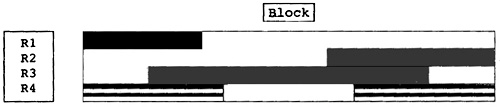

    Figure 13.1 Pictorial Representation of Block

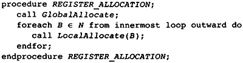

    Figure 13.2 Driver for Register Allocation

记得所有这些算法都是近似最优分配。通过求解整数规划问题可以达到最优分配；但是，对于产品编译器来说，这种技术代价太高。

寄存器分配的主体算法是依次执行每种形式的分配。FAT算法创建数据结构，局部寄存器分配器使用此数据结构，两者一起工作。图13.2给出了调用结构。首先执行全局寄存器分配，然后对每个block应用FAT算法和局部寄存器分配算法。

13.1 全局寄存器分配
********************

首先，编译器为全局临时变量分配寄存器，它们存放的值跨越block边界有效。通常，这意味着临时变量在一个block被求值，在另一个block被使用；但是，可能出现如下情形：临时变量在这个block中被求值，控制流离开block，后来又返回，它的值在相同block的较早处被使用。

这个全局分配器基于Preston Briggs（Briggs，Cooper，Torczon 1994）对Chaitin（1981）图着色寄存器算法的修改。它使用冲突图和早前限制资源phase引入的干扰或冲突的概念。两个临时变量可以被分配相同的物理寄存器，如果它们不冲突，也就是说在流图中不存在这样的点，在那里它们存放着可能不同的值，其值之后会被使用。

分配问题是为每个节点（临时变量）分配一个寄存器，由边相连的两个节点不会被赋予相同的寄存器。这是图着色问题，其中寄存器集合是颜色集合。不幸的是，图着色是一个NP-完全问题，不存在已知的好的求解算法。

Chaitin为图着色重新应用一种启发式方法，它对复杂控制流是有效的。[1]在冲突图中，邻居数小于颜色（寄存器）数的节点总是可以被着色，因为它可以被赋予除邻居颜色之外的任意颜色。这时，这个节点可以从图中移出，后面它将着色，在它的邻居都已经着色之后。重复这个过程，直到所有节点都已经从图中移出（如果可能的话）。然后，反转这个过程。将每个节点添加回图中，给它一个颜色，该颜色不同于当前图中其邻居的颜色。

[1如Chaitin同样注意到的，人们可以构建一个程序，其冲突图是任意的无向图，因此可以出现非常一般的图。然而，大多数图是简单的。例如，大多数临时变量只有一个定义点，大多数程序是结构化的，临时变量之间的相互作用更加受限。]

经常地，利用这个启发式方法，所有节点都可以被移出图。这时，上述观察给出了着色该图的完整的算法。Chaitin原本提出了一个算法，在没有邻居数小于颜色数的节点时停下来。算法然后选择一个节点挤出（spill）内存。

图13.3中的冲突图说明了启发式方法和一个较新的改进。有四个临时变量，边表示冲突。S3有一个邻居，可以把它移出图，留下S0、S1和S2。移出S3之后，它们各自有两个邻居，因此接着可以移出它们中的任意一个，比如说S0，然后S1，接着S2。最后，我们得到一个序列（S2，S1，S0，S3），它们需要被赋予寄存器。S2是第一个。把它放回到图中，赋予它任意寄存器，比如R0。S1是下一个：把它放回图中，赋予它一个寄存器，任意除了赋予S2的寄存器，比如说R1。类似地，对S0，赋予它R2。最后，要给S3赋予一个寄存器。它只和S2冲突（S2被赋予R0），可以被赋予1或R2。如此，这个算法可以分配寄存器，尽管S2有三个邻居。

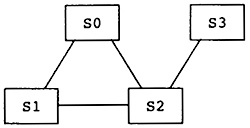

    Figure 13.3 Example Conflict Graph

纵然算法是借用序列描述的，我们看到，节点移出栈的次序和它们被赋予寄存器的次序是相反的。如此，当节点被移出冲突图时，它被压入栈，当它被再次插入冲突图时，它被弹出栈。

当然，节点本身并不移出冲突图。当节点被移出时，算法所引用的全部是它在冲突图中的邻居数。因此，算法必须记录仍然在图中的邻居的数目，当节点被移出时更新它。

13.1.1 何时启发式方法行不通
===========================

描述的启发式方法不是一个完整的算法。有可能冲突图中没有这样的节点，其邻居数小于颜色数。在当前这个编译器中，这是很少发生的，因为此前减小了寄存器压力，每个点活跃的临时变量数目减小了，冲突也减少了。然而，这是可能的。

Chaitin原本建议，选择并挤出这样一个临时变量，它最不重要，它的邻居最多。在临时变量的每次定义之后，插入存储操作，存储到内存位置，在每次被使用之前，插入载入操作，载入到临时变量。这会从冲突图中去掉所有通向这个节点的边，算法可以继续去掉边，有希望从冲突图中移出更多节点。将节点弹出栈，赋予它一个颜色，此时总是有一个可用的颜色。

Preston Briggs对Chaitin的原始算法提出了一个改进，使它的效果更好。Chaitin方法的问题是着色启发式方法太粗糙了。它假设临时变量的每个邻居会被赋予不同的寄存器，于是其它临时变量所需的寄存器数目是邻居的数目。实际上，几个邻居可能赋予相同的颜色。如果这样的话，Chaitin方法插入了不必要的存储和载入操作。

和Chaitin一样，Briggs也建议选择最不重要的临时变量；然而，不是立即插入存储和载入操作，而是简单地将临时变量压入正在构建的栈中。现在，当从栈中弹出节点并赋予它颜色时，会出现没有颜色可用的情形。这时，如Chaitin的算法那样挤出（spill）那个临时变量。

Briggs和Chaitin都在一个循环中重复寄存器分配，直到所有临时变量都被赋予了寄存器。当发生寄存器挤出时，寄存器分配器完成一趟完整的pass，而有些临时变量没有被赋予物理寄存器。在挤出的值就要被使用和被存储之前，需要分配寄存器来存放它。寄存器分配pass在中途之前不能分配这些寄存器，因此处理它们的最有效方法是重复着色算法，利用完整的寄存器集合。

这里提出的寄存器分配器不需要重复图着色算法。挤出（spill）引入的新临时变量在单个block中被存储和载入，后面局部调度器可以处理它们。这隐含着，在局部寄存器分配期间，寄存器压力可能超过物理寄存器的数目。总结来说，给无法着色的寄存器赋予内存挤出位置，跟早前限制资源phase赋予挤出位置完全一样。之后在局部寄存器分配期间，为这些临时变量确定存储和载入的内存位置，赋予寄存器。为此，当临时变量T被挤出时，全局分配器执行如下转换：

* 为挤出的临时变量分配一个内存位置，MEMORY(T)，如果还没有分配的话。
* 将这个临时变量添加到SpillRegisters集合，指示局部寄存器分配器，应该在它首次使用前插入LOAD指令（如果前面没有定义的话），在它末次定义之后插入STORE指令（除非临时变量不再活跃）。

注意，这是资源限制phase挤出操作的角色反转。在限制资源phase中，编译器假设临时变量在寄存器中，只有在真正必要时，才将临时变量搬运到内存。这里假设临时变量在内存中，在需要时将它搬运到寄存器。因此，载入操作出现在block之前，存储操作出现在block之后。向后移动载入操作，向前移动存储操作，必然影响其它已经分配的临时变量。这样，对于这些操作，不把它们移到block内，就不能改善它们的位置。

13.1.2 总体算法
======================

本编译器将这些想法结合成一个算法（见图13.4）。首先，编译器为那些在任意block开始处活跃的临时变量重新计算冲突矩阵。冲突图的每个节点（也就是临时变量）关联一个计数，NeighborsLeft。将它初始化为等于这个节点的邻居数。在初始化NeighborsLeft的同时，这些节点按照bucket排序放入bucket。同一个bucket中的所有节点具有相同的邻居数。

13.1.3 建立待着色临时变量的栈
=============================

然后，利用启发式方法从冲突图中移除节点，把它们压入到寄存器（临时变量）栈中。节点是按照bucket排序的，编译器只需要查看其中一个bucket。

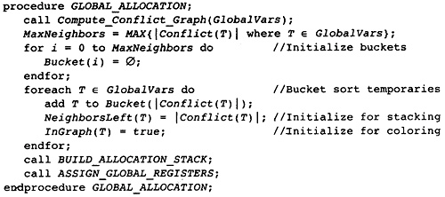

    Figure 13.4 Driver Procedure for Global Allocation

应该首先检查哪些bucket？是所包含的节点具有最多边的bucket，还是所包含的节点具有最少边的bucket？对作者来说，这是不明确的。如果首先查看边最多的节点，那么被移除的每个节点的边的总数更大，很可能更多节点的边的数目小于寄存器的数目。如果首先查看邻居较少（边较少）的节点，那么邻居数较小的节点将最后被着色，那时着色的自由度更小。当可用的寄存器较多时，将首先着色邻居数较大的节点。这个问题没有明确的答案。本书的设计首先查看边较少的节点，因为这样伪代码更简单。想要试验不同的次序，只需修改循环中引用bucket的地方[2]。

[2莱斯大学的Keith Cooper评论道，只有实验才能验证任何对寄存器分配算法的似乎合理的改进。从我的经验来说，有很多对算法的改变，在理论上应该只会提高分配器的性能，却降低了分配器的性能。这是NP-完全问题的基本特征。]

如图13.5所描述的栈操作的算法，可以作一些优化，选择合理的数据结构。这里有一些注意点。栈可以实现为预先分配的数组。它的尺寸不可能大于全局临时变量的数目。

编译器必须能够删除bucket中的任意节点。bucket可以实现为双向链表。向bucket插入节点时，总是可以在链表的开头插入。

算法被写成尽可能简单地控制i。我们可以试验选择节点的次序。我们也可以减小增长的数目。考虑所陈述的算法。如果当前节点在Bucket(i)中，那么下一个节点肯定在Bucket(j)中，其中j >= i - 1，因此可以从那个点开始循环，而不是从0开始。

13.1.4 为栈中的临时变量赋予寄存器
=================================

临时变量被压入了栈中，易于分配的临时变量在栈的底部，难于分配的临时变量在顶部，之后，图13.6中的算法遍历整个栈，为临时变量赋予颜色。每个临时变量必须被赋予一个不同于其邻居的颜色。

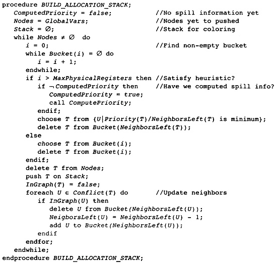

    Figure 13.5 Building Stack of Temporaries to Allocate

注意，算法不会试图更新返回到图中的邻居的数目。它不会更新属性InGraph，因为它是用来告知已经着色了一个临时变量。

如果查看所有邻居之后，发现没有剩余的寄存器，就挤出（spill）这个临时变量。这包括，设置InGraph属性为假，指示它没有关联的物理寄存器，将这个临时变量添加到SpillRegisters。局部寄存器分配器会想办法插入载入和存储操作，实现临时变量挤出。

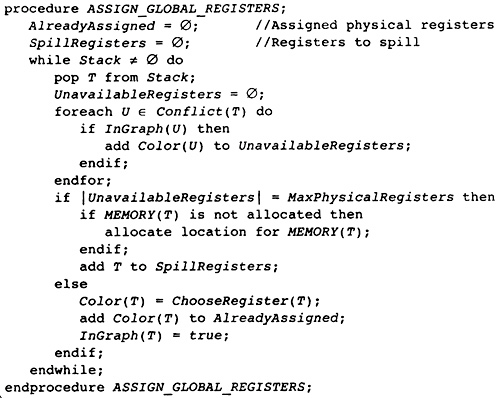

    Figure 13.6 Register Coloring Algorithm

13.1.5 选择实际的物理寄存器
===========================

任何没有赋予给邻居临时变量的物理寄存器，大约都可以赋予给当前临时变量；但是，选择某些物理寄存器可能改善最终的结果。如果有一个物理寄存器，在函数别的地方已经使用了它，那么优先选择这个寄存器。如果只有未使用的寄存器可用，那么编译器必须斟酌处理器的调用规范。有些寄存器由调用函数保存和恢复。这些寄存器是临时变量寄存器，当前函数可以使用它们，而不带来额外代价。其它寄存器必须由被调函数保存和恢复。在函数内部第一次使用它们的时候，必须在函数序曲和尾声处插入代码以保存和恢复这些寄存器。

图13.7中的算法实现了这些想法，还附加了一个想法。考虑临时变量T，正在为它分配寄存器。它的有些邻居（其InGraph属性为假），不妨称其中之一为U，还没有分配寄存器。如果可以为T分配一个寄存器，相同于其它和U冲突的临时变量之一的寄存器，那么到时候为U分配寄存器可能更容易。

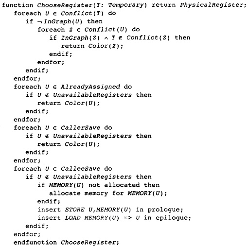

    Figure 13.7 Choosing the Register

如果这个启发式方法行不通，就尝试给T赋予一个已经被使用的物理寄存器。这会降低已用寄存器的数目。记得指令调度已经发生，编译器已经重排指令，使用更多寄存器不会带来任何好处。

如果没有可用的已使用寄存器，就用一个CallerSave寄存器，因为保存和恢复它们没有代价。这也失败了，就用一个CalleeSave寄存器；然而，必须在流图的序曲和尾声插入代码以保存和恢复物理寄存器。

13.1.6 实现挤出（Spilling）
===========================

尽管伪代码有所描述，我们不曾讨论在选择临时变量压入栈的时候，没有临时变量满足启发式方法的情形。我们讨论了在指派寄存器的时候，没有寄存器可用该怎么办。这时，临时变量被放入集合SpillRegisters，延迟挤出（spilling）操作直到局部寄存器分配。

本编译器利用Chaitin的方法选择临时变量，压入栈中（Chaitin 1982）。最近提出了更复杂的技术；然而，在当前的设计中它们的价值是不确定的。更复杂的技术看起来对于直线型代码和寄存器压力很大的情形表现更好；然而，我们用不同的方法处理这些情形。

选择临时变量压入栈时，有两个因素。寄存器着色的次序，和它们被放入栈的次序相反，编译器应该将最不重要的临时变量压入栈中。其次，编译器应该压入一个临时变量，它和大量不在栈中的临时变量冲突。这会减小冲突图中边的数目，使得更多节点更有可能满足着色启发式方法。编译器必须把这两个条件拼合在一起，形成单个算法或方程，来描述节点的优先级。很多方程可以做到；我们使用Chaitin的方程，它选择值最小的临时变量：

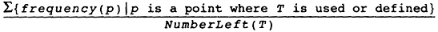

不幸的是，编译器无法预先计算以上信息，为可能发生挤出的地方保存起来，因为在临时变量压入栈的过程中，属性NumberLeft(T)在不断地变化。作为替代，编译器预先计算下面的方程，然后在需要挤出的时候执行除法：

.. code::

	Priority(T) = ∑{frequency(p) |p is a point where T is used or defined}

就代码而言，子函数ComputePriority[3]遍历流图，找出涉及临时变量的载入和存储操作，计算这个表达式的分子。将它保存为属性Priority(T)。之后，当要选择一个临时变量压入栈的时候，除以分母，选择结果值最小的那个。

[3伪代码不包含ComputePriority的代码。它琐碎地遍历流图，利用存储在block中的频度信息，查看出现的载入和存储操作，累积优先级信息。]

13.2 局部寄存器分配
********************

全局寄存器分配完成了。现在，我们必须分配在block中活跃的寄存器。这个分配器有着不同的结构，因为在函数中临时变量活跃的区域更加规则。在block中可以按照指令被执行的次序枚举它们。如果没有已分配寄存器的全局临时变量，针对直线型代码，有简单的算法可以做到良好的局部分配。本书的编译器最后肯定会利用这些想法，但是必须首先处理已分配寄存器的全局临时变量，这样它们不至于破坏简单的直线型算法（图13.8）。

在局部寄存器分配之前，编译器必须处理那些全局寄存器分配器没有给它们分配寄存器的全局临时变量。它们是集合SpillRegisters中的临时变量。编译器必须检查整个block，执行三个任务。首先，在这些临时变量最后一次被赋值之后，必须插入一个STORE指令，把值写到内存。其次，在这些临时变量第一次被使用之前，必须插入一个LOAD指令，从内存读取值，如果这个使用的前面不是对临时变量的赋值的话。最后，在这个block内，必须给予这个临时变量一个新的名字。每个临时变量关联着一个单一的名字，每当编译器把临时变量引用分割为单独分配的部分时，必须为它创建一个新的名字。临时变量有了新的名字，它在不同的block里就可以被分配为不同的寄存器。

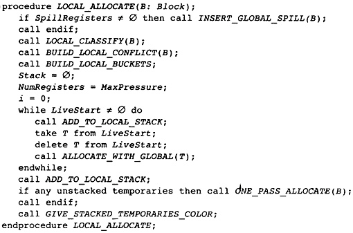

    Figure 13.8 Main Local Allocation Procedure

图13.9中的算法分两步执行了这三个任务。第一个pass反向遍历指令，对于这些临时变量的每一个，找出为其赋值的最后一条指令。在这些指令后面插入一个存储操作。同时，确定哪些临时变量前面需要插入一个载入操作。它一开始假设载入操作是需要的，如果发现了早前对临时变量的赋值，就否定这个假设。

第二个pass是前向pass，利用属性NewName为挤出的临时变量存放局部的名字，在第一次使用临时变量名字前插入载入操作。

挤出（spill）全局临时变量之后，局部寄存器分配器分类出现在block中的临时变量。在描述分类之前，读者应该明白，寄存器分配器遍历指令的过程模仿了计算活跃信息的过程。事实上，经常计算活跃信息。总是按照逆向执行顺序遍历流图，隐式或显式计算活跃信息，同时执行某种处理。分类临时变量的时候，所收集的信息是一系列临时变量集合和最大寄存器压力，就是在任何时间点最大的活跃临时变量数。下面列出了这些集合：

* LiveThrough：这些临时变量在block中每个点都活跃。它们可能在block中被引用，也可能被修改；然而，它们在指令之间的任意点都是活跃的。因此，在整个block中，它们中的每一个都占据一个物理寄存器，使得这些物理寄存器不能用于局部分配。

* LiveStart：这些临时变量在block开头活跃，而在block中若干指令之后变为不活跃。这些全局临时变量给局部寄存器分配器带来麻烦。这个局部寄存器分配器向后遍历block中的指令（记得模拟计算活跃信息），为临时变量分配寄存器，必须小心从事，不让所分配的寄存器和已分配给LiveStart中的临时变量的物理寄存器重叠。分配器使用了FAT启发式方法。

* LiveEnd：这些临时变量在block的某条指令处变为活跃，且在block的末尾处活跃。它们不会给局部寄存器分配器带来麻烦。实际上，这些是预先分配的局部临时变量，为了在这个block中为它们分配寄存器。

* LiveTransparent：这些临时变量跨越block活跃，而在这个block中没有引用。像LiveThrough一样，这些临时变量占据一个物理寄存器，跨越这个block。然而，当寄存器压力太高时，它们是有用的，因为可以在这个block之前和之后挤出（spill）它们，如限制资源phase所做的那样。

* LocalRegisters：这些局部临时变量在block中变为活跃，后来在block中变为不活跃。在计算密集的程序中，这是数量最大的一类临时变量。为这些临时变量分配物理寄存器是本节的重点。注意，挤出的临时变量所关联的新建临时变量属于这一类。

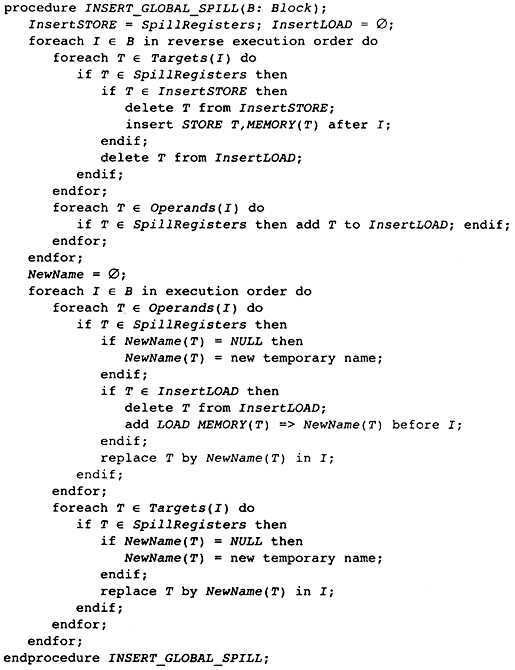

    Figure 13.9 Spilling and Classifying Temporaries

图13.10中的算法在block内精确地重新计算活跃信息，按照上面的定义，利用该活跃信息分类所有临时变量。举例来说，LiveTransparent中的临时变量在block的出口是活跃的，在block内没有对它的引用。因此，LiveTransparent初始化为出口处活跃的临时变量集合，然后移除被引用的临时变量。其它集合处理起来是类似的。

分类了临时变量之后，是时候准备寄存器分配了。令人惊奇的是，编译器为block计算冲突图。尽管这个分配器不以图着色为基础，但是图着色启发式方法提供了有用的信息：那些邻居少于可用颜色的临时变量是容易着色的，因此可以放在一边。这样重复这个过程，将所有容易的临时变量都放在一边，只剩下那些着色困难的临时变量，以专门的方式处理它们。事实上，容易的临时变量是琐碎的，移除它们之后，只对困难的临时变量做困难的决定。

编译器的局部寄存器分配器计算两种数据结构（见图13.11）。第一种是局部冲突图，图中出现的临时变量只有当前block的临时变量。我们希望，建立的图是一个小的图。有这样的情形，函数是一个大的block（几千行代码）。这时，全局冲突图是小的，而局部冲突图是大的。[4]

[4编译器编写者经常忘记有两类程序员。人类程序员更容易应付。编译器可以估算使用的模式。程序编写的程序更难处理，它们包含不友好的结构。]

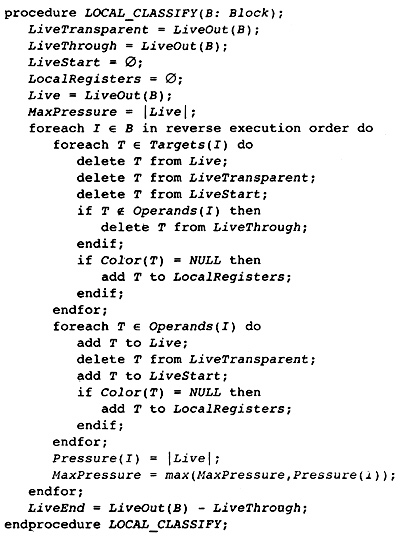

    Figure 13.10 Classifying Temporaries in a Block

算法还计算临时变量的活跃范围。FAT算法需要该信息。为了记录该信息，赋予每条指令两个数字。从block的末尾开始，数字为0，向着block的开始处，数字递增。数字对中小的那个代表修改寄存器的指令部分。大的那个代表获取操作数的指令部分。

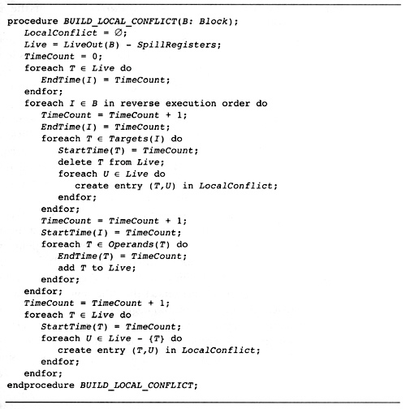

    Figure 13.11 Building Lifetimes and Local Conflict Graph

每个临时变量关联两个属性。StartTime(T)是关联写临时变量的指令的计数。如果临时变量在block的开始是活跃的，那么它引用一个在block前的值。EndTime(T)是引用临时变量的最后一条指令的计数。如果临时变量在block末尾是活跃的，那么这个属性指代block的末尾。一次遍历block，模拟计算活跃信息，计算得到这些属性，临时变量第一次变为活跃时，赋值EndTime，第一次变为不活跃时，赋值StartTime。

计算得到冲突信息和生命期信息之后，寄存器分配器准备执行标准的图着色启发式方法，移除容易的临时变量。如同全局分配器，临时变量按照bucket排序（见图13.12）。像全局寄存器分配器那样，采用相同的方法建立相同的属性。

现在，为了方便理解，我们以灵活的方式描述算法。我们要做的是，遍历整个block，给临时变量赋予物理寄存器。后面，图13.15描述了这个算法。在分配开始之前，所有物理寄存器都存放在一个称为FreeRegisters的集合中，它们是可用的寄存器。我们扫描block（还是按照反向的顺序，模拟活跃信息计算），当一个临时变量第一次变为活跃的时候（就是说，我们找到了临时变量的最后一次使用），把FreeRegisters中的一个寄存器赋予给它。在一个临时变量被定义的点（如果它不是同时被用作操作数），我们把分配给它的物理寄存器返还给FreeRegiters。

问题是，如果在block的另一端，有全局临时变量已经分配了物理寄存器，这个方法会行不通。我们可能从FreeRegisters取出一个物理寄存器，赋予给一个临时变量，它的生命期重叠一个全局临时变量，而后者已经在使用那个寄存器。

解决方法是，预先处理在block另一端活跃的全局临时变量（这里是block的开头，因为我们在向后遍历block）。这是FAT启发式方法。取这些临时变量的其中之一，称之为T。FAT启发式方法执行下面的操作：

1. 扫描整个block，找出寄存器压力达到最大值的所有点。这些点称为FAT点。

2. 对于每个FAT点，选择一个在这个点活跃的局部临时变量。我们说，这个临时变量覆盖这个FAT点。这样选择临时变量，使得每个FAT点被覆盖，并且任意所选择的两个临时变量的生命期不重叠，和T的生命期也不重叠。这可能做不到；那时，将会有进一步挤出（spilling）。毕竟，这是一个启发式方法，不是算法。

3. 每个覆盖FAT点的这些临时变量都赋予和T相同的物理寄存器。

4. 在后续的分配中，不考虑那些T和覆盖FAT点的临时变量所关联的物理寄存器。在覆盖FAT点的临时变量之一活跃的每条指令处，寄存器压力减小1。换句话说，我们忽略这些物理寄存器，T，和覆盖FAT点的临时变量。

5. 现在重复这个过程，处理在block开头活跃的其它全局临时变量，直到它们全部处理完毕。

在这个时刻，已经没有我们所关心的在block开头活跃的临时变量，于是我们可以应用单pass局部寄存器分配器，如上面描述的那样。

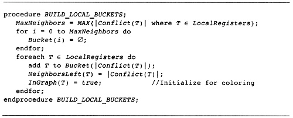

    Figure 13.12 Build Buckets for Local Coloring

这是我们所用的算法。唯一的修改是，在每次处理这些临时变量时，编译器应用着色启发式方法，移除容易的寄存器。这是我们在图13.8中描述的算法。现在我们描述支持函数（support procedure）。

图着色启发式方法实现为两个函数，ADD_TO_LOCAL_STACK（见图13.13）和GIVE_STACKED_TEMPORARIES_COLOR（见图13.14）。它们是全局分配算法的副本，这里不进一步描述它们。注意，变量NumberRegisters开始时等于常量MaxPhysicalRegisters，在FAT算法执行过程中，它不断地递减。

注意，应用着色启发式方法的时候，应该不会涉及挤出（spilling）。当临时变量的邻居数小于颜色数时，将它压入栈中。如果条件不成立，就不能压入栈中。应用FAT启发式方法的时候，一个物理寄存器被放到一边，不再参与其中，因此允许的邻居数减小1。这不影响之前压入栈中的任意临时变量。

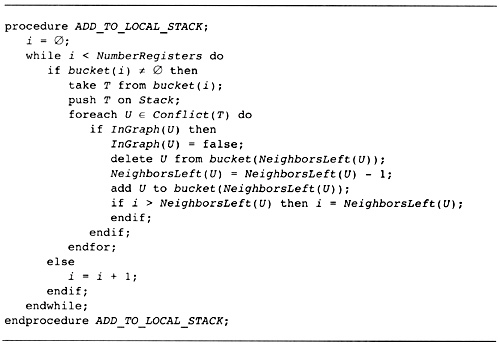

    Figure 13.13 Building Local Graph-Coloring Stack

图13.15描述了单pass寄存器分配器。它是一个单一的pass，模拟活跃信息计算（所以它知道一个临时变量何时变为活跃），当一个临时变量变为活跃时，分配空闲的物理寄存器。如果一个临时变量已经有一个颜色了，就不需要给它赋予一个。可能需要在block内挤出（spill）临时变量，由于FAT启发式方法的失败。

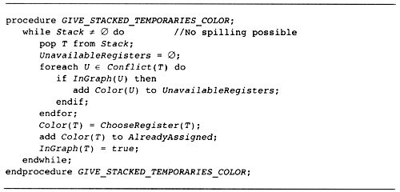

    Figure 13.14 Coloring the Easy Local Temporaries

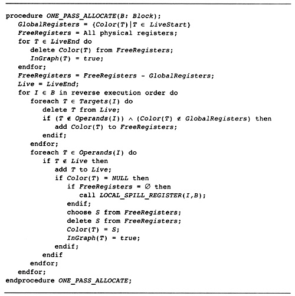

    Figure 13.15 One-Pass Register Allocation

图13.16中的FAT启发式方法是对原始描述的直接实现。利用FinishTime局部变量，选择非重叠的生命期。按照逆向执行顺序遍历，这个变量指示了这样的点，在那里最近添加到覆盖集合中的临时变量再次变为不活跃。属性BeginTime指示了这样的点，在那里一个全局临时变量变为不活跃，它将要和所有这些临时变量共享一个物理寄存器。因此，被选择的下一个临时变量应该在最大压力点活跃，并且它的生命期不和开头的全局变量或覆盖集合中前面的临时变量重叠。

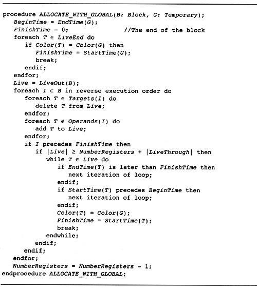

    Figure 13.16 FAT Heuristic

当需要挤出（spilling）的时候，使用经典的挤出启发式方法（图13.17）。在寄存器分配的过程中，考虑一条指令I，它有一个操作数需要一个赋予物理寄存器的临时变量。没有足够的物理寄存器，于是选择一个临时变量，它前面的使用是最远的。在I之后插入一个载入操作，在临时变量的上一次定义之后插入一个存储操作，这样一个寄存器被释放了，可用于block中可能最长的一段时间。

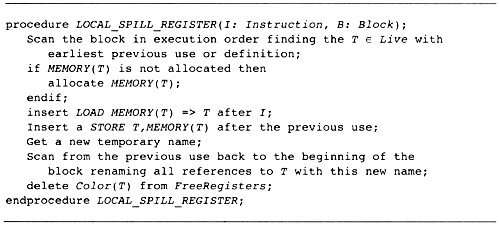

    Figure 13.17 Spilling within the Block

